<div align="center">

# Online Job Portal

**A full-stack job portal where employers post vacancies, job seekers apply and track their applications, and an administrator runs the whole site.**

Built with Java and Spring Boot. Runs with one command, no database installation.

[](https://adoptium.net/)
[](https://spring.io/projects/spring-boot)
[](https://www.thymeleaf.org/)
[](#configuration)
[](#testing)
[](https://gradle.org/)

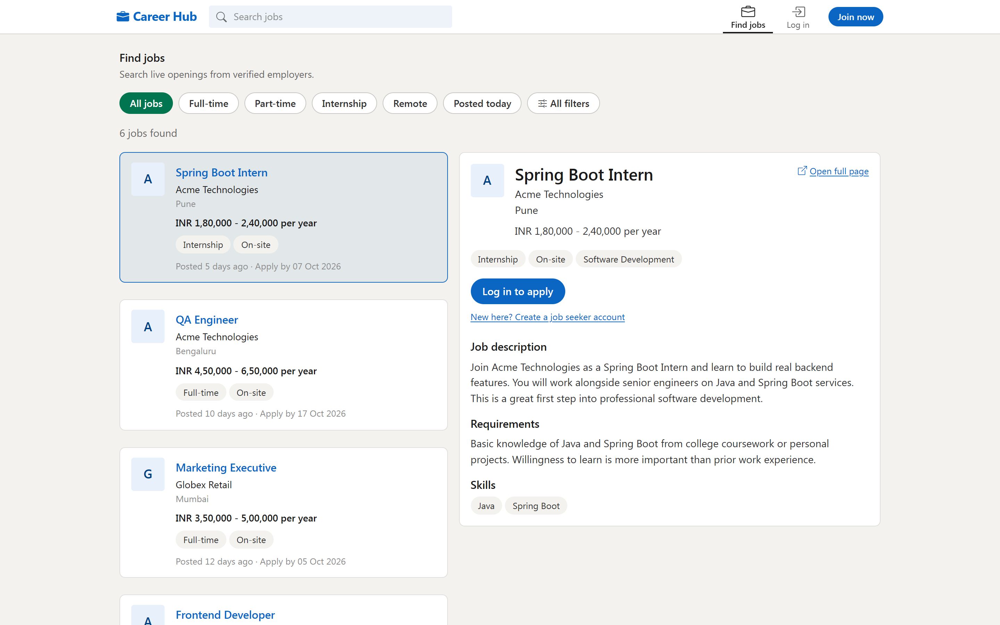

</div>

---

## Contents

[What it does](#what-it-does) ·
[Screenshots](#screenshots) ·
[Features](#features) ·
[Built with](#built-with) ·
[Getting started](#getting-started) ·
[Demo accounts](#demo-accounts) ·
[How it works](#how-it-works) ·
[Testing](#testing) ·
[Configuration](#configuration) ·
[Deployment](#deployment) ·
[Documentation](#documentation)

---

## What it does

Three kinds of people use the portal, and each gets their own dashboard:

| Role | What they do |
|---|---|
| **Administrator** | Approves or rejects job postings, manages every account, changes site-wide settings, and watches statistics and a live activity feed |
| **Employer** | Posts and manages jobs, reviews applicants through the hiring stages, messages candidates, and tracks how their postings perform |
| **Job seeker** | Searches and filters jobs, applies with a resume and cover letter, tracks each application, manages a profile, and gets job recommendations |

Visitors who are not signed in can still browse and search every live job, and are asked to log in only when they apply.

---

## Screenshots

<table>
<tr>
<td width="50%">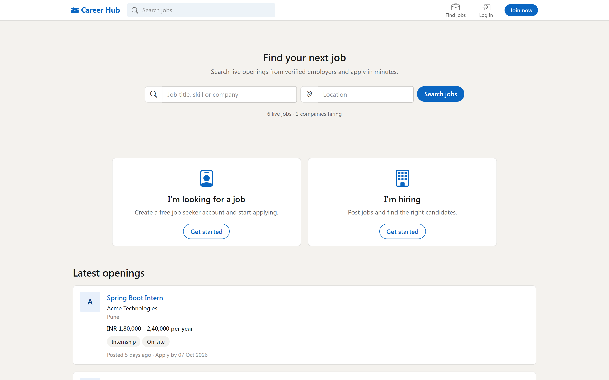<br><sub><b>Landing page</b> — search first, then the newest jobs</sub></td>
<td width="50%">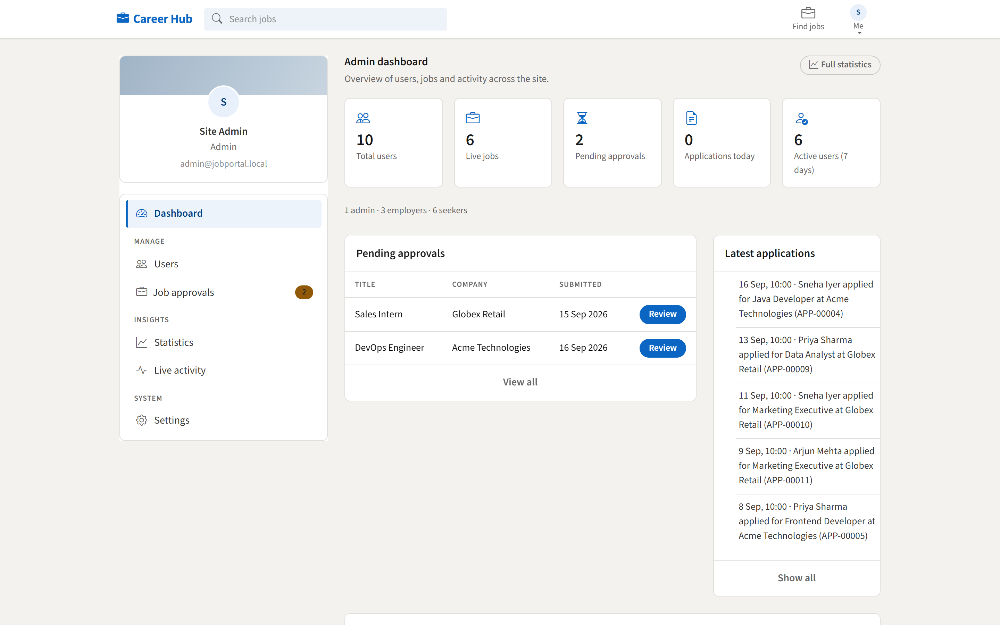<br><sub><b>Admin dashboard</b> — counts, approval queue, latest applications</sub></td>
</tr>
<tr>
<td>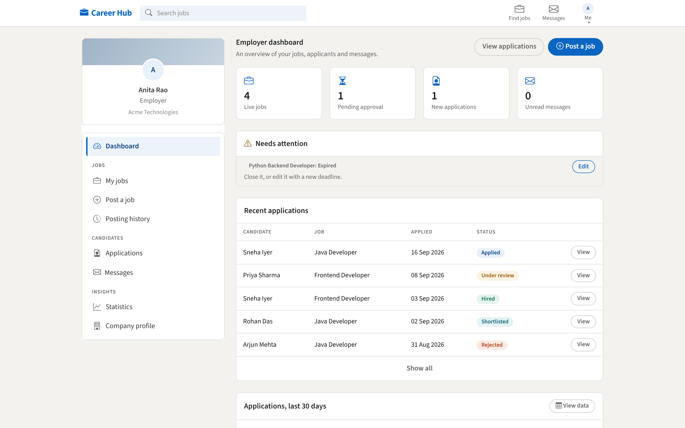<br><sub><b>Employer dashboard</b> — jobs needing attention and recent applicants</sub></td>
<td>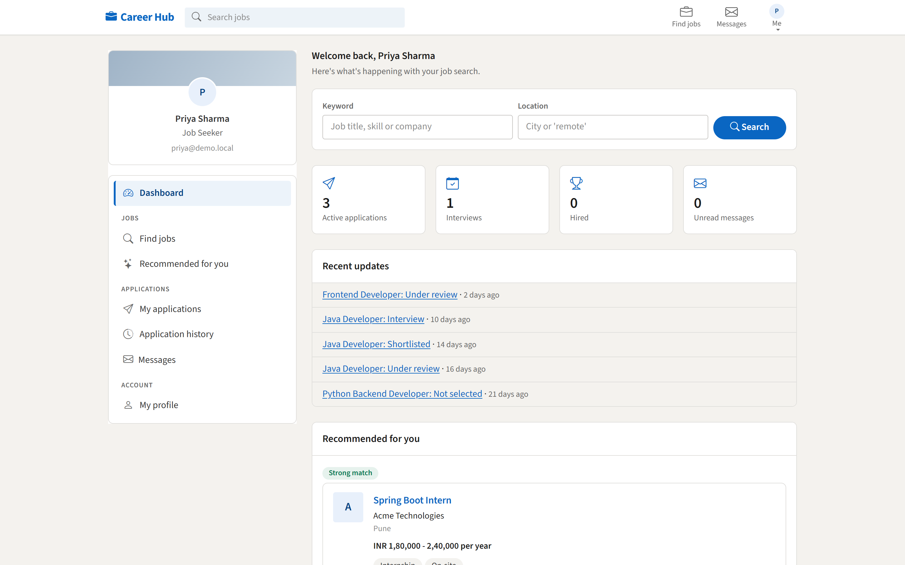<br><sub><b>Job seeker dashboard</b> — application status and recommended jobs</sub></td>
</tr>
<tr>
<td>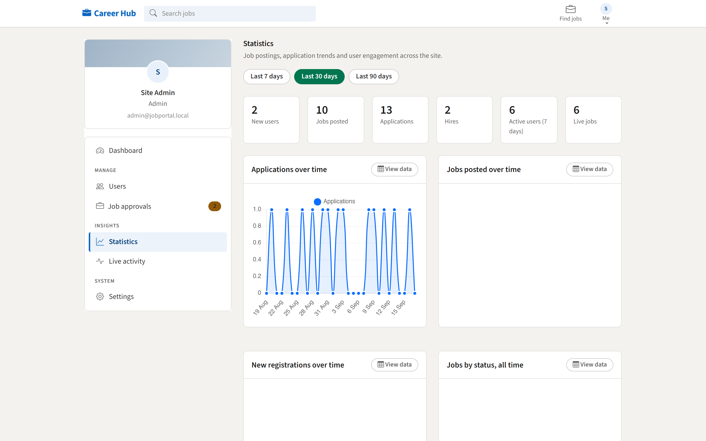<br><sub><b>Statistics</b> — every chart also printed as a table</sub></td>
<td>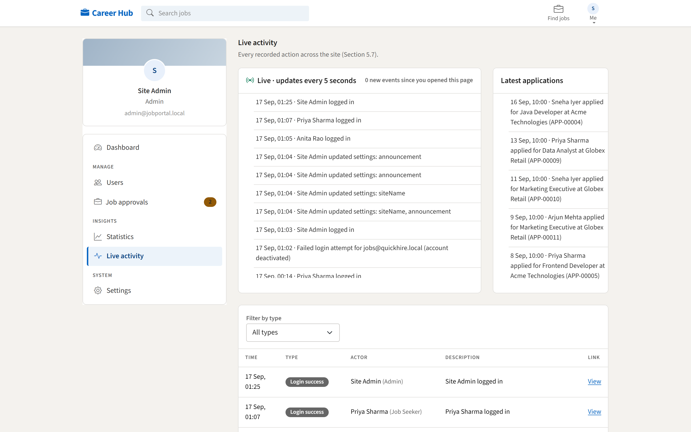<br><sub><b>Live activity</b> — new events appear within seconds</sub></td>
</tr>
<tr>
<td>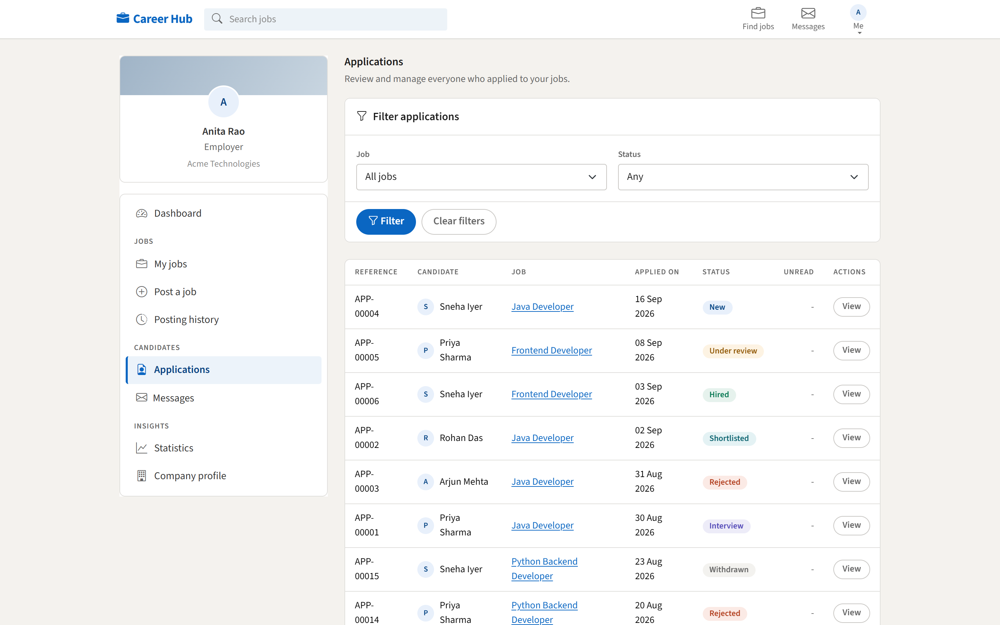<br><sub><b>Applicants</b> — filter, review, move through hiring stages</sub></td>
<td>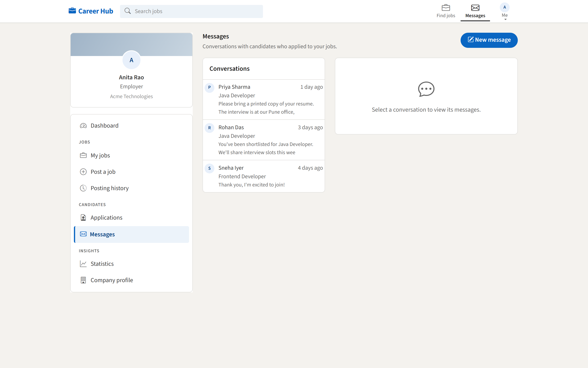<br><sub><b>Messaging</b> — one conversation per application</sub></td>
</tr>
<tr>
<td>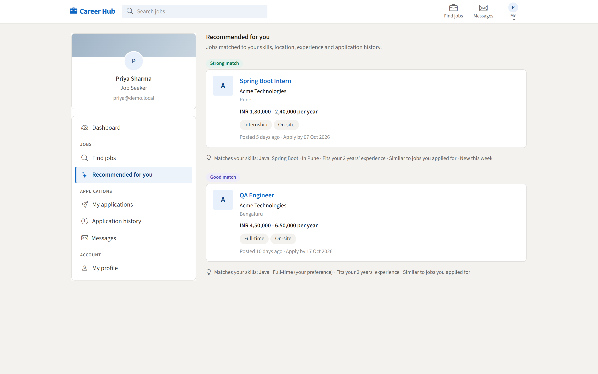<br><sub><b>Recommendations</b> — each one says why it matched</sub></td>
<td>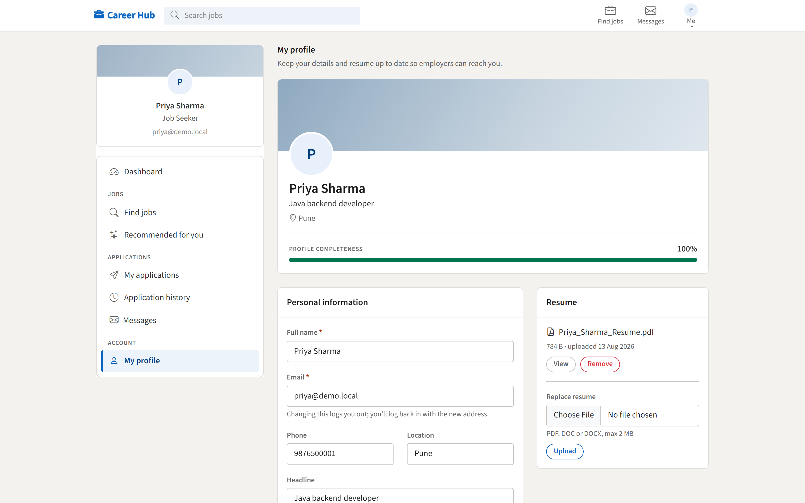<br><sub><b>Profile</b> — completeness meter, skills, resume</sub></td>
</tr>
</table>

> The site name is a setting an administrator can change, which is why these screenshots say "Career Hub".

---

## Features

<details open>
<summary><b>Administrator</b></summary>

- **User management** — create, edit, deactivate or delete any account; deletion is refused once a user has jobs, applications or messages, so history is never lost
- **Job approval** — a queue of pending postings to approve or reject with a reason the employer can read; approved jobs can also be taken down
- **System settings** — ten settings that take effect immediately: site name, announcement banner, page size, registration switches, whether jobs need approval, the job limit per employer, resume size and allowed types, and the activity refresh interval
- **Statistics** — job and application trends over 7, 30 or 90 days, plus engagement figures like approval turnaround and how many seekers actually apply
- **Live activity** — logins, registrations, postings, approvals and applications appear within seconds, without reloading the page

</details>

<details open>
<summary><b>Employer</b></summary>

- **Job posting** — title, description, requirements, skills, category, type, work mode, location, salary range, experience, openings and deadline, all validated
- **Job management** — edit, close, reopen or delete; editing a live job sends it back for approval, and deleting is refused once someone has applied
- **Posting history** — every job with a dated timeline: posted, approved, rejected, edited, closed, reopened
- **Applicant review** — filter by job or status, open a candidate's details and resume, and move them through applied, under review, shortlisted, interview, hired or rejected
- **Two kinds of notes** — one the candidate sees with a status change, and a private note that never leaves the employer's pages
- **Messaging** — start a conversation with any applicant; the candidate can reply once contacted
- **Statistics** — apply rate, candidate reply rate, average first response time, and application trends

</details>

<details open>
<summary><b>Job seeker</b></summary>

- **Search** — keyword, location, category, job type, work mode, minimum salary, experience and posting date, with sorting and paging; the URL keeps every filter, so a search can be shared
- **Apply** — use the profile resume or upload a new one, with an optional cover letter; each application stores its own copy of the resume, so replacing the profile one never changes what an employer already received
- **Tracking** — a status tracker and dated timeline per application, an "Updated" badge when an employer moves things along, and withdrawal while an application is still active
- **History** — decided applications with the outcome and how long it took
- **Profile** — details, skills, experience, education and resume, with a completeness meter that says what is still missing
- **Recommendations** — live jobs scored against skills, location, job type, experience and past applications, each showing why it was recommended

</details>

<details>
<summary><b>Across the whole site</b></summary>

- Role-based access: every URL zone is closed to the wrong role, and opening someone else's record returns a proper 404 page
- Passwords hashed with BCrypt; CSRF protection on every form
- Uploads checked for type, size and actual file content, not just the extension
- Interface modelled on LinkedIn: a sticky top bar, a profile rail beside the content, section cards, and status badges that always carry words as well as colour
- Works on a phone, keeps visible focus outlines, and honours a reduced-motion preference
- Fonts and front-end libraries are bundled, so the portal looks identical with no internet connection

</details>

---

## Built with

| Layer | Choice | Why |
|---|---|---|
| Language | **Java 17** (builds on any JDK 17 or newer) | Runs on any college lab machine |
| Framework | **Spring Boot 3.5.16** | Web, security, data access and validation in one place |
| Pages | **Thymeleaf 3.1** + Bootstrap 5.3 | Server-rendered HTML; no separate frontend project to learn |
| Security | **Spring Security 6** | Form login, role-based rules, BCrypt, CSRF |
| Data | **Spring Data JPA** with Hibernate | Queries written once, work on H2, MySQL or PostgreSQL |
| Database | **H2** file database by default | Nothing to install; the file lives in `data/` |
| Charts | **Chart.js** | Small, and every chart is paired with a data table |
| Build | **Gradle wrapper** | `gradlew` needs no Gradle installation |
| Tests | **JUnit 5**, Spring Security Test, MockMvc | 351 tests covering rules, queries and pages |

---

## Getting started

**You need:** a JDK 17 or newer. Nothing else — no database, no Gradle, no internet after the first build.

```bash
git clone https://github.com/ArjavJain07/Online-Job-Portal.git
cd Online-Job-Portal
```

**Windows**

```bash
run.bat
```

**macOS or Linux**

```bash
./gradlew bootRun
```

Then open **<http://localhost:8080>**.

The first start creates the database in `data/`, an uploads folder, and a full set of demo data: 10 users, 12 jobs across every status, 15 applications, message threads and several weeks of activity, so the dashboards and charts have something to show.

**Other useful commands**

```bash
./gradlew test          # run the test suite
./gradlew bootJar       # build a runnable jar in build/libs
```

`reset-demo.bat` deletes the database and uploads, so the next start seeds everything again.

---

## Demo accounts

The login page lists these while demo mode is on. One click fills the form.

| Role | Email | Password |
|---|---|---|
| Administrator | `admin@jobportal.local` | `Admin@123` |
| Employer — Acme Technologies | `hr@acme.local` | `Employer@123` |
| Employer — Globex Retail | `talent@globex.local` | `Employer@123` |
| Job seeker — full profile | `priya@demo.local` | `Seeker@123` |
| Job seeker — partial profile | `arjun@demo.local` | `Seeker@123` |

Six job seeker accounts exist in total, each set up to show a different situation: an application that was withdrawn, one that was hired, an empty profile that falls back to the latest jobs instead of recommendations, and so on.

---

## How it works

Requests flow through four layers. Controllers stay thin, every rule lives in a service, and only repositories touch the database.

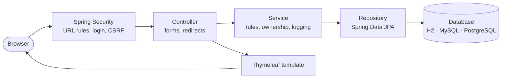

The main tables and how they relate:

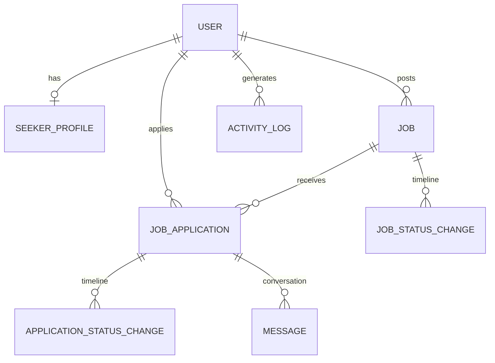

**Package layout**

```
com.jobportal
├── config          security, MVC and application settings
├── security        the signed-in user, login handlers, role redirects
├── domain          entities and enums (the job and application lifecycles)
├── repository      Spring Data repositories, search specifications, projections
├── service         all the rules: jobs, applications, messages, statistics, files
├── dto             small records passed to pages and charts
├── web             controllers grouped by role, form objects, shared helpers
├── api             the one JSON endpoint, for the live activity feed
├── seed            demo data loaded on first start
└── util            skills parsing, text matching, date buckets, file names
```

Two decisions worth knowing:

- **Job and application statuses are state machines.** The allowed next steps live in the enum, so an invalid move is refused in one place rather than checked in each page.
- **"Live job" is defined once.** Approved, deadline not passed, employer still active — used by search, recommendations and the apply check alike, so the three can never disagree.

---

## Testing

```bash
./gradlew test
```

**351 tests**, covering:

| Area | What is checked |
|---|---|
| Rules | Status transitions, apply and withdraw rules, job deletion and reopening, deletion protection |
| Security | Every role against every URL zone, other people's records returning 404, CSRF on forms and uploads |
| Data | Repository queries, search filters and paging, seeded data counts |
| Pages | Every page renders for the role that owns it, with the real content on it |
| Numbers | Statistics and recommendation scores checked against the seeded dataset |
| Files | Resume type, size and content checks, including a file renamed to look like a PDF |

The suite is also how the redesign was proved safe: the interface was rebuilt twice, and the tests confirmed behaviour never changed.

---

## Configuration

Settings an administrator can change from the browser, no restart needed:

| Setting | Effect |
|---|---|
| Site name, announcement banner | Shown across every page |
| Items per page | Every list and table |
| Seeker and employer registration | Opens or closes each sign-up route |
| Job approval required | New jobs either wait for approval or go live immediately |
| Maximum active jobs per employer | Refuses a new posting past the limit |
| Resume size and allowed types | Enforced on upload |
| Activity refresh interval | How often the live feed asks for new events |

**Database profiles** — the default needs no setup:

| Profile | Database | Command |
|---|---|---|
| default | H2 file in `data/` | `./gradlew bootRun` |
| `mysql` | MySQL on localhost | `./gradlew bootRun --args='--spring.profiles.active=mysql'` |
| `prod` | PostgreSQL, used by the hosted copy | Set `SPRING_PROFILES_ACTIVE=prod` |

---

## Deployment

The project ships with a `Dockerfile` and a Render blueprint, so a hosted copy is a few clicks: **New → Blueprint** on [Render](https://render.com), pick this repository, apply.

See **[docs/DEPLOY.md](docs/DEPLOY.md)** for the steps and the free-plan limits — the service sleeps when idle, uploaded files do not survive a restart, and a free database expires after 30 days. For a presentation, running locally is still the better demo.

---

## Documentation

| Document | What is in it |
|---|---|
| **[docs/PROJECT_PLAN.md](docs/PROJECT_PLAN.md)** | The full plan the project was built from: architecture, data model, every route and screen, a requirement traceability matrix, milestones, test plan and a demo script |
| **[docs/DEPLOY.md](docs/DEPLOY.md)** | Hosting on Render |
| **[design-system/jobportal/MASTER.md](design-system/jobportal/MASTER.md)** | The visual design system: palette, typography and layout rules |

---

<div align="center">
<sub>Built as a college project implementing the "Online Job Portal" specification.</sub>
</div>
