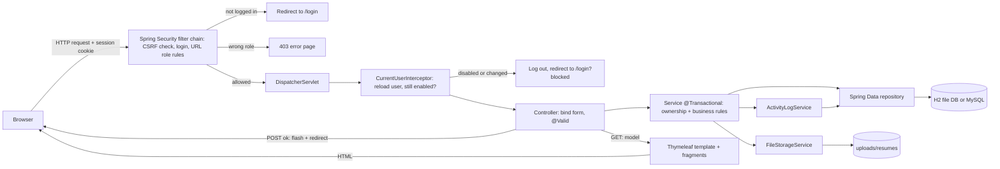
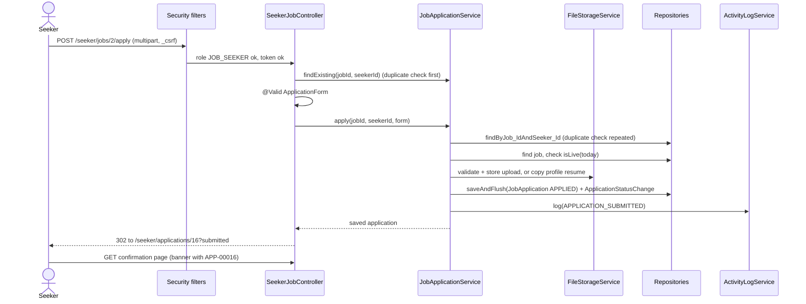
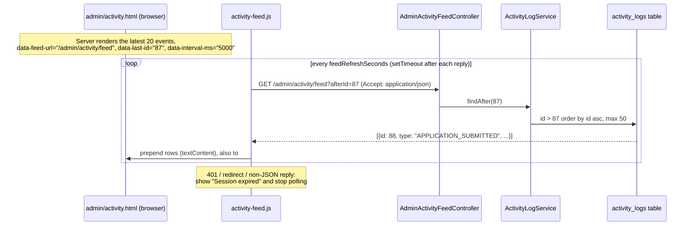
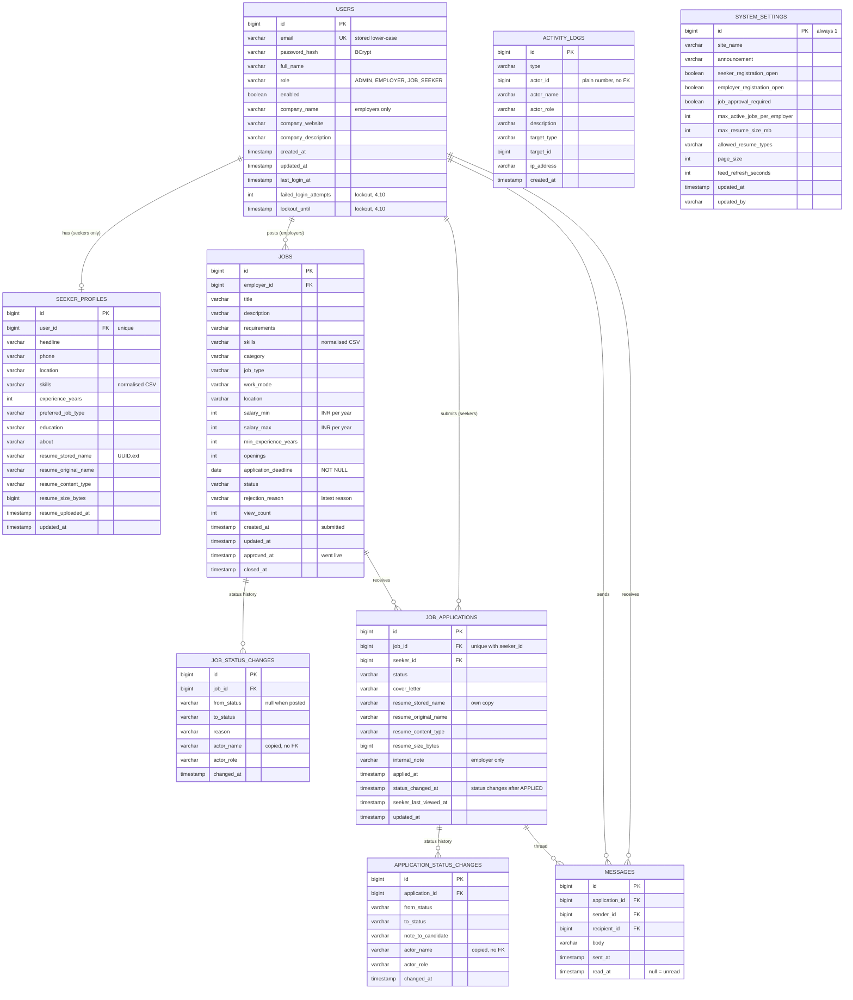
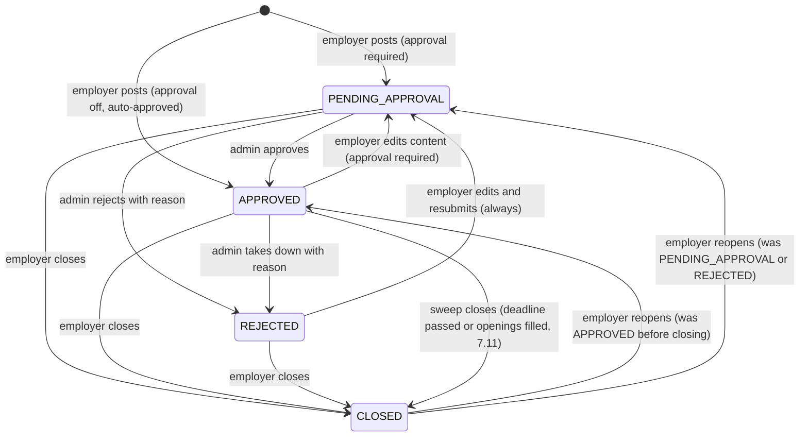
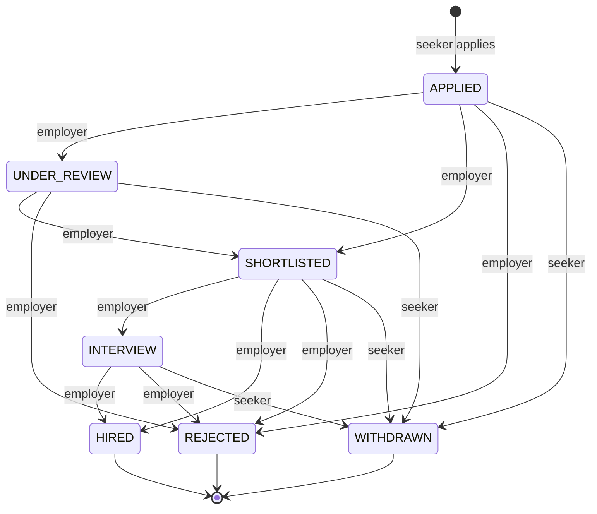
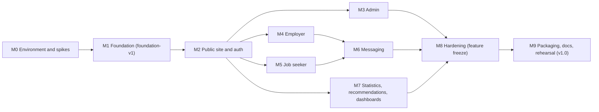

# Online Job Portal: Project Plan

| | |
|---|---|
| **Document** | `docs/PROJECT_PLAN.md`, the single authoritative plan for the project |
| **Version** | 1.0, 16 Sep 2026 |
| **Project** | Spec 9, Online Job Portal (college project, Java) |
| **Base package** | `com.jobportal` |
| **Run command** | `run.bat` (wraps `gradlew.bat bootRun`), then open http://localhost:8080 |

**How to use this document.** Section 1 says what we build and how we read the spec. Sections 3 to 7 are the design. Section 6 has one block per feature: routes, fields, messages, rules and acceptance criteria (ACs). Section 8 maps every spec ID to routes, templates and tests. Sections 11 to 15 cover building, testing and presenting. Names of classes, routes, templates, enums and seed data are the same everywhere in this document. If code and plan ever disagree, fix one of them so they match again.

**Priority words.** **MUST** = required for the spec or the demo. **SHOULD** = build if time allows, low risk. **COULD** = nice extra, only after everything else passes.

---

## 1. Project Overview

### 1.1 Goal

Build a web-based job portal where **employers** post job listings and manage applicants, **job seekers** search for jobs, apply with a resume and track their applications, and an **administrator** approves job postings, manages users and changes system-wide settings. Each role gets its own dashboard. The application runs from one command on a Windows lab machine with only a JDK installed. It needs no MySQL server and no internet at runtime.

### 1.2 The three roles

| Role (`Role` enum) | Who | How the account is created | Main goals |
|---|---|---|---|
| `ADMIN` | Portal administrator | Created at first start by `DataSeeder`. More admins can be created by an admin (A-F1). Nobody can self-register as admin. | Approve or reject job postings, manage users, change settings, watch statistics and live activity |
| `EMPLOYER` | Company recruiter | Self-registration at `/register/employer`, or created by an admin | Post and manage jobs, review applicants, change application status, message candidates, view statistics |
| `JOB_SEEKER` | Candidate | Self-registration at `/register/seeker`, or created by an admin | Search jobs, apply with a resume, track status, manage the profile and resume, get recommendations |

### 1.3 Scope summary

**Built (MUST):**
- Public landing page, public job search and job detail pages
- Registration (seeker, employer), login and logout, redirect to the role's dashboard, change password
- Admin: user management (A-F1, A-D1), job approval with reasons and take-down (A-F2, A-D2), settings panel (A-F3, A-D3), statistics (A-D4), live activity feed by polling (A-D5)
- Employer: company profile, job posting (E-F1), job management with edit, close, reopen and delete (E-D1), job history with a status timeline (E-D4), application review and status changes (E-F2, E-D2), messaging (E-F3, E-D3), statistics (E-D5)
- Job seeker: search and filters (S-F1, S-D1), apply with a resume and cover letter (S-F2), tracking with withdraw (S-F3, S-D2), history (S-D4), profile and resume (S-F4, S-D3), recommendations (S-D5)
- Resume upload with type, size and content checks; a per-application copy of the resume
- Seeded demo data, automated tests, README, report, demo script

**Not built:** email, WebSockets/SSE, REST API beyond the one feed endpoint, notification centre, maintenance mode, and everything listed in Section 16.

**Added after the plan was written:** an optional hosted copy on Render (`Dockerfile`, `render.yaml`, the `prod` profile on Postgres). It changes nothing about the local run, which is still H2 with one command. See `docs/DEPLOY.md`.

### 1.4 Glossary

| Term | Exact meaning in this project |
|---|---|
| **Live job** | `status = APPROVED` **and** `applicationDeadline >= today` **and** the employer account is enabled. Only Live jobs appear in search, on the landing page, in recommendations and accept applications. Defined once in `Job.isLive(today)` and `JobSpecifications.live(today)`. |
| **Expired job** | `status = APPROVED`, `applicationDeadline < today` and the employer account is enabled. It is a computed label, not a stored status. |
| **Hidden job** | `status = APPROVED` and the employer is deactivated, whatever the deadline (Hidden takes precedence over Expired). Computed label. |
| **Active job** (for the posting limit) | `status` is `PENDING_APPROVAL` or `APPROVED`. |
| **Active application** | Status `APPLIED`, `UNDER_REVIEW`, `SHORTLISTED` or `INTERVIEW`. |
| **Final application** | Status `HIRED`, `REJECTED` (shown to seekers as "Not selected") or `WITHDRAWN`. |
| **Owner** | The employer whose `Job.employer` is the current user, or the seeker whose `JobApplication.seeker` is the current user. |
| **Thread** | All messages attached to one `JobApplication`. There is at most one thread per application. |
| **Reference** | Human-readable application number `APP-00042`, built as `String.format("APP-%05d", id)`. |

### 1.5 Interpretations of the spec

The spec is short, so some phrases need a decision. Each row gives a line the student can say in the viva.

| ID | Spec phrase | Decision | Why (viva line) |
|---|---|---|---|
| I-1 | A-D5 "Real-time updates" | The browser polls `GET /admin/activity/feed?afterId=` every N seconds (setting, default 5). No WebSocket or SSE. | "Polling delivers updates within seconds, uses plain Spring MVC, is easy to test with MockMvc and holds no long-lived connections." |
| I-2 | E-F3 "Communicate with job applicants" | In-app message threads, one per application. No email. | "Email needs an SMTP server; in-app messages work offline and are stored with the application." |
| I-3 | E-D1 "edit, update, or delete" | Edit = change the job's fields. Update = change the posting's state (close or reopen). Delete = remove, allowed only when the job has 0 applications. | "Deleting a job with applicants would destroy candidates' records, so we close it instead." |
| I-4 | A-F2 output "Job approval status" | The status badge and rejection reason are visible to the admin and the employer, and each decision is recorded on the job's timeline. The A-D2 table offers both decisions inline: Approve is one button; Reject expands a reason box in the row, because a rejection always needs a reason. | "The employer always sees why a job was rejected and can fix and resubmit it." |
| I-5 | S-F2 input "cover letter" | Optional, at most 3000 characters. The resume is required. | "Many real portals make the cover letter optional; we accept and validate it without forcing it." |
| I-6 | S-D4 "past job applications and their results" | History shows final applications (Hired, Not selected, Withdrawn), with an "All applications" toggle. S-D2 shows active ones only. | "Status is about what is in progress; history is about results." |
| I-7 | S-F3 input "Application details" | The seeker opens one application and sees a status tracker, a dated timeline with employer notes, and an "Updated" badge in the list. | "Tracking means seeing what changed and when." |
| I-8 | A-F1 input "User details (name, email, role)" | Also an active/inactive status, a company name for employers, and a temporary password on create. Delete is allowed only for users with no jobs, applications or messages. Others are deactivated. | "Deactivating keeps history intact; delete is for mistakes and test accounts." |
| I-9 | A-F3 "Configuration settings" | The 10 typed settings in Section 7.5. | "Each setting has a visible effect we can demo." |
| I-10 | S-D5 "personalized job recommendations based on user profile" | A rule-based score using skills, preferred job type, location, experience and the categories of jobs applied to before. Each result shows why it was recommended. | "A transparent score is explainable and unit-testable; machine learning is future work." |
| I-11 | A-D4 "user engagement" | The metrics in the definitions table of Section 7.6: active users, seeker participation, applications per applying seeker, employer posting rate, messages, approval turnaround. | "Every number has a formula we can show." |
| I-12 | E-D5 "candidate engagement" | Apply rate, candidate reply rate, withdrawal rate, candidates messaged, average first response time. | Same as I-11. |
| I-13 | E-F1 input "salary" | Minimum and maximum salary are required whole numbers in INR per year. Display: "INR 6,00,000 - 9,00,000 per year". | "A range is how Indian job ads show pay; integers make filtering and sorting exact." |
| I-14 | "upload their resumes" | PDF, DOC or DOCX. The profile holds one current resume. Each application stores its own copy. | "Replacing the profile resume never changes what an employer already received." |
| I-15 | Withdraw (not in the spec) | Seekers can withdraw an active application. Withdrawal is final and they cannot re-apply to that job. | "Needed for realistic tracking; being final keeps the one-application-per-job rule simple." |
| I-16 | Employer accounts | No admin approval of employer accounts. Only job postings are approved (A-F2). | "The spec asks for approval of job postings, not accounts." |
| I-17 | Forgotten password | No email reset. An admin sets a new password on the user edit form (A-F1). | "Password reset by email is out of scope; the admin path covers it." |
| I-18 | "Each user type will have a dedicated dashboard" | Each role has a dashboard home page, its own sidebar and its own URL zone (`/admin/**`, `/employer/**`, `/seeker/**`). | "URL zones make access rules one line each." |

### 1.6 Design decision log

The three drafts disagreed on several points. These are the final decisions. Later sections follow them.

| ID | Topic | Decision | Rejected alternative |
|---|---|---|---|
| D-1 | Real-time (A-D5) | Polling with an `afterId` cursor, interval from settings | SSE (`SseEmitter`): async timeouts, emitter leaks, harder tests |
| D-2 | `spring.jpa.open-in-view` | `true`, set explicitly; list queries still fetch what pages show | `false`: its main reason was SSE, and it causes `LazyInitializationException` in templates |
| D-3 | Job statuses | `JobStatus {PENDING_APPROVAL, APPROVED, REJECTED, CLOSED}`; Live, Expired and Hidden are computed; admin take-down sets `REJECTED` with a reason; a `REJECTED` job (rejected or taken down) always goes back to `PENDING_APPROVAL` when it is resubmitted or reopened, whatever `jobApprovalRequired` says | Stored `EXPIRED` status plus a nightly scheduler; take-down as `CLOSED` (the employer could reopen it without review); auto-approving resubmitted jobs when approval is off (the employer could undo a take-down) |
| D-4 | Application statuses | `APPLIED, UNDER_REVIEW, SHORTLISTED, INTERVIEW, HIRED, REJECTED, WITHDRAWN`, transitions coded in the enum | `SUBMITTED` as first status |
| D-5 | Account state | `boolean enabled` | `AccountStatus` enum with employer account approval |
| D-6 | Employer data | Company fields live on `users` (`companyName`, `companyWebsite`, `companyDescription`); only seekers have a profile entity | Separate `EmployerProfile` entity |
| D-7 | Application entity name | `JobApplication` (avoids confusion with `JobPortalApplication`) | `Application` |
| D-8 | Recommendations | Point score with a qualification rule, threshold 5, Strong/Good/Fair label, reasons, "Latest jobs" fallback | Percentage "match" scores; extra profile fields (preferred category, expected salary) |
| D-9 | Statistics location | Dedicated pages `/admin/statistics` and `/employer/statistics` with a 7, 30 or 90 day range; dashboards show summary cards | All charts on the dashboards; fixed 30 days or 12 weeks |
| D-10 | Settings storage | One row, typed fields (`SystemSettings`, id 1), 10 settings | Key/value table with string parsing; maintenance mode, messaging toggle |
| D-11 | Upload limits | Setting `maxResumeSizeMb` default 2 (1 to 5), enforced in `FileStorageService`; servlet cap 10 MB file, 11 MB request; `server.tomcat.max-swallow-size=-1`; CSRF token also in multipart form URLs | 5 MB multipart cap (would block the setting range); 1 MB demo default |
| D-12 | Deleting users and jobs | Blocked when related rows exist ("Deactivate instead" / "Close instead"); one seeded user can be deleted | Cascading `AccountDeletionService` |
| D-13 | Messaging | One thread per application. Employer starts it. Seeker replies after the first employer message. Routes `/employer/messages/**`, `/seeker/messages/**`; thread also embedded on application detail pages | No seeker inbox; bulk messaging |
| D-14 | Registration routes | `/register` (choose), `/register/seeker`, `/register/employer` | One form with a role radio button |
| D-15 | Notifications | No `Notification` entity. Unread-message badge, "Updated" badge (seeker), "New" badge (employer), pending counts (admin) | Notification bell and `/notifications` pages |
| D-16 | Foreign ids | Another user's record returns **404**; a wrong-role URL zone returns **403** | 403 for foreign ids |
| D-17 | Seed data | One dataset (Section 13), class `DataSeeder`, properties `app.seed.*`, bundled `demo/sample-resume.pdf` | Three different datasets; a PDF generated from a string |
| D-18 | Changes to logged-in users | `CurrentUserInterceptor` reloads the user on every request and logs out disabled or changed accounts | `SessionRegistry` plus `SessionInvalidationService` |
| D-19 | Job views | `viewCount` column, counted once per session, owner and admins excluded | No view counts |
| D-20 | Job timeline (E-D4) | `JobStatusChange` entity, mirroring `ApplicationStatusChange` | Rebuild from activity log text |
| D-21 | Concurrency | No `@Version` optimistic locking (future work) | Optimistic lock handler |
| D-22 | Experience | `minExperienceYears` integer on jobs, `experienceYears` on profiles | `ExperienceLevel` enum |
| D-23 | Packages | Layer-first (`web`, `service`, `repository`, `domain`), controllers grouped by role | Package by feature |
| D-24 | H2 console | On in the default profile, admin-only; off in `mysql` and `test` profiles | Always on / never mentioned |
| D-25 | Misc. config | Session timeout 60 min; upload property `app.upload-dir`; H2 URL without `AUTO_SERVER` | 30 min; `app.upload.dir`; `AUTO_SERVER=TRUE` |
| D-26 | Constraint errors | Check first, then `saveAndFlush` inside try/catch at known points; one logged fallback handler | Relying on translation at commit time |
| D-27 | Employer notes | `noteToCandidate` on each status change (visible to the seeker) and a separate private `internalNote` (never rendered on seeker pages) | One ambiguous note field |
| D-28 | Automatic close sweep (7.11) | `@Scheduled` interval as a plain property, `app.job-sweep.*` in `application.properties`, not a `SystemSettings` field; closing still goes through `JobStatus.CLOSED` via the existing `JobService.recordStatusChange`, never a new stored status | A `SystemSettings` field: every one of the existing 10 is read fresh per request (`SettingsService.get()`), but a `@Scheduled` interval is fixed when the trigger is registered, so making it truly live would need a `SchedulingConfigurer`/dynamic `Trigger` re-reading the row on every tick - more machinery than this warrants; a *stored* `EXPIRED` status (already rejected once, D-3) |

---

## 2. Technology Stack

### 2.1 Chosen stack

The baseline stack is already scaffolded and compiles on the target machine. It is kept unchanged. Only one build tweak is planned (M0): disable the extra "plain" jar so there is a single runnable jar.

| Layer | Choice (version) | Why |
|---|---|---|
| Language / runtime | Java, compiled with `--release 17`, built on JDK 25 | Runs on any lab machine with JDK 17 or newer |
| Framework | Spring Boot 3.5.16 (Spring Framework 6.2) | One dependency set, embedded Tomcat, auto-configuration, `bootRun` |
| Web / MVC | Spring MVC controllers, server-rendered | Each request is a method call returning a template name; easy to trace in a viva |
| Views | Thymeleaf 3.1 + `thymeleaf-extras-springsecurity6` | Natural HTML templates, form binding with `th:field`, role checks with `sec:authorize` |
| UI | Bootstrap 5.3.3, Bootstrap Icons 1.11.3 (webjars) | Responsive layout without writing much CSS; served from jars, so it works offline |
| Charts | Chart.js 4.4.1 (webjar) | Simple JavaScript API; data passed from Thymeleaf inline JSON |
| Security | Spring Security 6.5 | Form login, BCrypt, CSRF protection, URL role rules, session handling |
| Persistence | Spring Data JPA + Hibernate 6.6 | Repositories from interfaces, derived queries, `Specification` for search |
| Validation | Jakarta Bean Validation (Hibernate Validator) | `@NotBlank`, `@Size` and so on, on form objects, shown next to fields |
| Database | H2 2.3 file database `./data/jobportal` (default); MySQL 8 via the `mysql` profile (optional) | H2 needs no install and survives restarts; the MySQL driver is already on the classpath |
| File storage | Local folder `./uploads/resumes` | No cloud dependency; simple to inspect |
| Build | Gradle 9.7.1 wrapper | `gradlew.bat` downloads nothing once the cache is warm; no Maven needed |
| Dev tooling | Spring Boot DevTools | Automatic restart, template cache off during `bootRun` |
| Testing | JUnit 5, Spring Boot Test, MockMvc, `spring-security-test`, AssertJ, Mockito | Test controllers with real security and a real (in-memory) database |

**Libraries deliberately not added:** Lombok (hides getters and setters the student must explain), MapStruct, Thymeleaf Layout Dialect (native fragment parameters are enough), any JavaScript framework.

**Flyway was added later** (10.7), replacing `ddl-auto=update` once the project had a hosted database with real rows in it. It was left out of the original stack on the grounds that a local demo does not need migrations, which stopped being true the moment the schema existed in two places at once.

### 2.2 Alternatives considered

| Alternative | Why not |
|---|---|
| React or Angular single-page app + REST API | Two codebases, JSON APIs, CORS and token handling. Much more to explain, and the spec's pages are forms and tables that server rendering handles well. |
| Plain Servlets + JSP + JDBC | More boilerplate (manual SQL, manual session and CSRF handling, manual validation), and security is easier to get wrong. |
| MySQL as the default database | Not installed on lab machines; the demo would depend on a service. Kept as an optional profile. |
| WebSockets (STOMP) or SSE for A-D5 | Needs extra configuration, async handling and harder tests. Polling meets "real-time updates" at demo scale (I-1). |
| Maven | Not installed; the Gradle wrapper is already set up and verified. |

---

## 3. System Architecture

### 3.1 Layers

| Layer | Package | Responsibility | Rules |
|---|---|---|---|
| Security | `com.jobportal.security`, `config.SecurityConfig` | Login, logout, URL role zones, CSRF, loading the current user | No business logic |
| Web (controllers) | `com.jobportal.web.*`, `com.jobportal.api` | Map URLs to methods, bind and validate form objects, choose a template or redirect, add flash messages | Thin: no queries, no rules beyond "which page next". Never bind entities directly. |
| Service | `com.jobportal.service` | Business rules, ownership checks, transactions, activity logging, file handling | Every public write method is `@Transactional`. Reads use `@Transactional(readOnly = true)` only when they write nothing. |
| Repository | `com.jobportal.repository` | Spring Data interfaces, JPQL for grouped statistics, `JobSpecifications` | No business rules |
| Domain | `com.jobportal.domain`, `domain.enums` | JPA entities and enums with small, pure helper methods (`Job.isLive`, `ApplicationStatus.allowedNext`) | No Spring beans inside entities |
| Views | `src/main/resources/templates` | Thymeleaf pages and fragments | Render user text with `th:text` only |

### 3.2 Package overview

```
com.jobportal
├── JobPortalApplication        entry point
├── config                      SecurityConfig, WebMvcConfig, ClockConfig, AppProperties, SchedulingConfig
├── security                    AppUserDetails, AppUserDetailsService, success/failure handlers, CurrentUserInterceptor
├── domain                      entities (User, SeekerProfile, Job, JobStatusChange, JobApplication,
│   └── enums                   ApplicationStatusChange, Message, ActivityLog, SystemSettings) and enums
├── repository                  Spring Data repositories, projections, JobSpecifications
├── service                     business services (one per feature area)
├── dto                         records passed to templates and JSON (ChartData, RecommendedJob, ActivityDto, ...)
├── web
│   ├── form                    form objects with Bean Validation
│   ├── common                  Home, JobBrowse, Auth, Account controllers
│   ├── admin | employer | seeker   role controllers
│   ├── advice                  GlobalModelAttributes, GlobalExceptionHandler
│   └── support                 PageLinks, Formats (template helper beans)
├── api                         AdminActivityFeedController (the only JSON endpoint)
├── exception                   ResourceNotFoundException, BusinessRuleException, FileValidationException
├── seed                        DataSeeder, DemoDataLoader
└── util                        SkillParser, TextMatcher, DateBuckets, FileNames
```

The full file tree is in Section 9.

### 3.3 How a request flows



**Example: a seeker applies for a job**



### 3.4 How real-time updates flow



Every service that changes data calls `ActivityLogService.log(...)` inside the same transaction, so a rolled-back action never shows up in the feed. The feed is a read-only view over `activity_logs`. Details are in Section 7.7.

### 3.5 Design rules everyone follows

1. **Post/Redirect/Get.** Every successful POST adds a flash message and redirects. A failed validation re-renders the form (no redirect) so values and errors stay.
2. **Form objects, not entities,** are bound from requests (prevents mass assignment, keeps validation separate).
3. **Ownership in queries.** Services load owned records with `findByIdAndEmployer_Id`, `findByIdAndSeeker_Id` or `findByIdAndJob_Employer_Id`. Not found means 404, whether the id does not exist or belongs to someone else.
4. **One definition of Live** (`Job.isLive`, `JobSpecifications.live`), used by every public query and by apply.
5. **GET never changes business data.** Read markers (`Message.readAt`, `JobApplication.seekerLastViewedAt`) and `Job.viewCount` are the only writes allowed on GET, and those service methods are plain `@Transactional` (not read-only).
6. **Time comes from an injected `Clock`** (`LocalDateTime.now(clock)`), so tests can fix "today".
7. **Templates never receive JSON-serialised entities.** Charts and the feed use records (`ChartData`, `ActivityDto`) containing only strings and numbers.

---

## 4. User Roles, Access Control & Security

### 4.1 Access matrix

"Login" = redirected to `/login`. "403" = error page. "404" = not found (also used for other users' records).

| Area / URL | Anonymous | Job Seeker | Employer | Admin |
|---|---|---|---|---|
| `/`, `/jobs`, `/jobs/{id}` (Live, expired or closed jobs) | Allow | Allow | Allow | Allow |
| `/jobs/{id}` of a pending or rejected job | 404 | 404 | Owner: preview; others 404 | Allow (preview) |
| `/login`, `/register`, `/register/seeker`, `/register/employer` | Allow | Redirect to own dashboard | Redirect | Redirect |
| Static files (`/webjars/**`, `/css/**`, `/js/**`, `/images/**`), `/error` | Allow | Allow | Allow | Allow |
| `/dashboard` (role redirect), `/account/password`, `POST /logout` | Login | Allow | Allow | Allow |
| `/admin/**` pages | Login | 403 | 403 | Allow |
| `/admin/activity/feed` (JSON) | 401 when sent by the feed script (`X-Requested-With: XMLHttpRequest`), otherwise Login (explicit entry point, 4.2) | 403 | 403 | Allow |
| `/employer/**` | Login | 403 | Allow, own data only | 403 |
| `/seeker/**` | Login | Allow, own data only | 403 | 403 |
| `/h2-console/**` (default profile only) | Login | 403 | 403 | Allow |
| Any other URL (not listed above, e.g. `/nope`) | Login (security runs before Spring MVC can find out the page does not exist) | 404 | 404 | 404 |

The admin manages users and jobs but **cannot read application details, resumes or message bodies**. The admin's views of applications are counts and activity descriptions only.

### 4.2 `SecurityConfig`

| Setting | Value |
|---|---|
| Login page | `GET /login` (custom template), processed by the filter at `POST /login` |
| Username parameter | `email` (case-insensitive: the email is trimmed and lower-cased before lookup) |
| Password encoder | `BCryptPasswordEncoder` (strength 10) |
| `UserDetailsService` | `AppUserDetailsService` (the only one) |
| `AuthenticationProvider` | Spring's own `DaoAuthenticationProvider`, declared as a bean so that `setPostAuthenticationChecks(PostAuthenticationLockoutCheck)` can move the lockout question to after the password comparison (4.10). Nothing else about it is changed: `hideUserNotFoundExceptions` and the `mitigateAgainstTimingAttack` dummy hash both stay. |
| Success handler | `RoleBasedAuthenticationSuccessHandler` |
| Failure handler | `LoginFailureHandler` |
| Logout | `POST /logout` then `/login?logout`; invalidates the session and deletes `JSESSIONID` |
| Access denied | Default handler, which renders `templates/error/403.html` |
| Login required (authentication entry point) | One explicit `DelegatingAuthenticationEntryPoint`: requests with `X-Requested-With: XMLHttpRequest` get 401; every other request is redirected to `/login` |
| Session | Timeout 60 min; session fixation protection `changeSessionId` (default; the session id changes at login and attributes are kept) |
| CSRF | On (default). Ignored only for the H2 console path. |
| Headers | Defaults (`X-Content-Type-Options: nosniff`, cache control, `X-Frame-Options`), with frame options `sameOrigin` so the H2 console works |

```java
@Configuration
@EnableWebSecurity
public class SecurityConfig {

    @Bean
    PasswordEncoder passwordEncoder() {
        return new BCryptPasswordEncoder();
    }

    /** Spring Security 6.5: makes string patterns unambiguous even though the H2 console adds a second servlet. */
    @Bean
    PathPatternRequestMatcherBuilderFactoryBean requestMatcherBuilder() {
        return new PathPatternRequestMatcherBuilderFactoryBean();
    }

    @Bean
    SecurityFilterChain filterChain(HttpSecurity http,
                                    RoleBasedAuthenticationSuccessHandler successHandler,
                                    LoginFailureHandler failureHandler,
                                    @Value("${spring.h2.console.enabled:false}") boolean h2Console) throws Exception {
        if (h2Console) {
            http.authorizeHttpRequests(auth -> auth.requestMatchers(PathRequest.toH2Console()).hasRole("ADMIN"))
                .csrf(csrf -> csrf.ignoringRequestMatchers(PathRequest.toH2Console()));
        }
        http
            .authorizeHttpRequests(auth -> auth
                .dispatcherTypeMatchers(DispatcherType.ERROR, DispatcherType.FORWARD).permitAll()
                .requestMatchers(PathRequest.toStaticResources().atCommonLocations()).permitAll()
                .requestMatchers("/", "/jobs", "/jobs/*", "/login", "/register", "/register/**", "/error").permitAll()
                .requestMatchers("/admin/**").hasRole("ADMIN")
                .requestMatchers("/employer/**").hasRole("EMPLOYER")
                .requestMatchers("/seeker/**").hasRole("JOB_SEEKER")
                .anyRequest().authenticated())
            .formLogin(form -> form
                .loginPage("/login")
                .usernameParameter("email")
                .successHandler(successHandler)
                .failureHandler(failureHandler)
                .permitAll())
            .logout(logout -> logout
                .logoutUrl("/logout")
                .logoutSuccessUrl("/login?logout")
                .deleteCookies("JSESSIONID"))
            .exceptionHandling(ex -> ex.authenticationEntryPoint(loginRequiredEntryPoint()))
            .headers(headers -> headers.frameOptions(frame -> frame.sameOrigin()));
        return http.build();
    }

    /** What an anonymous user gets when a URL needs login: the feed script gets 401, everything else goes to /login. */
    private AuthenticationEntryPoint loginRequiredEntryPoint() {
        LinkedHashMap<RequestMatcher, AuthenticationEntryPoint> entryPoints = new LinkedHashMap<>();
        entryPoints.put(new RequestHeaderRequestMatcher("X-Requested-With", "XMLHttpRequest"),
                        new HttpStatusEntryPoint(HttpStatus.UNAUTHORIZED));
        DelegatingAuthenticationEntryPoint entryPoint = new DelegatingAuthenticationEntryPoint(entryPoints);
        entryPoint.setDefaultEntryPoint(new LoginUrlAuthenticationEntryPoint("/login"));
        return entryPoint;
    }
}
```

Notes for the student:
- Roles are stored as `ADMIN`, `EMPLOYER`, `JOB_SEEKER`. `AppUserDetails.getAuthorities()` returns `ROLE_` + role, which is what `hasRole("ADMIN")` checks.
- Old tutorials use `WebSecurityConfigurerAdapter`, `antMatchers`, `authorizeRequests` and `.and()`. None of these exist in Spring Security 6. Imports are `jakarta.*`, not `javax.*`.
- **Why the entry point is built by hand.** The shortcut `exceptionHandling(ex -> ex.defaultAuthenticationEntryPointFor(401, xhrMatcher))` is registered when the DSL runs, and form login registers its own login-page entry point later (when the filter chain is built), and only for requests whose `Accept` header asks for HTML. When there are two such mappings, Spring Security uses the **first registered** one (the 401) as the fallback for every request that matches neither, so a MockMvc `get(...)` without an `Accept` header, or a `*/*` client, would get 401 instead of the login redirect. Setting one `DelegatingAuthenticationEntryPoint` with `authenticationEntryPoint(...)` replaces all the defaults: XHR requests get 401, everything else is redirected to `/login`, whatever the `Accept` header says. Checked in M0 spike 4.
- `dispatcherTypeMatchers(ERROR, FORWARD).permitAll()` lets requests that were **already allowed** (public pages, or any page for a logged-in user) render the 403, 404 and 500 pages during Spring Boot's error dispatch, instead of that second dispatch being sent to login. It does not make unknown URLs public: an anonymous `GET /nope` matches `anyRequest().authenticated()` and is redirected to `/login` before Spring MVC runs; a logged-in user opening `/nope` gets the 404 page. Anonymous visitors get 404 pages only on public paths, for example `/jobs/999999` or `/jobs/abc`.
- **No `@PreAuthorize`.** URL zones decide the role; services decide ownership.
- **The snippet above predates the lockout.** `SecurityConfig` now also carries `@EnableConfigurationProperties(LockoutProperties.class)` and an `AuthenticationProvider` `@Bean`; `filterChain` itself is unchanged. This section originally said "no hand-built `DaoAuthenticationProvider`" and 4.4 called moving a check to post-authentication "future work"; 4.10 is that future work, done for the lockout, and explains why it could not be avoided.
- **The provider is a bean only, never `http.authenticationProvider(...)` as well.** A single `AuthenticationProvider` bean is picked up by `InitializeAuthenticationProviderBeanManagerConfigurer` and becomes the global `AuthenticationManager`, which is already the parent of the chain's own `ProviderManager` (whose only local provider is the anonymous one). Registering it on the chain too would put the same provider in both, and `ProviderManager` falls through to its parent after a local failure - so every wrong password would be BCrypt-hashed twice, doubling the CPU a guessing bot costs us in the one place meant to do the opposite.

### 4.3 Registration rules

| Rule | Detail |
|---|---|
| Who can self-register | Job seekers (`/register/seeker`) and employers (`/register/employer`). Admin accounts are created only by `DataSeeder` or an admin. |
| Settings | If `seekerRegistrationOpen` or `employerRegistrationOpen` is false, both GET and POST of that route render `auth/registration-closed.html` and create nothing. The chooser page and landing page hide that option. |
| Email | Trimmed, lower-cased (`Locale.ROOT`), must be unique ("An account with this email already exists."). |
| Password | 8 to 64 **printable ASCII** characters (letters, digits and symbols, no spaces), at least one letter and one digit; confirmation must match. Pattern: `^(?=.*[A-Za-z])(?=.*\d)[\x21-\x7E]{8,64}$`. Because every allowed character is one byte in UTF-8, 64 characters are at most 64 bytes, which keeps BCrypt under its 72-byte limit (Spring Security 6.5's `BCryptPasswordEncoder` throws `IllegalArgumentException` above 72 bytes, which would be a 500). A character limit alone is not enough: 64 Devanagari characters or emoji are well over 72 bytes. |
| Employer | `companyName` required (2 to 120 characters); `companyWebsite` optional URL. |
| Created records | `User` (`enabled = true`). For seekers, also an empty `SeekerProfile` (`experienceYears = 0`). Activity `USER_REGISTERED`. |
| After registering | Redirect to `/login?registered` with "Account created. Please log in." No automatic login. |
| Already logged in | `/login` and `/register*` redirect to `/dashboard`. |

### 4.4 Login, logout and role redirect

**`RoleBasedAuthenticationSuccessHandler`** (extends `SimpleUrlAuthenticationSuccessHandler`):
1. Updates `users.last_login_at` and logs `LOGIN_SUCCESS` (needed by A-D4 and A-D5).
2. Reads the saved request (the page the user tried to open before logging in). If its path is inside the user's own zone (`/seeker/**` for seekers, and so on) or is a public page, redirect there. This makes "Log in to apply" land on the apply form.
   **The saved-request URL carries Spring Security 6's `?continue` marker.** `HttpSessionRequestCache` stores the request with a `matchingRequestParameterName` of `continue`, and `DefaultSavedRequest.getRedirectUrl()` appends it, so the redirect after "Log in to apply" is `http://localhost/seeker/jobs/2/apply?continue`, not `/seeker/jobs/2/apply`. The handler therefore compares only `URI.create(url).getPath()` against the role zone, and tests assert with `redirectedUrlPattern("**/seeker/jobs/*/apply*")` rather than an exact URL (12.2). The alternative, `requestCache.setMatchingRequestParameterName(null)`, is not used: the marker is Spring Security's own way of telling a replayed saved request from a fresh one.
3. Otherwise redirects to the role dashboard: `ADMIN` to `/admin/dashboard`, `EMPLOYER` to `/employer/dashboard`, `JOB_SEEKER` to `/seeker/dashboard`.

**`LoginFailureHandler`**: logs `LOGIN_FAILED` with the attempted email (never the password). A `DisabledException` redirects to `/login?blocked`; anything else to `/login?error` (one generic message for an unknown email and a wrong password, so attackers cannot tell which of the two was wrong).

**Accepted trade-off: the deactivated message reveals the account.** Spring's `AbstractUserDetailsAuthenticationProvider` runs its pre-authentication checks, including `isEnabled()`, **before** it compares the password. So a deactivated account gets `DisabledException` and the `/login?blocked` message **whatever password is typed**, which tells anyone who tries that email that it belongs to a deactivated account. We accept this: only deactivated accounts are revealed, active accounts still get the generic message, and a real user whose account was deactivated gets a clear explanation instead of "Invalid email or password". The stricter alternative (future work, viva answer) is to move the enabled check into a post-authentication check, so the blocked message appears only after a correct password; it needs a hand-built `DaoAuthenticationProvider`, which 4.2 deliberately avoids.

**`GET /dashboard`** (`HomeController#dashboard`) redirects by role the same way; the navbar "My dashboard" link uses it.

| Query parameter on `/login` | Message shown | Style |
|---|---|---|
| `?error` | "Invalid email or password." | danger |
| `?blocked` | "Your account has been deactivated. Please contact the administrator." | danger |
| `?locked` | "Too many failed login attempts, so this account is temporarily locked. You can try again in about N minutes." (Section 4.10; only ever reached with the **correct** password, and N comes from the session, never from the URL) | danger |
| `?changed` | "Your account was updated by an administrator. Please log in again." | warning |
| `?emailChanged` | "Your email address was changed. Please log in again with your new email." | info |
| `?logout` | "You have been logged out." | success |
| `?registered` | "Account created. Please log in." | success |

Logout is always a POST form (a plain link would fail the CSRF check). No `invalidSessionUrl` is configured: it would redirect people browsing public pages after a restart. Protected pages already redirect to `/login` when the session is gone.

### 4.5 Ownership rules

| Resource | Who may access | How it is enforced | If not allowed |
|---|---|---|---|
| Job (employer pages) | The employer who posted it | `jobRepository.findByIdAndEmployer_Id(id, me.getId())` | 404 |
| Job (admin pages) | Any admin | `findById` | 404 if missing |
| Job (public detail) | Anyone when employer enabled and status `APPROVED` or `CLOSED`; owner or admin for other statuses | `JobSearchService.getPublicJob(id, viewer)` | 404 |
| Application (employer pages, resume) | Employer who owns the job | `jobApplicationRepository.findByIdAndJob_Employer_Id(id, me.getId())` | 404 |
| Application (seeker pages, resume, withdraw) | The seeker who applied | `findByIdAndSeeker_Id(id, me.getId())` | 404 |
| Message thread | Owning employer or applying seeker | Same application lookup as above | 404 |
| Seeker profile and profile resume (own pages) | That seeker | Always loaded by `me.getId()`, never by a URL id | Not possible |
| Candidate profile fields, read-only (employer application detail) | The employer who owns the job the candidate applied to | `jobApplicationRepository.findByIdAndJob_Employer_Id(id, me.getId())`, then `application.getSeeker()` and that seeker's profile. Only the display fields of 6.3 E-F2 are rendered (email, phone, location, headline, skills, experience, education, about); the **profile resume file is never served here**, only the application's own copy (`/employer/applications/{id}/resume`). Nothing is loaded from a seeker id in the URL. | 404 |
| Employer statistics `jobId` filter | Owner | Foreign `jobId` is ignored (all own jobs shown) | No leak |
| Employer applications `jobId` filter | Owner | Foreign `jobId` is ignored | No leak |

`me` is `@AuthenticationPrincipal AppUserDetails me`. No service method trusts an owner id sent from the browser.

### 4.6 Enabling and disabling accounts

`AppUserDetails` is stored in the session at login and holds only `id`, `email`, `passwordHash`, `role` and `enabled` (it must be `Serializable`; DevTools persists sessions across restarts). So an admin's change would not reach a logged-in user by itself. **`CurrentUserInterceptor`** (a `HandlerInterceptor`, registered in `WebMvcConfig` for all paths except `/webjars/**`, `/css/**`, `/js/**`, `/images/**` and `/error`) fixes this:

1. For authenticated requests, load `(id, fullName, email, role, enabled, companyName)` by id with one small query.
2. If the row is missing or `enabled = false`: `request.logout()`, redirect to `/login?blocked`.
3. If role or email differs from the session principal: `request.logout()`, redirect to `/login?changed`.
4. Otherwise store a `CurrentUser` record as a request attribute. `GlobalModelAttributes` exposes it as `currentUser` for the navbar, so a changed name shows immediately.

| Effect of `enabled = false` | Rule |
|---|---|
| Login | Refused with `/login?blocked` message |
| Open sessions | Logged out on the next request (the next click) |
| Employer's jobs | No longer Live (Live requires employer enabled). They stay in the database and reappear when re-enabled. Admin sees the "Hidden (employer deactivated)" label. |
| Seeker's applications | Still visible to employers, with an "Account deactivated" badge; statuses can still change |
| Messaging | Sending to or from a disabled user is refused: "Messaging is unavailable because this account is deactivated." |
| Reversible | Yes, `POST /admin/users/{id}/toggle-status` again |
| Limits | An admin cannot deactivate themselves or the last active admin |

### 4.7 CSRF protection

- Spring Security generates a token per session. Every `<form th:action="@{...}" method="post">` gets a hidden `_csrf` field automatically. Forms must use `th:action`, not a plain `action`.
- Logout is a POST form in the navbar.
- The only JavaScript request is the GET feed poll, which needs no token.
- **Multipart forms** (resume upload, apply) also put the token in the URL: `th:action="@{/seeker/profile/resume(_csrf=${_csrf.token})}"`. If a file is larger than the servlet cap (10 MB), Tomcat stops reading the request body, so a token that is only in the body is lost and the user would get a confusing 403. A query-string token survives, so the request reaches `GlobalExceptionHandler` and the user sees "The file is too large...". Putting a token in a URL is acceptable for a local app; it is verified by manual test UP-1.
- `CsrfProtectionTest` checks that a POST without a token returns 403.

### 4.8 Password hashing

- Stored as a BCrypt hash in `users.password_hash` (60 characters, includes a random salt). Plain passwords are never stored or logged.
- `AppUserDetails` implements `CredentialsContainer`, so the hash is erased from the session copy after login.
- Change password (`/account/password`) requires the current password. Admins can set a new password for any user (I-17).

### 4.9 Other protections

| Threat | Protection |
|---|---|
| Cross-site scripting | All user text is rendered with `th:text` (escaped). `th:utext` is never used. Multi-line text uses CSS `white-space: pre-line`. The feed script inserts text with `textContent`. |
| Mass assignment | Form objects contain only editable fields |
| SQL injection | JPQL parameters and Criteria API only; `LIKE` wildcards `%`, `_`, `\` in search text are escaped |
| Malicious uploads | Extension whitelist, magic-byte check, size limit, random UUID file names, files stored outside `static`, downloads go through ownership checks, `nosniff` header (Section 7.4) |
| Password guessing | Per-account lockout after repeated failures, with a cooldown (Section 4.10) |
| Information leaks | `server.error.include-stacktrace=never`, `include-message=never`, whitelabel page off, generic login error for unknown email or wrong password (a deactivated account is revealed by its own message, accepted trade-off in 4.4; the lockout of 4.10 is deliberately built so that it adds nothing to that leak), 404 for foreign ids |
| Open redirect | The "back to previous page" redirect uses only the path of a same-host `Referer`; otherwise `/dashboard` |
| H2 console | Admin-only, CSRF exempt only for its own path, disabled in the `mysql` and `test` profiles. It can run any SQL, so mention it as a demo-only tool in the viva. |

### 4.10 Login lockout (brute-force protection)

Added after the hosted deployment went live: within minutes of the VPS being reachable, bots from two addresses were probing it for `/.env`, `/.env.prod` and `/.env.bak`. `POST /login` had no throttling of any kind, so an unattended password-guessing run against `admin@jobportal.local` would have been limited only by BCrypt's own cost. (Section 16 still lists "login rate limiting and account lockout" under future work; that list is left as written, and this section supersedes the lockout half of that row.)

| Decision | Value |
|---|---|
| What is counted | **Consecutive** failed passwords per **account** (`users.failed_login_attempts`) |
| Lockout | After `app.lockout.max-attempts` (5) failures, `users.lockout_until` is set to now + `app.lockout.cooldown-minutes` (15) |
| Reset | A successful login clears both columns; so does the first failure after a cooldown has expired |
| Enforcement point | `DaoAuthenticationProvider#setPostAuthenticationChecks` -> `PostAuthenticationLockoutCheck`, i.e. **after** the password is compared |
| Clock | The `Clock` bean of 7.10, so `LoginAttemptServiceTest` can stand at two instants and test the cooldown without sleeping |

**The enumeration rule, and why the check is post-authentication.** `AbstractUserDetailsAuthenticationProvider` runs `isAccountNonLocked()` in its *pre*-authentication checks, before the password is looked at - the same position that makes `isEnabled()` leak deactivated accounts in 4.4. Answering the lock question there would have turned that narrow, accepted leak into a general oracle over every address in the database: five junk passwords to any email, then a sixth, and "this account is locked" would mean "this address is registered" while the generic message would mean it is not. Enumerating the whole user list would cost six requests per address.

Enforcing it one step later, in `postAuthenticationChecks`, removes the oracle entirely:

| Attempt | Where it fails | What the caller sees |
|---|---|---|
| Unknown address, any password | `retrieveUser` (step 1) | `/login?error` |
| Real address, wrong password, **not** locked | password compare (step 3) | `/login?error` |
| Real address, wrong password, **locked** | password compare (step 3) | `/login?error` - identical to the two rows above |
| Real address, right password, **locked** | `PostAuthenticationLockoutCheck` (step 4) | `/login?locked` + the unlock countdown |
| Real address, right password, not locked | - | logged in, counter cleared |

The lockout is fully enforced in every row: even the correct password gets no session during the cooldown. The only caller ever told that an account is locked is one that has just proved it knows that account's password, so the message tells it nothing it did not already know.

**Trade-off accepted, stated plainly.** A real user who has forgotten their password and locked themselves out keeps seeing "Invalid email or password." and only learns about the cooldown if they happen to type the right password. The friendlier alternative - saying "locked, try again in 12 minutes" on any wrong password - is precisely the oracle above. Not handing out the user list wins. This is the opposite choice from 4.4, and deliberately so: there, the friendlier message was already the shipped behaviour for a handful of admin-deactivated accounts; here, the leak would cover every account on the site.

**Three supporting decisions.**

- **Per account, not per IP.** The address is only trustworthy behind the proxy, and only the `prod` profile sets `server.forward-headers-strategy=framework` (10.1); everywhere else `getRemoteAddr()` is the proxy itself, so every visitor would share one counter. More seriously, `X-Forwarded-For` is attacker-controlled the moment anything can reach the app port directly: a bot would rotate it to keep its counter at zero, and could instead forge a victim's address to lock that victim out. A security decision must not be keyed on a value the attacker writes. Shared addresses (office NAT, mobile carriers) would also punish innocent users. The known gap this leaves is **password spraying** - one common password against many accounts, where no single account reaches the threshold. That gap belongs to per-IP throttling at the nginx layer (`limit_req` on `POST /login`), which sees the real socket peer and cannot be lied to; it is deployment configuration, not application code.
- **On the `User` row, not in memory.** A `ConcurrentHashMap` would avoid the write, but the hosted instance is a free Render web service that sleeps after 15 minutes idle and is replaced on every deploy (`render.yaml`), so an in-memory counter is wiped constantly and a patient bot would get unlimited fresh five-guess windows just by pausing. Two columns survive a restart and cost one indexed `UPDATE` on a path that already writes an `activity_log` row per failed login. Both columns are **nullable** (`Integer`, `LocalDateTime`): `ddl-auto=update` over a database that already holds rows cannot add a `NOT NULL` column, and Hibernate only *logs* a failed schema change, so the app would come up with a column that does not exist. `null` means "has never failed".
- **Properties, not `SystemSettings`.** The ten settings of 7.5 are product knobs; this one decides how hard the site is to break into, and an admin-editable threshold is itself an attack surface - one compromised admin session could set it to 999 through `/admin/settings`. Changing `app.lockout.*` needs access to the deployment. The cost: loosening the lockout during a live demo needs a restart, which is acceptable because a locked demo account clears itself after 15 minutes.

**An active lock is never extended.** Failures during a cooldown are neither counted nor allowed to push `lockout_until` further out. An extendable lockout is a denial-of-service switch: anyone who knows an address could keep its owner permanently locked out by posting the form in a loop. The cooldown always ends at the instant it was first set.

**The unlock time travels in the session, not the URL.** `LoginFailureHandler` parks the instant under `loginLockoutUntil`; `AuthController` reads it once, removes it, and turns it into a minute count with the `Clock`. A `/login?locked&minutes=...` link therefore cannot make the page state a time of the sender's choosing, and `/login` - which is anonymous - never looks an account up by an email in a parameter.

---

## 5. Data Model

### 5.1 Entity-relationship diagram



`ACTIVITY_LOGS` and `SYSTEM_SETTINGS` have no foreign keys on purpose. Activity rows and status-history rows copy the actor's name, so they never block deleting a user and they still read correctly after a rename.

### 5.2 Entities and fields

Java field names are camelCase. Spring Boot's naming strategy turns them into snake_case columns (for example `applicationDeadline` becomes `application_deadline`). "Form rule" is where the value is validated; the column length matches the form's `@Size` maximum.

**Exception: values the application composes or normalises are not typed by a user, so their columns are deliberately wider than any form limit.** Each one is marked "composed" or "normalised" in the tables below, with the arithmetic that fixes its length:

| Field(s) | Built from | Longest possible value | Column length |
|---|---|---|---|
| `Job.skills`, `SeekerProfile.skills` (normalised) | `SkillParser.parse` joins the cleaned skills with `", "`, so an input typed without spaces gains one character per comma | form limit 300 + at most 29 added spaces = 329 | **400** |
| `JobStatusChange.actorName`, `ApplicationStatusChange.actorName`, `ActivityLog.actorName` (composed) | `"fullName (companyName)"` for employers: `fullName` at most 100, `companyName` at most 120, plus `" ()"` | 223 | **230** |
| `ActivityLog.description` (composed) | Sentences such as `"<fullName> applied for <job title> at <companyName> (APP-00016)"`: 100 + 120 + 120 + fixed words and the reference | about 380 | **500** |

Without these widths the composed string would be longer than its column, Hibernate would fail at flush ("Value too long for column"), the transaction would roll back and the user would see the misleading D-26 fallback "The change could not be saved because related data exists." No central truncation helper is used; the wider columns are the contract (11.3 item 1).

#### `User` (table `users`)

| Field | Java type | Column rules | Form rule / notes |
|---|---|---|---|
| `id` | `Long` | PK, identity | |
| `fullName` | `String` | NOT NULL, length 100 | 2 to 100 characters. For employers it is the contact person's name. |
| `email` | `String` | NOT NULL, UNIQUE, length 254 | Valid email, stored trimmed and lower-case |
| `passwordHash` | `String` | NOT NULL, length 100 | BCrypt hash of an 8 to 64 character printable-ASCII password (4.3) |
| `role` | `Role` | NOT NULL, `@Enumerated(STRING)`, length 20 | |
| `enabled` | `boolean` | NOT NULL | Default true |
| `companyName` | `String` | nullable, length 120 | Required (2 to 120) when role is `EMPLOYER`, null otherwise |
| `companyWebsite` | `String` | nullable, length 200 | Optional `@URL` |
| `companyDescription` | `String` | nullable, length 1000 | Optional |
| `createdAt` | `LocalDateTime` | NOT NULL | Set when created |
| `updatedAt` | `LocalDateTime` | nullable | Set by services on update |
| `lastLoginAt` | `LocalDateTime` | nullable | Set by `RoleBasedAuthenticationSuccessHandler` |
| `failedLoginAttempts` | `Integer` | nullable | Consecutive failed passwords (4.10). Nullable on purpose: `ddl-auto=update` cannot add a `NOT NULL` column to a table that already has rows, and Hibernate only logs the failure. `getFailedLoginAttempts()` folds `null` to 0. |
| `lockoutUntil` | `LocalDateTime` | nullable | When the cooldown ends, or null when not locked (4.10). Never extended while a lock is active. |

There is no `@OneToMany` or inverse `@OneToOne` on `User`. Related rows are found through repositories.

#### `SeekerProfile` (table `seeker_profiles`)

| Field | Java type | Column rules | Form rule / notes |
|---|---|---|---|
| `id` | `Long` | PK, identity | |
| `user` | `User` | `@OneToOne(fetch = LAZY, optional = false)`, `user_id` UNIQUE NOT NULL | Owning side; created at registration |
| `headline` | `String` | length 120 | Optional, at most 120 |
| `phone` | `String` | length 15 | Optional, pattern `^[0-9+\- ]{10,15}$` |
| `location` | `String` | length 100 | Optional, at most 100 (used by recommendations) |
| `skills` | `String` | length 400 (normalised, see the exception table above) | Optional; form limit 300 characters, then normalised by `SkillParser` (Section 7.8), which can add up to 29 characters |
| `experienceYears` | `int` | NOT NULL | 0 to 50, default 0 |
| `preferredJobType` | `JobType` | nullable, STRING | Optional |
| `education` | `String` | length 200 | Optional |
| `about` | `String` | length 1000 | Optional |
| `resumeStoredName` | `String` | nullable, length 60 | `{uuid}.{ext}` inside `uploads/resumes` |
| `resumeOriginalName` | `String` | nullable, length 150 | Sanitised original file name |
| `resumeContentType` | `String` | nullable, length 100 | Derived from the extension, not from the browser |
| `resumeSizeBytes` | `Long` | nullable | |
| `resumeUploadedAt` | `LocalDateTime` | nullable | |
| `updatedAt` | `LocalDateTime` | nullable | |

#### `Job` (table `jobs`)

| Field | Java type | Column rules | Form rule / notes |
|---|---|---|---|
| `id` | `Long` | PK, identity | |
| `employer` | `User` | `@ManyToOne(fetch = LAZY, optional = false)`, `employer_id` | Always the logged-in employer |
| `title` | `String` | NOT NULL, length 120 | 3 to 120 |
| `description` | `String` | NOT NULL, length 4000 | 30 to 4000 |
| `requirements` | `String` | NOT NULL, length 2000 | 10 to 2000 |
| `skills` | `String` | NOT NULL, length 400 (normalised, see the exception table above) | Required; form limit 300 characters, 1 to 30 skills after `SkillParser`, which can add up to 29 characters |
| `category` | `JobCategory` | NOT NULL, STRING | Required |
| `jobType` | `JobType` | NOT NULL, STRING | Required |
| `workMode` | `WorkMode` | NOT NULL, STRING | Required |
| `location` | `String` | NOT NULL, length 100 | Required; for remote jobs, for example "Remote (India)" |
| `salaryMin` | `int` | NOT NULL | 0 to 100,000,000 |
| `salaryMax` | `int` | NOT NULL | 0 to 100,000,000 and at least `salaryMin` |
| `minExperienceYears` | `int` | NOT NULL | 0 to 30 |
| `openings` | `int` | NOT NULL | 1 to 1000, default 1 |
| `applicationDeadline` | `LocalDate` | NOT NULL | Today to today + 180 days on create, and on edit only when the value changes (an unchanged past deadline is accepted); pre-filled with today + 30 |
| `status` | `JobStatus` | NOT NULL, STRING | See 5.5 |
| `rejectionReason` | `String` | nullable, length 500 | Latest rejection or take-down reason; cleared on approval. Full history is in `JobStatusChange`. |
| `viewCount` | `int` | NOT NULL, default 0 | Incremented once per session (Section 6.1, P-2) |
| `createdAt` | `LocalDateTime` | NOT NULL | When submitted |
| `updatedAt` | `LocalDateTime` | nullable | |
| `approvedAt` | `LocalDateTime` | nullable | When it (last) went live. Drives "Newest" sort, "Posted within" and "Posted 3 days ago". |
| `closedAt` | `LocalDateTime` | nullable | |

Helper methods (pure, unit-tested in `JobTest`): `isLive(LocalDate today)`, `displayStatus(LocalDate today)`, `isActive()` (pending or approved), `skillList()`.

#### `JobStatusChange` (table `job_status_changes`)

| Field | Java type | Column rules | Notes |
|---|---|---|---|
| `id` | `Long` | PK, identity | |
| `job` | `Job` | `@ManyToOne(LAZY, optional = false)` | |
| `fromStatus` | `JobStatus` | nullable | Null for the "Posted" event |
| `toStatus` | `JobStatus` | NOT NULL | |
| `reason` | `String` | nullable, length 500 | Required for rejections and take-downs |
| `actorName` | `String` | NOT NULL, length 230 (composed) | "Anita Rao (Acme Technologies)", "Site Admin", or "System" for auto-approval |
| `actorRole` | `Role` | nullable | Null for "System" |
| `changedAt` | `LocalDateTime` | NOT NULL | |

The timeline label is computed from `fromStatus`, `toStatus` and `actorRole` (table in 5.5).

#### `JobApplication` (table `job_applications`)

Unique constraint `uk_application_job_seeker (job_id, seeker_id)`.

| Field | Java type | Column rules | Notes |
|---|---|---|---|
| `id` | `Long` | PK, identity | Reference `APP-%05d` |
| `job` | `Job` | `@ManyToOne(LAZY, optional = false)` | |
| `seeker` | `User` | `@ManyToOne(LAZY, optional = false)`, `seeker_id` | |
| `status` | `ApplicationStatus` | NOT NULL, STRING | See 5.6 |
| `coverLetter` | `String` | nullable, length 3000 | Optional |
| `resumeStoredName` | `String` | NOT NULL, length 60 | This application's own copy |
| `resumeOriginalName` | `String` | NOT NULL, length 150 | |
| `resumeContentType` | `String` | NOT NULL, length 100 | |
| `resumeSizeBytes` | `long` | NOT NULL | |
| `internalNote` | `String` | nullable, length 1000 | Employer-only note; never rendered in `seeker/*` templates |
| `appliedAt` | `LocalDateTime` | NOT NULL | |
| `statusChangedAt` | `LocalDateTime` | nullable | Set on every status change after `APPLIED`: employer changes **and** seeker withdrawal. Null while the application is still `APPLIED`. Drives the "Last update" column and the "Updated" badge. Withdrawal also sets `seekerLastViewedAt` to the same instant, so the seeker's own action raises no badge. |
| `seekerLastViewedAt` | `LocalDateTime` | nullable | Set when the seeker opens the detail page |
| `updatedAt` | `LocalDateTime` | nullable | |

Helpers: `getReference()`, `isUpdatedForSeeker()` = `statusChangedAt != null && (seekerLastViewedAt == null || statusChangedAt.isAfter(seekerLastViewedAt))`.

`statusChangedAt` is deliberately separate from `updatedAt`. Opening the detail page writes `seekerLastViewedAt`; if the badge compared against `updatedAt`, that write would make the badge reappear forever.

#### `ApplicationStatusChange` (table `application_status_changes`)

| Field | Java type | Column rules | Notes |
|---|---|---|---|
| `id` | `Long` | PK, identity | |
| `application` | `JobApplication` | `@ManyToOne(LAZY, optional = false)` | |
| `fromStatus` | `ApplicationStatus` | nullable | Null for the first row (APPLIED) |
| `toStatus` | `ApplicationStatus` | NOT NULL | |
| `noteToCandidate` | `String` | nullable, length 500 | Shown to the seeker on the timeline |
| `actorName` | `String` | NOT NULL, length 230 (composed) | Same rule as `JobStatusChange.actorName` |
| `actorRole` | `Role` | NOT NULL | `EMPLOYER` or `JOB_SEEKER` (apply, withdraw) |
| `changedAt` | `LocalDateTime` | NOT NULL | |

Powers the seeker timeline, "Decided on", the S-D4 duration column and the E-D5 first-response metric.

#### `Message` (table `messages`)

| Field | Java type | Column rules | Notes |
|---|---|---|---|
| `id` | `Long` | PK, identity | |
| `application` | `JobApplication` | `@ManyToOne(LAZY, optional = false)` | Defines the thread |
| `sender` | `User` | `@ManyToOne(LAZY, optional = false)` | |
| `recipient` | `User` | `@ManyToOne(LAZY, optional = false)` | |
| `body` | `String` | NOT NULL, length 2000 | Plain text, 1 to 2000 characters |
| `sentAt` | `LocalDateTime` | NOT NULL | |
| `readAt` | `LocalDateTime` | nullable | Null means unread. (`read` is a reserved word in MySQL, so no boolean named `read`.) |

#### `ActivityLog` (table `activity_logs`)

| Field | Java type | Column rules | Notes |
|---|---|---|---|
| `id` | `Long` | PK, identity | Feed cursor |
| `type` | `ActivityType` | NOT NULL, STRING, length 40 | See 5.7 |
| `actorId` | `Long` | nullable, **no FK** | Null for anonymous failed logins and "System" |
| `actorName` | `String` | nullable, length 230 (composed) | May be a company name (120) or "fullName (companyName)" |
| `actorRole` | `Role` | nullable | |
| `description` | `String` | NOT NULL, length 500 (composed) | Human-readable sentence; never contains message bodies or passwords |
| `targetType` | `TargetType` | nullable | `USER`, `JOB`, `APPLICATION`, `SETTINGS` |
| `targetId` | `Long` | nullable | |
| `ipAddress` | `String` | nullable, length 45 | From `request.getRemoteAddr()` |
| `createdAt` | `LocalDateTime` | NOT NULL | |

#### `SystemSettings` (table `system_settings`)

Exactly one row with `id = 1` (id assigned, not generated). Fields, defaults and ranges are in Section 7.5. `updatedAt` and `updatedBy` (admin name) record the last save.

### 5.3 Mapping rules

| Rule | Why |
|---|---|
| `@Table(name = "users")` and plural snake_case table names | `user` is a reserved word in H2 2.x; creating it fails with a warning and the app breaks later with "Table USER not found" |
| `@GeneratedValue(strategy = GenerationType.IDENTITY)` on every generated id | Ids increase by 1 on H2 and MySQL, so `APP-00016` references look sensible; `AUTO` jumps by 50 after restarts |
| Every `@ManyToOne` is `fetch = FetchType.LAZY, optional = false` | JPA's default EAGER causes extra queries on every list |
| No cascading `@OneToMany` collections | Deletes are explicit service code (5.8); no accidental cascade |
| Every enum uses `@Enumerated(EnumType.STRING)` | Readable values in the database; reordering constants cannot corrupt data |
| Long text uses `@Column(length = N)` (VARCHAR), never `@Lob` | `LIKE` and `lower()` behave the same on H2 and MySQL; the MySQL row size stays well under its limit |
| Timestamps are plain `LocalDateTime` fields set by services from the injected `Clock`. `@PrePersist` fills `createdAt`/`appliedAt`/`sentAt`/`changedAt` **only when null**. No `@CreationTimestamp`, `@UpdateTimestamp` or `@CreatedDate`. | Those annotations overwrite the seeder's back-dated values, and every chart would show one spike on the seeding day |
| Avoid column names `key`, `value`, `year`, `month`, `day`, `read` | Reserved words in H2 or MySQL |
| No `hibernate.dialect` property | Hibernate 6.6 detects it |
| Entities have getters and setters written out (no Lombok) and no `toString` that touches lazy fields | Explainable; avoids accidental lazy loading |

Example mapping style:

```java
@Entity
@Table(name = "jobs")
public class Job {

    @Id
    @GeneratedValue(strategy = GenerationType.IDENTITY)
    private Long id;

    @ManyToOne(fetch = FetchType.LAZY, optional = false)
    @JoinColumn(name = "employer_id")
    private User employer;

    @Column(nullable = false, length = 120)
    private String title;

    @Enumerated(EnumType.STRING)
    @Column(nullable = false, length = 20)
    private JobStatus status;

    @Column(nullable = false)
    private LocalDate applicationDeadline;

    @Column(nullable = false)
    private LocalDateTime createdAt;

    private LocalDateTime approvedAt;

    @PrePersist
    void prePersist() {
        if (createdAt == null) {      // DataSeeder sets past dates before saving
            createdAt = LocalDateTime.now();
        }
    }

    public boolean isLive(LocalDate today) {
        return status == JobStatus.APPROVED
                && !applicationDeadline.isBefore(today)
                && employer.isEnabled();
    }

    // other fields, getters and setters
}
```

### 5.4 Reference enums

Every enum has a `getLabel()` used by templates, so the database value (`FULL_TIME`) and the display text ("Full-time") never get mixed up.

| Enum | Values (label) |
|---|---|
| `Role` | `ADMIN` (Admin), `EMPLOYER` (Employer), `JOB_SEEKER` (Job Seeker) |
| `JobType` | `FULL_TIME` (Full-time), `PART_TIME` (Part-time), `INTERNSHIP` (Internship), `CONTRACT` (Contract) |
| `WorkMode` | `ONSITE` (On-site), `REMOTE` (Remote), `HYBRID` (Hybrid) |
| `JobCategory` | `SOFTWARE_DEVELOPMENT` (Software Development), `DATA_ANALYTICS` (Data & Analytics), `DESIGN` (Design), `MARKETING` (Marketing), `SALES` (Sales), `FINANCE` (Finance & Accounting), `HUMAN_RESOURCES` (Human Resources), `CUSTOMER_SUPPORT` (Customer Support), `OPERATIONS` (Operations), `OTHER` (Other) |
| `TargetType` | `USER`, `JOB`, `APPLICATION`, `SETTINGS` |
| `JobDisplayStatus` (not stored) | `LIVE` (Live), `EXPIRED` (Expired), `HIDDEN` ("Hidden (employer deactivated)"), `PENDING_APPROVAL` (Pending approval), `REJECTED` (Rejected), `CLOSED` (Closed) |

**Enums are frozen at the `foundation-v1` tag** (Milestone M1). The reason was that `ddl-auto=update` creates a constraint listing the accepted values and never updates it, so adding a value later broke inserts on any database that already existed, and the only fix was deleting `./data` (`reset-demo.bat`) — impossible once a hosted database held real rows.

Since 10.7 the constraints are written out in `db/migration` instead, so adding a value is an ordinary migration that drops and recreates the check constraint, keeps every existing row, and shows up in a diff. The freeze is now a review convention rather than a technical dead end.

### 5.5 `JobStatus` lifecycle

`JobStatus { PENDING_APPROVAL, APPROVED, REJECTED, CLOSED }`



| From | To | Who / route | Conditions | Side effects | Timeline label |
|---|---|---|---|---|---|
| (new) | `PENDING_APPROVAL` | Employer, `POST /employer/jobs` | `jobApprovalRequired = true`; below active-job limit | `createdAt` | Posted |
| (new) | `APPROVED` | System, `POST /employer/jobs` | `jobApprovalRequired = false` | `createdAt`, `approvedAt` | Posted and auto-approved |
| `PENDING_APPROVAL` | `APPROVED` | Admin, `POST /admin/jobs/{id}/approve` | Deadline today or later; employer enabled | `approvedAt = now`, `rejectionReason = null` | Approved |
| `PENDING_APPROVAL` | `REJECTED` | Admin, `POST /admin/jobs/{id}/reject` | Reason 10 to 500 characters | `rejectionReason` | Rejected |
| `APPROVED` | `REJECTED` | Admin, `POST /admin/jobs/{id}/take-down` | Reason 10 to 500 characters | `rejectionReason`; existing applications continue | Taken down |
| `APPROVED` | `PENDING_APPROVAL` | Employer, `POST /employer/jobs/{id}` | A content field changed and approval required | Job hidden until approved again | Edited, awaiting re-approval |
| `REJECTED` | `PENDING_APPROVAL` | Employer, `POST /employer/jobs/{id}` | Always, whatever `jobApprovalRequired` says (every entry into `REJECTED` is an admin reject or take-down, so the admin reviews the job again) | | Resubmitted |
| `PENDING_APPROVAL`, `APPROVED`, `REJECTED` | `CLOSED` | Employer, `POST /employer/jobs/{id}/close` | | `closedAt = now` | Closed |
| `CLOSED` | `APPROVED` | Employer, `POST /employer/jobs/{id}/reopen` | New deadline today to today + 180; below limit; the latest change into `CLOSED` came from `APPROVED` | `approvedAt = now`, `closedAt = null` | Reopened |
| `CLOSED` | `PENDING_APPROVAL` | Employer, reopen | Same, but the job was closed from `PENDING_APPROVAL` or `REJECTED` (whatever `jobApprovalRequired` says) | `closedAt = null` | Reopened, awaiting approval |
| `APPROVED` | `CLOSED` | System, scheduled sweep (`JobSweepService`, 7.11) | `applicationDeadline` before today | `closedAt = now` | Closed |
| `APPROVED` | `CLOSED` | System, scheduled sweep (`JobSweepService`, 7.11) | `HIRED` application count reaches `openings` | `closedAt = now` | Closed |

Rules that are not transitions:
- **`jobApprovalRequired` affects only two things:** whether a new job starts as `PENDING_APPROVAL` or `APPROVED`, and whether a content edit of an `APPROVED` job sends it back to `PENDING_APPROVAL`. It never affects resubmit or reopen. So with approval off an employer still cannot undo an admin rejection or take-down, either by editing or by closing and reopening.
- **Content fields** (a change triggers re-approval): title, description, requirements, skills, category, jobType, workMode, location, salaryMin, salaryMax, minExperienceYears. Changing only `applicationDeadline` or `openings` keeps an approved job `APPROVED` (activity `JOB_UPDATED`, no status row).
- **Expired jobs, until swept:** an `APPROVED` job whose deadline has passed stays `APPROVED` until the next sweep run (below). Editing it with a new deadline (today to today + 180) keeps it `APPROVED` and makes it Live again; no reopen is needed. On edit the deadline range is checked only when the value changes, so an unchanged past deadline does not block other edits.
- Editing a `PENDING_APPROVAL` job keeps it pending (activity `JOB_UPDATED`, no status row).
- A `CLOSED` job cannot be edited: "Closed jobs can't be edited. Reopen the job first."
- Reopen returns a job to the state it was closed from, except that a job closed from `REJECTED` goes to `PENDING_APPROVAL`. Closing and reopening can therefore never skip admin review of a rejected or taken-down job.
- **Delete** is allowed in any status only when the job has 0 applications (5.8).
- **The scheduled sweep (7.11) is the one exception to "there is no scheduler; expiry is computed"** (D-3's rejected alternative was a *stored* `EXPIRED` status plus a nightly scheduler, not this): the Live/Expired/Hidden label is still always computed, never stored (`Job.displayStatus`, unchanged by 7.11). What 7.11 adds is narrower - on its own interval, an `APPROVED` job already displaying as Expired, or whose `openings` are already filled, is moved on to `CLOSED`, through the same `recordStatusChange` every other transition in this table uses, with actor "System" (the same convention as the `(new) -> APPROVED` row above). Until the next run, a freshly-expired or freshly-filled job is still `APPROVED`, exactly as before 7.11.

**`JobDisplayStatus`** (computed by `Job.displayStatus(today)`):

| Stored status | Extra condition | Display | Badge class |
|---|---|---|---|
| `APPROVED` | employer disabled (checked first, so it wins over Expired) | Hidden (employer deactivated) | `text-bg-secondary` |
| `APPROVED` | employer enabled, deadline before today | Expired | `text-bg-secondary` |
| `APPROVED` | otherwise | Live | `text-bg-success` |
| `PENDING_APPROVAL` | | Pending approval | `text-bg-warning` |
| `REJECTED` | | Rejected | `text-bg-danger` |
| `CLOSED` | | Closed | `text-bg-dark` |

### 5.6 `ApplicationStatus` lifecycle

```java
public enum ApplicationStatus {
    APPLIED("Applied", "Applied"),
    UNDER_REVIEW("Under review", "Under review"),
    SHORTLISTED("Shortlisted", "Shortlisted"),
    INTERVIEW("Interview", "Interview"),
    HIRED("Hired", "Hired"),
    REJECTED("Rejected", "Not selected"),
    WITHDRAWN("Withdrawn", "Withdrawn");

    private final String label;        // employers and admins
    private final String seekerLabel;  // job seekers

    ApplicationStatus(String label, String seekerLabel) {
        this.label = label;
        this.seekerLabel = seekerLabel;
    }

    public Set<ApplicationStatus> allowedNext() {
        return switch (this) {
            case APPLIED      -> EnumSet.of(UNDER_REVIEW, SHORTLISTED, REJECTED, WITHDRAWN);
            case UNDER_REVIEW -> EnumSet.of(SHORTLISTED, REJECTED, WITHDRAWN);
            case SHORTLISTED  -> EnumSet.of(INTERVIEW, HIRED, REJECTED, WITHDRAWN);
            case INTERVIEW    -> EnumSet.of(HIRED, REJECTED, WITHDRAWN);
            case HIRED, REJECTED, WITHDRAWN -> EnumSet.noneOf(ApplicationStatus.class);
        };
    }

    public boolean canTransitionTo(ApplicationStatus next) { return allowedNext().contains(next); }
    public boolean isActive() { return !allowedNext().isEmpty(); }
    public boolean isFinal()  { return allowedNext().isEmpty(); }

    /** Options for the employer's dropdown: everything allowed except WITHDRAWN. */
    public Set<ApplicationStatus> employerOptions() {
        Set<ApplicationStatus> options = EnumSet.noneOf(ApplicationStatus.class);
        options.addAll(allowedNext());
        options.remove(WITHDRAWN);
        return options;
    }
    // getLabel(), getSeekerLabel()
}
```



| From \ allowed to | Employer may choose | Seeker may choose |
|---|---|---|
| `APPLIED` | Under review, Shortlisted, Rejected | Withdrawn |
| `UNDER_REVIEW` | Shortlisted, Rejected | Withdrawn |
| `SHORTLISTED` | Interview, Hired, Rejected | Withdrawn |
| `INTERVIEW` | Hired, Rejected | Withdrawn |
| `HIRED`, `REJECTED`, `WITHDRAWN` | none (final) | none |

That is 14 legal pairs out of 49. `ApplicationStatusTest` is a parameterised test over all 49 pairs. Every change writes an `ApplicationStatusChange` row. A mistaken rejection cannot be undone; the employer messages the candidate instead (documented limitation).

| Status | Badge class | Pipeline order (charts) |
|---|---|---|
| Applied (employer sees "New") | `text-bg-primary` | 1 |
| Under review | `text-bg-info` | 2 |
| Shortlisted | `text-bg-warning` | 3 |
| Interview | `text-bg-dark` | 4 |
| Hired | `text-bg-success` | 5 |
| Rejected / Not selected | `text-bg-danger` | 6 |
| Withdrawn | `text-bg-secondary` | 7 |

### 5.7 `ActivityType` catalogue

| Type | Logged by | Example description | Target |
|---|---|---|---|
| `USER_REGISTERED` | `RegistrationService` | "Neha Verma registered as a job seeker" | USER |
| `LOGIN_SUCCESS` | `RoleBasedAuthenticationSuccessHandler` | "Priya Sharma logged in" | USER |
| `LOGIN_FAILED` | `LoginFailureHandler` | "Failed login attempt for jobs@quickhire.local (account deactivated)" | none |
| `PASSWORD_CHANGED` | `UserService.changePassword` | "Arjun Mehta changed their password" | USER |
| `USER_CREATED` | `UserService.create` | "Site Admin created employer account Test HR" | USER |
| `USER_UPDATED` | `UserService.update` | "Site Admin updated Priya Sharma" | USER |
| `USER_STATUS_CHANGED` | `UserService.toggleStatus` | "Site Admin deactivated QuickHire Staffing (Suresh Pillai)" | USER |
| `USER_DELETED` | `UserService.delete` | "Site Admin deleted Karan Singh" | none (user is gone) |
| `JOB_POSTED` | `JobService.create` | "Acme Technologies posted Cloud Support Engineer" | JOB |
| `JOB_UPDATED` | `JobService.update` | "Acme Technologies edited DevOps Engineer (resubmitted)" | JOB |
| `JOB_APPROVED` | `JobModerationService.approve` | "Site Admin approved Sales Intern (Globex Retail)" | JOB |
| `JOB_REJECTED` | `JobModerationService.reject` | "Site Admin rejected DevOps Engineer (Acme Technologies)" | JOB |
| `JOB_TAKEN_DOWN` | `JobModerationService.takeDown` | "Site Admin took down Marketing Executive" | JOB |
| `JOB_CLOSED` | `JobService.close`; `JobSweepService` (System, 7.11) | "Acme Technologies closed QA Engineer"; sweep: "System closed Data Analyst (deadline passed)" / "(openings filled)" | JOB |
| `JOB_REOPENED` | `JobService.reopen` | "Acme Technologies reopened QA Engineer" | JOB |
| `JOB_DELETED` | `JobService.delete` | "Acme Technologies deleted QA Engineer" | none |
| `APPLICATION_SUBMITTED` | `JobApplicationService.apply` | "Priya Sharma applied for Spring Boot Intern at Acme Technologies (APP-00016)" | APPLICATION |
| `APPLICATION_STATUS_CHANGED` | `JobApplicationService.changeStatus` | "Acme Technologies moved APP-00016 to Shortlisted" | APPLICATION |
| `APPLICATION_WITHDRAWN` | `JobApplicationService.withdraw` | "Priya Sharma withdrew APP-00009" | APPLICATION |
| `MESSAGE_SENT` | `MessageService.send` | "Acme Technologies messaged a candidate (APP-00016)" (never the body) | APPLICATION |
| `PROFILE_UPDATED` | `SeekerProfileService`, `EmployerProfileService` | "Neha Verma updated their profile" | USER |
| `RESUME_UPLOADED` | `SeekerProfileService.uploadResume` | "Neha Verma uploaded a resume" | USER |
| `SETTINGS_UPDATED` | `SettingsService.save` | "Site Admin updated settings: announcement, maxResumeSizeMb" | SETTINGS |

**Lengths of the composed strings.** `actorName` is either a person's name (at most 100), a company name (at most 120) or `"fullName (companyName)"` (at most 223), so the column is **230**. `description` embeds a name, a job title and a company name plus fixed words and a reference, so it can reach about 380 characters and the column is **500**. These are the same numbers as in 5.2; nothing is truncated in code, the columns are wide enough by design.

**Deliberately not logged:** session logout (and the other items listed in 11.3 contract item 5). Logging out changes no data and ends the session that `LOGIN_SUCCESS` already recorded, so there is no `LOGOUT` type and no `LogoutSuccessHandler`. Say this in the viva if asked why the feed shows logins but not logouts.

### 5.8 Delete and cascade rules

The database uses the default foreign key behaviour (restrict): a parent row with children cannot be deleted. Services check first and show a friendly message.

| Action | Allowed when | What is deleted, in order | Otherwise the user sees |
|---|---|---|---|
| Admin deletes a user | Not yourself; not the last active admin; the user has **no jobs, no applications and no messages** (sent or received) | `SeekerProfile` (if any), then `User`; the profile resume file is deleted **after commit** | "This user has 4 applications and 3 messages. Deactivate the account instead." |
| Admin changes a user's role | Not yourself; not the last active admin; the user has no jobs, applications or messages | Seeker to other role: delete `SeekerProfile` (and resume file after commit). To seeker: create an empty profile. To employer: `companyName` required. From employer: company fields cleared. | "Role can't be changed because this user has jobs, applications or messages. Create a new account instead." |
| Employer deletes a job | The job has **0 applications** | `JobStatusChange` rows for the job, then `Job` | "This job has 4 applications, so it can't be deleted. Close it instead." |
| Seeker removes profile resume | Always | File deleted after commit; resume fields set to null. Application copies untouched. | |
| Seeker withdraws | Status is active | Nothing is deleted (status becomes `WITHDRAWN`) | "This application can no longer be withdrawn (status: Not selected)." |
| Anything deletes activity logs | Never (no UI) | | |

`FileStorageService.deleteAfterCommit(storedName)` registers a `TransactionSynchronization` whose `afterCommit()` deletes the file, so a rollback never leaves a database row pointing at a deleted file. A fallback `@ExceptionHandler(DataIntegrityViolationException)` logs at ERROR and shows "The change could not be saved because related data exists." if a check was ever missed.

---

## 6. Functional Design by Role

### 6.0 Conventions used in this section

- Each feature block lists: **spec IDs**, **routes** (method, path, template or result), **screen contents**, **inputs and validation** with exact messages, **outputs and messages**, **business rules and edge cases**, **acceptance criteria (ACs)** and **tests**.
- ACs use the seeded data from Section 13 and refer to jobs, users and applications by title or email. Application codes A1 to A15, job codes J1 to J12 and message codes MSG1 to MSG8 are the seed table ids from Section 13 (on a fresh database they are also the real database ids). Message codes use the `MSG` prefix so they are never confused with milestones M0 to M9.
- "Flash success" means a green dismissible alert after a redirect; "field error" means red text under the field with the form re-rendered.
- Every list page that can grow without a bound is paginated with `pageSize` from settings and keeps its filters in the pagination links (a `page` parameter in its route table).
- **Four short lists are deliberately not paginated**, so they have no `page` parameter: the seeker's active applications (`/seeker/applications`, at most one row per job the seeker applied to and still has in progress, about 10 expected, 25 in the worst realistic case), the employer's current jobs (`/employer/jobs`, bounded by `maxActiveJobsPerEmployer`, default 20 and at most 100), and the two inboxes (`/employer/messages`, `/seeker/messages`, one row per conversation, under 30 expected). Their long counterparts **are** paginated: `/seeker/applications/history`, `/employer/jobs/history` and every admin list. 7.9's query table lists a `Pageable` only for the paginated ones.
- Query parameters that filter, page or tune a list (`q`, `role`, `status`, `result`, `view`, `type`, `days`, `jobId`, `applicationId`, `from`, `page`, `afterId`) are lenient: bad values fall back to a default and never produce an error page (binding rule in 7.9).
- All templates extend `layout/public.html` or `layout/dashboard.html` (Section 7.1), except the error pages (`error/403.html`, `error/404.html`, `error/500.html` and `error.html`), which are self-contained (see 7.1).

### 6.1 Public & Authentication

#### P-1 Landing page

**Covers:** Summary ("online job portal"), G-7 entry point.

| Method | Path | Template |
|---|---|---|
| GET | `/` | `public/index.html` |

**Screen:** hero section with a keyword and location search form that submits `GET /jobs`; counters "6 live jobs · 2 companies hiring" (Live jobs and distinct employers with Live jobs); the 6 newest Live jobs as `fragments/job-card` cards (ordered by `approvedAt` descending); two call-to-action cards "I'm looking for a job" (to `/register/seeker`) and "I'm hiring" (to `/register/employer`), each hidden when that registration is closed; logged-in users see "Go to your dashboard" instead. The announcement banner (setting) appears above the content on every page.

**Business rules:** only Live jobs; empty state "No jobs are open right now. Please check back soon."

**Acceptance criteria**
- AC-P1-1: The landing page lists Java Developer, Spring Boot Intern, Frontend Developer, QA Engineer, Data Analyst and Marketing Executive, and does not contain DevOps Engineer, Sales Intern, Store Manager, Customer Support Associate, Python Backend Developer or Warehouse Supervisor.
- AC-P1-2: With `employerRegistrationOpen = false`, the "I'm hiring" card is absent.

**Tests:** `PublicPagesTest#homeShowsOnlyLiveJobs`, `#hiringCardHiddenWhenEmployerRegistrationClosed`.

#### P-2 Public job search and job detail

**Covers:** S-F1 for visitors, G-7.

| Method | Path | Template |
|---|---|---|
| GET | `/jobs?q=&location=&category=&jobType=&workMode=&minSalary=&maxExperience=&postedWithin=&sort=&page=` | `public/jobs.html` |
| GET | `/jobs/{id}` | `public/job-detail.html` |

**Search** uses the same criteria, validation and output as S-F1 (Section 6.4) through `JobSearchService.search`. The public page has no "Applied" badges.

**Detail screen:** title, company name (links nowhere), location, job type and work mode badges, category, salary range ("INR 6,00,000 - 9,00,000 per year"), minimum experience ("1+ years" or "Freshers welcome"), openings, deadline ("Apply by 11 Oct 2026, 25 days left"), "Posted 19 days ago" (from `approvedAt`), description and requirements (`pre-line`), skills as badges, "About the company" (`companyDescription`, website), and the apply panel.

**Who can see which job:**

| Job state | Anonymous, seekers, other employers | Owning employer | Admin |
|---|---|---|---|
| Live | Full page with apply panel | Page with info banner "This is how job seekers see your job." | Page, no apply panel |
| `APPROVED` but expired, or `CLOSED` (employer enabled) | Page with grey banner "This job is no longer accepting applications." | Same | Same |
| `PENDING_APPROVAL` or `REJECTED` | 404 | Page with warning banner "Preview: Pending approval" or "Preview: Rejected. Reason: ..." | Page with banner and a "Review" button to `/admin/jobs/{id}` |
| Employer deactivated (any status) | 404 | (cannot log in) | Page with banner "Hidden (employer deactivated)" |

**Apply panel states:**

| Viewer | Panel |
|---|---|
| Anonymous | Button "Log in to apply" linking to `/seeker/jobs/{id}/apply`. Security redirects to `/login` and saves the request; after a seeker logs in they land on the apply form. Small link "New here? Create a job seeker account". |
| Seeker, not applied, job Live | Button "Apply now" to `/seeker/jobs/{id}/apply` |
| Seeker, already applied | "You applied on 12 Sep 2026 (Status: Under review)" and a link "View application" |
| Employer or admin | No panel |
| Job not Live | Banner instead of the panel |

**View counting:** `JobSearchService.recordView(job, session, viewer)` increments `viewCount` with one bulk update (`UPDATE Job j SET j.viewCount = j.viewCount + 1 WHERE j.id = :id`, `@Modifying`) only when the job is Live, the viewer is not the owner or an admin, and the job id is not yet in the session attribute `viewedJobIds` (a `Set<Long>`). The method is `@Transactional` (writes on GET are allowed for counters, rule 3.5.5).

**Edge cases:** `/jobs/abc` gives 404 (type mismatch handler); unknown id gives 404; refreshing the page does not add a view.

**Acceptance criteria**
- AC-P2-1: Anonymous `GET /jobs/{J5 DevOps Engineer}` returns 404; the same URL as `hr@acme.local` shows the page with "Preview: Pending approval"; as admin shows it with a "Review" button.
- AC-P2-2 (delivered in M5, when the apply route exists): Anonymous `GET /seeker/jobs/{J2}/apply` redirects to `/login`; after logging in as `priya@demo.local` the browser lands on the Spring Boot Intern apply form. The redirect URL is the saved request plus Spring Security 6's `?continue` marker (`/seeker/jobs/2/apply?continue`, 4.4), so the test matches `redirectedUrlPattern("**/seeker/jobs/*/apply*")`. Logging in as `hr@acme.local` from the same saved request lands on `/employer/dashboard`.
- AC-P2-3: Two anonymous GETs of Java Developer in one session increase `viewCount` by 1; a GET by `hr@acme.local` does not change it.
- AC-P2-4: `GET /jobs/{J11 Python Backend Developer}` (expired) shows the page with "This job is no longer accepting applications." and no apply button.

**Tests:** `PublicPagesTest#pendingJobIs404ForPublicButVisibleToOwnerAndAdmin`, `#expiredJobShowsClosedBanner`, `#viewCountedOncePerSessionExcludingOwner`; `AuthFlowTest#loginToApplyReturnsToApplyForm`, `#savedRequestIgnoredForWrongRole`.

#### P-3 Registration

**Covers:** G-10 (user types), I-16.

| Method | Path | Template / result |
|---|---|---|
| GET | `/register` | `auth/register-choose.html` (two cards: job seeker, employer; closed options hidden) |
| GET | `/register/seeker` | `auth/register-seeker.html`, or `auth/registration-closed.html` |
| POST | `/register/seeker` | Redirect `/login?registered`; on errors re-render the form |
| GET | `/register/employer` | `auth/register-employer.html`, or `auth/registration-closed.html` |
| POST | `/register/employer` | Redirect `/login?registered` |

**Forms:** `RegistrationForm` (seeker) and `EmployerRegistrationForm extends RegistrationForm`.

| Field | Rule | Message |
|---|---|---|
| `fullName` | `@NotBlank @Size(min = 2, max = 100)` | "Please enter your full name (2-100 characters)." |
| `email` | `@NotBlank @Email @Size(max = 254)`; unique after lower-casing | "Please enter a valid email address." / "An account with this email already exists." |
| `password` | `@NotBlank`, `@Pattern(regexp = "^(?=.*[A-Za-z])(?=.*\\d)[\\x21-\\x7E]{8,64}$")` (printable ASCII, 4.3) | "Password must be 8-64 characters (letters, digits and symbols, no spaces) and contain at least one letter and one digit." |
| `confirmPassword` | `@AssertTrue isPasswordsMatching()` | "Passwords do not match." |
| `companyName` (employer) | `@NotBlank @Size(min = 2, max = 120)` | "Please enter your company name (2-120 characters)." |
| `companyWebsite` (employer) | optional `@URL @Size(max = 200)` | "Please enter a valid website address, for example https://example.com." |

**Outputs:** login page message "Account created. Please log in." Closed page: "Job seeker registration is currently closed. Please check back later." (or "Employer registration ...").

**Business rules:** see 4.3. The duplicate-email check runs before saving; the unique column is the safety net (translated by `saveAndFlush` + catch, rule D-26).

**Acceptance criteria**
- AC-P3-1: Registering `ravi@demo.local` as a seeker redirects to `/login?registered`, creates a `JOB_SEEKER` user with an empty `SeekerProfile`, and logs `USER_REGISTERED`.
- AC-P3-2: Registering with `PRIYA@demo.local` shows "An account with this email already exists." and creates nothing; mismatched passwords show "Passwords do not match."; an employer form without a company name shows the company name error.
- AC-P3-3: With `seekerRegistrationOpen = false`, `GET` and `POST /register/seeker` render the closed page and no user is created.
- AC-P3-4: A password with a space (`Pass word1`) or with non-ASCII characters (for example 30 Devanagari letters plus `1`, which is 91 bytes in UTF-8) shows the password error and creates nothing (no 500); `Seeker@123` is accepted.

**Tests:** `RegistrationTest#seekerRegistrationCreatesUserAndProfile`, `#duplicateEmailIgnoringCaseRejected`, `#employerNeedsCompanyName`, `#closedRegistrationCreatesNothing`, `#passwordMustBePrintableAscii`.

#### P-4 Login, logout and role redirect

**Covers:** G-1 (dedicated dashboards).

| Method | Path | Result |
|---|---|---|
| GET | `/login` | `auth/login.html` (messages from 4.4); already logged in: redirect `/dashboard` |
| POST | `/login` | Spring Security filter; parameters `email`, `password` |
| POST | `/logout` | Redirect `/login?logout` |
| GET | `/dashboard` | Redirect to the role dashboard |

**Screen:** email and password fields, "Log in" button, link to register. When `app.demo.show-credentials=true`, a collapsible "Demo accounts" card lists the seeded accounts; clicking one fills the form (`forms.js`). It is hidden in the `test` profile and can be turned off before a formal evaluation.

**Acceptance criteria**
- AC-P4-1: `admin@jobportal.local`, `hr@acme.local` and `priya@demo.local` each land on `/admin/dashboard`, `/employer/dashboard` and `/seeker/dashboard` respectively, and `lastLoginAt` is updated.
- AC-P4-2: A wrong password for `priya@demo.local` and an unknown email both show "Invalid email or password."; `jobs@quickhire.local` (deactivated) shows the deactivated message with the right password and also with a wrong one (the accepted trade-off in 4.4); all of them log `LOGIN_FAILED`.
- AC-P4-3: After `POST /logout`, `GET /seeker/dashboard` redirects to `/login`.

**Tests:** `AuthFlowTest#loginRedirectsEachRoleToOwnDashboard`, `#badCredentialsShowGenericError`, `#disabledUserCannotLogin`, `#logoutInvalidatesSession`.

#### P-5 Change password

| Method | Path | Template / result |
|---|---|---|
| GET | `/account/password` | `account/change-password.html` |
| POST | `/account/password` | Redirect `/account/password` with flash |

| Field | Rule | Message |
|---|---|---|
| `currentPassword` | `@NotBlank`; must match the stored hash | "Current password is incorrect." |
| `newPassword` | Same rule as registration; must differ from current | "New password must be different from the current password." |
| `confirmPassword` | `@AssertTrue isPasswordsMatching()` | "Passwords do not match." |

**Output:** flash "Password changed successfully." The user stays logged in. Logs `PASSWORD_CHANGED`.

**AC-P5-1:** Arjun changes `Seeker@123` to `NewPass@123`; logging out and in with the new password works and the old one fails. A wrong current password shows the error and changes nothing.

**Test:** `AccountTest#changePasswordRequiresCurrentAndWorks`.

#### P-6 Error pages

| Situation | Status | Template | Text |
|---|---|---|---|
| Wrong role for a URL zone | 403 | `error/403.html` | "Access denied. You don't have permission to open this page." + "Go to my dashboard" |
| Unknown URL for a logged-in user; unknown id, another user's record or `/jobs/abc` for anyone | 404 | `error/404.html` | "Page not found. The page or record you asked for doesn't exist or isn't available to you." |
| Unknown URL outside the public paths for an anonymous user (e.g. `/nope`) | 302 | redirect to `/login` | Security runs first and the URL is not public (4.1, 4.2); after login the user gets the 404 page |
| Unexpected exception | 500 | `error/500.html` | "Something went wrong. Please try again. If it keeps happening, tell the administrator." (no stack trace) |
| Any other status (e.g. 400, 405) | as is | `error.html` (top level of `templates`, the view name `error` that Spring Boot's `BasicErrorController` falls back to after `error/<code>`) | Generic message with the status code |

**Acceptance criteria**
- AC-P6-1: `hr@acme.local` opening `/admin/users` gets 403; anonymous `/nope` redirects to `/login`; `priya@demo.local` opening `/nope` gets 404; anonymous `/jobs/999999` and `/jobs/abc` get 404. (MockMvc sees only the status for the 403 and the unknown-URL 404, 12.1; the page text is checked manually in A-10 and S-09.)
- AC-P6-2 (delivered in M5, when the seeker application route exists): `priya@demo.local` opening `/seeker/applications/{A2}` (Rohan's) gets 404 with the "Page not found" text.

**Tests:** `AccessControlTest#employerGets403OnAdminPages`, `#unknownUrlIs404ForLoggedInUser`, `#foreignIdsReturn404`; `AccessControlTest#anonymousRedirectedToLoginForEachZone` includes `/nope`.

---

### 6.2 Admin

#### DASH-A Admin dashboard home

**Covers:** G-1, summary parts of A-D4 and A-D5.

| Method | Path | Template |
|---|---|---|
| GET | `/admin/dashboard` | `admin/dashboard.html` |

**Screen**
- KPI cards (`fragments/kpi-card`): **Total users** (with "1 admin · 3 employers · 6 seekers"), **Live jobs**, **Pending approvals** (links to `/admin/jobs`), **Applications today**, **Active users (7 days)**.
- **Pending approvals** mini table: 5 oldest `PENDING_APPROVAL` jobs (title, company, submitted, Review button).
- **Live activity** widget: the last 10 events (`ActivityLogRepository.findTop10ByOrderByIdDesc()`), updated by polling (`fragments/activity-feed`), link "Open activity monitor".
- **Latest applications** list (`#latest-applications`): the last 5 `APPLICATION_SUBMITTED` events; `activity-feed.js` prepends each new `APPLICATION_SUBMITTED` event from the same poll and keeps 5 rows (7.7).
- One chart: applications per day, last 30 days, with a link "Full statistics" to `/admin/statistics`.

**Page scripts:** `<th:block th:fragment="scripts">` loading `/js/activity-feed.js`, passed as `scripts=~{::scripts}` (7.7), plus the chart initialisation; the block sits outside `<main>` (7.1).

**AC-DA-1:** With seed data the dashboard shows Total users 10, Live jobs 6, Pending approvals 2; the pending table lists Sales Intern before DevOps Engineer (oldest first).

**Test:** `AdminDashboardTest#kpisMatchSeedData`.

**Milestone note:** everything on this page **except the chart** is built in **M3**, because manual A-01, manual LV-1 and AC-A-D5-2 all assert the real dashboard (KPIs, activity widget, `#latest-applications`) and M3 cannot be signed off against M1's placeholder. Only the "Applications, last 30 days" chart and its "Full statistics" link arrive with **M7** (11.2).

#### A-F1 + A-D1 User management

**Covers:** A-F1 (create, update, delete with confirmation), A-D1 (table with edit and delete), I-8, I-17.

| Method | Path | Template / result |
|---|---|---|
| GET | `/admin/users?q=&role=&status=&page=` | `admin/users.html` |
| GET | `/admin/users/new` | `admin/user-form.html` |
| POST | `/admin/users` | Redirect `/admin/users` |
| GET | `/admin/users/{id}/edit` | `admin/user-form.html` |
| POST | `/admin/users/{id}` | Redirect `/admin/users` |
| POST | `/admin/users/{id}/toggle-status` | Redirect back to `/admin/users` (keeps filters) |
| GET | `/admin/users/{id}/delete` | `admin/user-delete.html` (confirmation page) |
| POST | `/admin/users/{id}/delete` | Redirect `/admin/users` |

**A-D1 table:** filter bar with `q` (name, email or company contains, case-insensitive), `role` (Any + 3 roles), `status` (Any, Active, Inactive); "Create user" button. Columns: Name · Email · Role badge · Company · Status badge (Active / Inactive) · Registered · Last login ("Never" when null) · Actions: **Edit**, **Deactivate/Activate** (small POST form with `data-confirm`), **Delete** (link to the confirmation page). For the admin's own row, Deactivate and Delete are not shown. Ordered newest registered first. Empty state "No users match these filters."

**`UserForm` fields (create and edit):**

| Field | Rule | Message |
|---|---|---|
| `fullName` | `@NotBlank @Size(min = 2, max = 100)` | "Please enter a name (2-100 characters)." |
| `email` | `@NotBlank @Email @Size(max = 254)`; unique ignoring case (excluding this user on edit) | "An account with this email already exists." |
| `role` | `@NotNull Role` | "Please choose a role." |
| `enabled` | boolean (checkbox "Account active") | |
| `companyName` | Required 2 to 120 when role is `EMPLOYER` (`@AssertTrue isCompanyNameValid()`) | "Company name is required for employer accounts." |
| `newPassword` | On create: required. On edit: optional (blank keeps the current password). Same printable-ASCII pattern as registration (4.3). | "Please set a temporary password (8-64 characters, no spaces, at least one letter and one digit)." |

**Delete confirmation page:** shows the user's name, email and role and a dependency summary: "Jobs: 0 · Applications: 0 · Messages: 0". If all are zero: red "Delete permanently" button (POST). Otherwise the button is replaced with the blocking message and a "Deactivate instead" button.

**Outputs (flash):**
- "User Test User created."
- "User Priya Sharma updated." (with a new password: "User Priya Sharma updated. The new password works immediately."). The name in the message is the name as saved, so it is also used after a role change.
- "User QuickHire Staffing (Suresh Pillai) deactivated." / "... activated."
- "User Karan Singh deleted."

**Business rules and edge cases**
1. Create: sets `enabled` from the form, hashes the password, creates an empty `SeekerProfile` for `JOB_SEEKER`, logs `USER_CREATED`.
2. Update: role change allowed only under the rules in 5.8; email change of another user logs that user out on their next request (`/login?changed`).
3. An admin cannot change their own role or status, deactivate or delete themselves: "You can't change the role or status of your own account." / "You can't deactivate or delete your own account." Their **name and email are editable**, and changing their **own** email is handled like the email change on the profile pages (6.3 EP, 6.4 S-F4), not by `CurrentUserInterceptor`: the controller compares `id` with `me.getId()`, and when the email changed it calls `new SecurityContextLogoutHandler().logout(request, response, auth)` and returns `redirect:/login?emailChanged` ("Your email address was changed. Please log in again with your new email.", 4.4). Without this the acting admin would be logged out by the interceptor on their next request with the wrong message, "Your account was updated by an administrator" (4.6 step 3). Changing only their own name saves normally and shows the usual flash.
4. The last active admin cannot be deactivated, deleted or given another role: "At least one active admin account is required."
5. Delete: only without jobs, applications or messages (5.8), logs `USER_DELETED`.
6. Deactivate: effects in 4.6; logs `USER_STATUS_CHANGED`.
7. A forgotten password is handled by typing a new one on the edit form (I-17).

**Acceptance criteria**
- AC-A-F1-1: Admin creates job seeker "Test User" `test.user@demo.local` with password `Temp@1234`; flash "User Test User created."; the row appears; logging in with those credentials lands on `/seeker/dashboard`.
- AC-A-F1-2: Creating a user with `PRIYA@demo.local` shows the duplicate error; an `EMPLOYER` without a company name shows the company error; no user is created.
- AC-A-F1-3: The delete page for Karan Singh shows zero dependencies, and deleting shows "User Karan Singh deleted."; the delete page for Priya Sharma shows "This user has 4 applications and 3 messages. Deactivate the account instead.", and a direct `POST /admin/users/{Priya}/delete` is refused with the same message.
- AC-A-F1-4: Deactivating Priya while she is logged in elsewhere makes her next request redirect to `/login?blocked`; the admin deactivating their own account is refused.
- AC-A-F1-5: Admin edits Arjun Mehta, leaves the name, email and role unchanged and sets the new password `Reset@123`: flash "User Arjun Mehta updated. The new password works immediately.", `USER_UPDATED` is logged, and Arjun can log in with `Reset@123` (the old password fails). Saving the form again with the password blank and the name changed to "Arjun K. Mehta" shows "User Arjun K. Mehta updated." and the table row shows the new name. The admin editing **their own** row and changing only the name stays logged in with the usual flash; changing their own email to `admin2@jobportal.local` logs them out and redirects to `/login?emailChanged` (not `/login?changed`), and logging in with the new email works.
- AC-A-F1-6: Admin changes Neha Verma (no jobs, applications or messages) from `JOB_SEEKER` to `EMPLOYER` with company name "Test Co": flash "User Neha Verma updated."; her `SeekerProfile` row is deleted; `/admin/users?role=EMPLOYER` now lists 4 rows; logging in as `neha@demo.local` lands on `/employer/dashboard`. The same change for Priya Sharma is refused with "Role can't be changed because this user has jobs, applications or messages. Create a new account instead."
- AC-A-D1-1: `/admin/users?role=EMPLOYER` shows 3 rows with QuickHire Staffing marked Inactive; `?q=globex` shows 1 row; the admin's own row has no Delete or Deactivate action.

**Tests:** `AdminUserManagementTest#createUserShowsConfirmationAndCanLogin`, `#duplicateEmailRejected`, `#employerRequiresCompanyName`, `#deleteAllowedOnlyWithoutDependencies`, `#deactivatedUserLoggedOutOnNextRequest`, `#selfAndLastAdminProtected`, `#updateUserShowsConfirmation`, `#ownEmailChangeForcesRelogin`, `#roleChangeAllowedWithoutActivity`, `#roleChangeBlockedWhenUserHasActivity`, `#tableFiltersByRoleAndQuery`.

#### A-F2 + A-D2 Job listing management

**Covers:** A-F2 (approve or reject, output: approval status), A-D2 (table with approve and reject), I-4.

| Method | Path | Template / result |
|---|---|---|
| GET | `/admin/jobs?status=PENDING_APPROVAL&q=&page=` | `admin/jobs.html` |
| GET | `/admin/jobs/{id}` | `admin/job-review.html` |
| POST | `/admin/jobs/{id}/approve` | Redirect `/admin/jobs` |
| POST | `/admin/jobs/{id}/reject` | Redirect `/admin/jobs`; on a missing reason re-render the review page |
| POST | `/admin/jobs/{id}/take-down` | Redirect `/admin/jobs/{id}` |

**A-D2 table:** status tabs with counts: Pending approval (default) · Approved · Rejected · Closed · All; search `q` on title or company. The `status` parameter is `PENDING_APPROVAL` (the default when missing), `APPROVED`, `REJECTED`, `CLOSED` or `ALL`; anything else is treated as `PENDING_APPROVAL`; `ALL` applies no status filter. Columns: Title · Company · Category · Submitted · Deadline (red "Passed" when before today) · Status badge (display status) · Applications · Actions: **Review**, and for pending rows two inline decisions: **Approve** (small POST form) and **Reject**, a button that expands (Bootstrap collapse) a row below with a `reason` textarea (10 to 500 characters, same `JobReviewForm`) and a **Confirm reject** button posting to `/admin/jobs/{id}/reject`. A reason that fails validation re-renders the review page with the field error. Pending tab is sorted oldest first (a queue); the other tabs, including All, newest first. Empty pending state: "No jobs are waiting for approval."

**Review page:** the job exactly as seekers will see it; employer panel (company, contact name, email, account status); submitted date; deadline; the job's status timeline, invoked in full with its declared argument (7.1): `<div th:replace="~{fragments/timeline :: jobTimeline(${jobStatusChanges})}"></div>`, where `jobStatusChanges` is the model attribute the controller loads with `JobStatusChangeRepository.findByJob_IdOrderByChangedAtAsc(id)`; decision forms:
- Pending: **Approve** button; **Reject** form with `reason` textarea (10 to 500).
- Approved: **Take down** form with `reason` textarea (10 to 500) and `data-confirm`.
- Rejected or closed: no decision forms.

**`JobReviewForm`:** `reason` `@NotBlank @Size(min = 10, max = 500)`: "Please give a reason of 10-500 characters. The employer will see it."

**Outputs (flash):**
- "Job 'DevOps Engineer' approved and is now live."
- "Job 'Sales Intern' rejected. The employer can see your reason."
- "Job 'Marketing Executive' taken down. The employer can see your reason."

**Errors:**
- "Only jobs pending approval can be approved or rejected." (stale page, double click)
- "The application deadline has passed. Reject the job and ask the employer to set a new deadline."
- "The employer's account is deactivated, so this job can't be approved."
- "Only live or approved jobs can be taken down."

**Business rules:** transitions and side effects per 5.5; every decision writes a `JobStatusChange` row and an activity log entry. The employer sees the status badge and latest reason on `/employer/jobs` and the full history on the job detail page. Take-down leaves applications untouched; the seeker detail page says "This job is no longer open, but your application is still being processed."

**Acceptance criteria**
- AC-A-F2-1: Approving DevOps Engineer shows the approval flash; the job appears in `/jobs`; `approvedAt` is set; its timeline shows "Approved" by Site Admin.
- AC-A-F2-2: Rejecting Sales Intern with an empty reason shows the reason error and the job stays pending; with "Please add the stipend payment schedule." the job becomes `REJECTED` and Globex's `/employer/jobs` shows the reason.
- AC-A-F2-3: Taking down Marketing Executive with a reason removes it from `/jobs`; Globex still sees applications A10 and A11. Approving a pending job whose deadline was set to yesterday is refused with the deadline message.
- AC-A-D2-1: The default tab lists exactly Sales Intern then DevOps Engineer, each row with an Approve button and an inline reject form with a `reason` field; `?status=ALL` covers all 12 jobs ("Showing 1-10 of 12" with the default page size) and `?status=NOPE` shows the pending tab; `hr@acme.local` opening `/admin/jobs` gets 403.

**Tests:** `AdminJobApprovalTest#approveMakesJobLive`, `#rejectRequiresReasonAndShowsToEmployer`, `#takeDownHidesJobKeepsApplications`, `#approveBlockedWhenDeadlinePassed`, `#pendingTabOldestFirst`.

#### A-F3 + A-D3 System settings

**Covers:** A-F3 (update with confirmation), A-D3 (settings panel), I-9.

| Method | Path | Template / result |
|---|---|---|
| GET | `/admin/settings` | `admin/settings.html` |
| POST | `/admin/settings` | Redirect `/admin/settings`; on errors re-render |

**Screen:** one form in five cards. Each field shows its current value, a help text and the allowed range. "Last saved 16 Sep 2026 10:42 by Site Admin" at the top.

| Card | Fields (full definitions in Section 7.5) |
|---|---|
| General | Site name, Announcement banner text, Items per page |
| Registration | Allow job seeker registration, Allow employer registration |
| Jobs | Require admin approval for new and edited jobs, Maximum active jobs per employer |
| Uploads | Maximum resume size (MB), Allowed resume types (checkboxes PDF, DOC, DOCX) |
| Monitoring | Activity feed refresh interval (seconds) |

**`SettingsForm` validation:** `@NotBlank @Size(min = 2, max = 60) siteName`; `@Size(max = 200) announcement`; `@Min(1) @Max(100) maxActiveJobsPerEmployer`; `@Min(1) @Max(5) maxResumeSizeMb`; `@NotEmpty allowedResumeTypes` (each one of pdf, doc, docx); `@Min(5) @Max(50) pageSize`; `@Min(3) @Max(60) feedRefreshSeconds`. Messages name the range, for example "Items per page must be between 5 and 50." and "Choose at least one resume type."

**Outputs:** success flash "Settings saved. Changes apply immediately."; on any invalid field nothing is saved and the page shows "Settings were not saved. Please fix the highlighted fields." Logs `SETTINGS_UPDATED` listing the changed field names.

**Business rules**
- Switching approval off does not approve jobs that are already pending; they still need a decision.
- Lowering the resume size or removing a type does not touch files already uploaded.
- Lowering the job limit does not close existing jobs; it only blocks new posts and reopens above the limit.
- **No settings cache.** `SettingsService.get()` reads the row with `systemSettingsRepository.findById(1L)` every time it is called. That is one primary-key lookup per request: with `open-in-view` the persistence context lives for the whole request, so later calls in the same request return the already-loaded row without SQL. There is no in-memory copy that could get out of step with the database after a rolled-back save or between tests (7.5, 12.1).

**Acceptance criteria**
- AC-A-F3-1: Turning off job seeker registration shows the success flash; `/register/seeker` then renders the closed page and `/register` hides the seeker card.
- AC-A-F3-2: With approval turned off, Acme posts a job and it is Live immediately with flash "Job 'Cloud Support Engineer' is now live."; DevOps Engineer and Sales Intern stay pending.
- AC-A-F3-3: With the resume size set to 1 MB, uploading a 1.5 MB PDF shows "File is larger than 1 MB."; after setting the site name to "CampusJobs" the navbar brand link reads "CampusJobs" and the `<title>` of the next page rendered ends with "| CampusJobs" (both come from `siteName` in `GlobalModelAttributes`, 7.5).
- AC-A-D3-1: Submitting items per page 500 and a blank site name shows both field errors and "Settings were not saved..."; the stored values are unchanged. Unticking all resume types shows "Choose at least one resume type."

**Tests:** `SystemSettingsTest#disablingSeekerRegistrationBlocksIt`, `#approvalOffAutoApprovesNewJobsOnly`, `#resumeSizeLimitApplied`, `#siteNameShownInNavbar` (AC-A-F3-3 second clause: navbar brand and page title), `#invalidValuesSaveNothing`.

#### A-D4 Job statistics

**Covers:** A-D4 (graphs and tables of job postings, application trends, user engagement), I-11.

| Method | Path | Template |
|---|---|---|
| GET | `/admin/statistics?days=30` | `admin/statistics.html` |

`days` accepts 7, 30 or 90; anything else, including a missing value or text such as `abc`, is treated as 30. `days` is bound as `@RequestParam(required = false) String` and parsed by `DateBuckets.normaliseDays`, so a non-number never reaches the type-mismatch 404 handler (binding rule in 7.9). Buckets are daily for 7 and 30 days and weekly (13 weeks) for 90 days, grouped in Java and zero-filled (Section 7.6).

**Screen**
- Range buttons: Last 7 days · Last 30 days · Last 90 days.
- KPI cards for the range: New users · Jobs posted · Applications · Hires (changes to `HIRED` in range); plus Active users (7 days) and Live jobs (now).
- Charts, each in `fragments/chart-card` with a "Show data" table under it:
  1. Applications over time (line)
  2. Jobs posted over time (bar)
  3. New registrations over time (bar)
  4. Jobs by status, all time (doughnut): Pending approval, Approved, Rejected, Closed
  5. Applications by category, in range (horizontal bar)
  6. Application outcomes, in range (pie, current status of applications submitted in range, pipeline order)
  7. **User engagement: logins over time** (bar): successful logins per bucket, counted from `LOGIN_SUCCESS` activity rows through `DateBuckets` (the `lastLoginAt` column only keeps the latest login, so the activity log is the source)
- Table **Top 5 most-applied jobs** in range: Job · Company · Applications · Hired.
- Table **User engagement** with the metric, its formula and its value (definitions in Section 7.6).
- Empty state per chart: "No data for this period."

**Acceptance criteria**
- AC-A-D4-1: `days=30` shows the Applications KPI 13, the applications chart has non-zero values on 13 distinct days, and its data table adds up to 13.
- AC-A-D4-2: `days=90` shows Applications 15 and 13 weekly labels; `days=abc` renders the 30-day view (status 200, not 404).
- AC-A-D4-3: The Jobs by status table shows Pending approval 2, Approved 8, Rejected 1, Closed 1; the engagement table shows Seeker participation "4 of 6 (67%)", Active users (7 days) "6 of 10 (60%)" and Approval turnaround "24.0 hours".
- AC-A-D4-4: The "Logins over time" chart's data table adds up to 8 for `days=30` (the seeded `LOGIN_SUCCESS` rows of the 8 users who have logged in; Neha and Karan never have) and to 6 for `days=7`; a failed login attempt does not change it.

**Tests:** `AdminStatisticsTest#thirtyDayKpisMatchSeedData`, `#ninetyDaysUsesWeeklyBuckets`, `#invalidRangeFallsBackTo30`, `#engagementMetricsMatchSeedData`, `#loginsChartCountsLoginSuccessRows`; `DateBucketsTest`.

#### A-D5 User activity monitoring

**Covers:** A-D5 (real-time updates on user activities and job applications), I-1.

| Method | Path | Template / result |
|---|---|---|
| GET | `/admin/activity?type=&page=` | `admin/activity.html` |
| GET | `/admin/activity/feed?afterId=` | JSON array (`AdminActivityFeedController`) |
| (widget) | on `/admin/dashboard` | `fragments/activity-feed` |

**Screen (`/admin/activity`)**
- **Live panel** (page 0 with no type filter only): "Live · updates every 5 seconds" indicator, a list of the newest events (`#activity-feed`, first render from `findTop20ByOrderByIdDesc()`). New events slide in at the top with a short highlight; a counter shows "3 new events since you opened this page" (the number is the `#new-event-count` element, starting at 0).
- **Latest applications** panel (`#latest-applications`): the last 5 `APPLICATION_SUBMITTED` events. `activity-feed.js` prepends every `APPLICATION_SUBMITTED` event from the same poll to this list and trims it to 5 rows (7.7), so new job applications appear here in real time too.
- **History table**: filter by `type` (select of `ActivityType` labels), paginated, newest first. Columns: Time · Type badge · Actor (name and role) · Description · Link (for USER: `/admin/users/{id}/edit`; JOB: `/admin/jobs/{id}`; SETTINGS: `/admin/settings`; APPLICATION: none, admins do not open applications).
- **Page script (required for the "real-time" behaviour):** `admin/activity.html` **and** `admin/dashboard.html` each define `<th:block th:fragment="scripts"><script th:src="@{/js/activity-feed.js}"></script></th:block>` as a sibling of `<main>` and pass `scripts=~{::scripts}` to `layout/dashboard`. The dashboard layout itself loads only the four shared scripts (7.1), so without this include both pages render a static list that never updates. They are the only two pages that load `activity-feed.js`.

**Feed contract**
- `GET /admin/activity/feed?afterId=87` returns up to 50 events with `id > 87`, ordered by `id` ascending:
  `[{"id":88,"type":"APPLICATION_SUBMITTED","typeLabel":"Application submitted","actorName":"Priya Sharma","actorRole":"JOB_SEEKER","description":"Priya Sharma applied for Spring Boot Intern at Acme Technologies (APP-00016)","link":null,"createdAt":"2026-09-16T10:42:05","timeLabel":"16 Sep, 10:42"}]`
- `afterId` missing, negative or not a number is treated as 0 (returns the oldest 50 events after 0; the page always passes the last rendered id). It is bound as a `String` (7.9).
- The polling interval comes from `feedRefreshSeconds` (`data-interval-ms` on the container).
- Security: admin only; anonymous requests from the script get 401 (4.2); the script stops and shows "Your session has expired. Reload the page to log in again." Details in Section 7.7.

**Acceptance criteria**
- AC-A-D5-1: `feed?afterId={latest id}` returns `[]`; after Priya applies, the same call returns exactly one `APPLICATION_SUBMITTED` item with `actorName` "Priya Sharma"; no item ever contains a message body.
- AC-A-D5-2: `hr@acme.local` calling the feed gets 403 (`ActivityFeedTest#forbiddenForEmployer`); an anonymous call with `X-Requested-With: XMLHttpRequest` gets 401 (`#unauthorizedForAnonymousAjax`), and an anonymous call **without** that header is redirected to `/login` (`AccessControlTest#feedRedirectsAnonymousNonAjax`); `/admin/activity` renders `data-feed-url="/admin/activity/feed"` and `data-interval-ms="5000"`, and `"10000"` after the setting is changed to 10 (`#intervalRenderedFromSettings`); both `/admin/activity` and `/admin/dashboard` render a `#latest-applications` list and both include `/js/activity-feed.js` (`#latestApplicationsPanelRendered`).
- AC-A-D5-3 (manual LV-1 to LV-4): with the admin page open in one browser, an application made in another browser appears within the refresh interval without reloading, both in the live list and at the top of "Latest applications"; after the admin session expires the page shows the session message and stops polling.

**Tests:** `ActivityFeedTest#returnsOnlyNewerEntriesAscending`, `#limitsTo50`, `#forbiddenForEmployer`, `#unauthorizedForAnonymousAjax`, `#intervalRenderedFromSettings`, `#latestApplicationsPanelRendered`, `#messageBodiesNeverLogged`; `AccessControlTest#feedRedirectsAnonymousNonAjax`.

Test note: `#intervalRenderedFromSettings` saves the setting through `POST /admin/settings` inside the test transaction; it works because `SettingsService.get()` reads the database, not a cache (7.5).

---

### 6.3 Employer

#### DASH-E Employer dashboard home

**Covers:** G-1, summary of E-D5.

| Method | Path | Template |
|---|---|---|
| GET | `/employer/dashboard` | `employer/dashboard.html` |

**Screen**
- KPI cards: **Live jobs**, **Pending approval**, **New applications** (status `APPLIED`), **Unread messages**.
- **Needs attention** list: rejected jobs with their reason and an "Edit and resubmit" button; expired jobs with "Close it, or edit it with a new deadline" (an Edit button; a new deadline makes the job Live again, 5.5); applications waiting in `APPLIED` for more than 7 days.
- **Recent applications**: last 5 (candidate, job, applied, status, View).
- One chart: applications per day over the last 30 days, link "Full statistics".
- Buttons: "Post a job", "View applications".

**AC-DE-1:** Acme's dashboard shows Live jobs 4, Pending approval 1, New applications 1, Unread messages 1, and "Needs attention" lists "Python Backend Developer: Expired".

**Test:** `EmployerDashboardTest#kpisAndAttentionListMatchSeedData`.

#### EP Company profile (supporting)

| Method | Path | Template / result |
|---|---|---|
| GET | `/employer/profile` | `employer/profile.html` |
| POST | `/employer/profile` | Redirect `/employer/profile` |

**`EmployerProfileForm`:** `fullName` (contact person, 2 to 100), `email` (valid, unique), `companyName` (2 to 120), `companyWebsite` (optional URL, at most 200), `companyDescription` (optional, at most 1000).

**Outputs:** "Company profile updated." Changing the email logs the user out and redirects to `/login?emailChanged`. Logs `PROFILE_UPDATED`. The company name and description appear on every job page.

**AC-EP-1:** Changing the company name to "Acme Tech Pvt Ltd" shows the flash, and `/jobs/{J1}` shows the new name.

**Test:** `EmployerProfileTest#companyNameUpdateShownOnJobPage`, `#emailChangeForcesRelogin`.

#### E-F1 + E-D1 Job posting and job management

**Covers:** E-F1 (job details: title, description, requirements, salary; confirmation), E-D1 (table with edit, update, delete), I-3, I-13.

| Method | Path | Template / result |
|---|---|---|
| GET | `/employer/jobs` | `employer/jobs.html` |
| GET | `/employer/jobs/new` | `employer/job-form.html` |
| POST | `/employer/jobs` | Redirect `/employer/jobs/{id}` |
| GET | `/employer/jobs/{id}` | `employer/job-detail.html` |
| GET | `/employer/jobs/{id}/edit` | `employer/job-form.html` |
| POST | `/employer/jobs/{id}` | Redirect `/employer/jobs/{id}` |
| POST | `/employer/jobs/{id}/close` | Redirect `/employer/jobs` |
| POST | `/employer/jobs/{id}/reopen` | Redirect `/employer/jobs/{id}` |
| POST | `/employer/jobs/{id}/delete` | Redirect `/employer/jobs` |

**E-D1 table (`/employer/jobs`):** shows the employer's `PENDING_APPROVAL`, `APPROVED` (Live, Expired or Hidden) and `REJECTED` jobs; `CLOSED` jobs are in history (E-D4). Header: "Post a job" button and "Active jobs: 6 of 20". Columns: Title (links to detail) · Status badge, plus the rejection reason in small red text · Submitted · Live since · Deadline · Applications (links to `/employer/applications?jobId=`) · Views · Actions: **Edit**, **Close** (`data-confirm="Close this job? It will stop accepting applications."`), **Delete** (enabled only with 0 applications; otherwise a disabled button with the tooltip "Close instead"). Newest first. Empty state: "You haven't posted any jobs yet. Post your first job."

**Job detail page (`/employer/jobs/{id}`):** all job fields; display status; quick stats (views, applications by status); the status timeline, invoked in full as `<div th:replace="~{fragments/timeline :: jobTimeline(${jobStatusChanges})}"></div>` (same model attribute and fragment signature as the admin review page, used by E-D4); actions: Edit (not for closed), Close, Delete (rendered exactly as in the E-D1 table: disabled with the tooltip "Close instead" when the job has applications), and for closed jobs a **Reopen** form with a new deadline; link "View applications". Because both pages disable the button, the refusal message "This job has 4 applications, so it can't be deleted. Close it instead." is only reachable by a direct POST (stale page or hand-crafted request) and is checked by `EmployerJobTest#deleteOnlyWithoutApplications`.

**`JobForm` fields:**

| Field | Control | Rule | Message |
|---|---|---|---|
| `title` | text | `@NotBlank @Size(min = 3, max = 120)` | "Title must be 3-120 characters." |
| `description` | textarea + counter | `@NotBlank @Size(min = 30, max = 4000)` | "Description must be 30-4000 characters." |
| `requirements` | textarea + counter | `@NotBlank @Size(min = 10, max = 2000)` | "Requirements must be 10-2000 characters." |
| `skills` | text "Comma-separated, e.g. java, spring boot, sql" | `@NotBlank @Size(max = 300)`; 1 to 30 skills after `SkillParser` | "Add at least one skill (at most 30)." |
| `category` | select | `@NotNull JobCategory` | "Please choose a category." |
| `jobType` | select | `@NotNull JobType` | "Please choose a job type." |
| `workMode` | select | `@NotNull WorkMode` | "Please choose a work mode." |
| `location` | text | `@NotBlank @Size(max = 100)` | "Please enter a location (at most 100 characters)." |
| `salaryMin` | number, "INR per year" | `@NotNull @Min(0) @Max(100000000)` | "Salary must be a whole number from 0 to 10,00,00,000." |
| `salaryMax` | number | same, plus `@AssertTrue isSalaryRangeValid()` | "Maximum salary must be at least the minimum salary." |
| `minExperienceYears` | number | `@NotNull @Min(0) @Max(30)` | "Experience must be 0-30 years." |
| `openings` | number | `@NotNull @Min(1) @Max(1000)`, default 1 | "Openings must be 1-1000." |
| `applicationDeadline` | date, pre-filled today + 30 | `@NotNull`; service checks today to today + 180 on create, and on edit only when the value differs from the stored deadline (an unchanged past deadline is accepted, so an expired job's other fields can still be edited) | "Deadline must be between today and 180 days from now." |

Template tip: the class-level `isSalaryRangeValid()` error is attached to the property `salaryRangeValid`, so the template shows it with `th:errors="*{salaryRangeValid}"`.

**Outputs (flash):**

| Action | Message |
|---|---|
| Create, approval required | "Job 'Cloud Support Engineer' submitted for approval. You'll see the decision under My Jobs." |
| Create, approval off | "Job 'Cloud Support Engineer' is now live." |
| Edit with no status change: a `PENDING_APPROVAL` job (stays pending), an `APPROVED` job with only the deadline or openings changed (including an expired job given a new deadline, which is Live again), or any edit of an `APPROVED` job while approval is off | "Job 'Java Developer' updated." |
| Edit of live job, content changed, approval required | "Job 'Java Developer' updated and sent for re-approval. It is hidden from job seekers until approved." |
| Edit of rejected job (always goes to `PENDING_APPROVAL`, whatever the approval setting, 5.5) | "Job 'DevOps Engineer' resubmitted for approval." |
| Close | "Job 'QA Engineer' closed. It is no longer accepting applications." |
| Reopen | "Job 'Java Developer' reopened and is live again." / "Job 'Store Manager' reopened and sent for approval." |
| Delete | "Job 'QA Engineer' deleted." |

**Errors:** "You already have 20 active jobs (the limit set by the administrator). Close a job before posting another." · "This job has 4 applications, so it can't be deleted. Close it instead." · "Closed jobs can't be edited. Reopen the job first." · "The new deadline must be between today and 180 days from now." · "This job is already closed."

**Business rules**
1. All lookups use `findByIdAndEmployer_Id`; another employer's job gives 404.
2. Status transitions, re-approval rule and timeline labels: Section 5.5.
3. Active-job limit counts `PENDING_APPROVAL` + `APPROVED` (expired included, so the employer should close expired jobs; the dashboard reminds them). Checked on create and on reopen.
4. Skills are cleaned by `SkillParser` before saving (trimmed, de-duplicated ignoring case, at most 30, stored as typed, e.g. "Java, Spring Boot, SQL") and always compared ignoring case.
5. A content edit that sends a live job back to `PENDING_APPROVAL` does not touch existing applications; the seeker detail page shows "This job is being updated and is temporarily hidden."
6. Logs `JOB_POSTED`, `JOB_UPDATED`, `JOB_CLOSED`, `JOB_REOPENED`, `JOB_DELETED`.

**Acceptance criteria**
- AC-E-F1-1: Acme posts "Cloud Support Engineer" with valid fields; it is `PENDING_APPROVAL`, the flash appears, it is listed in `/employer/jobs` with "Pending approval", it is not in `/jobs`, and its timeline shows "Posted".
- AC-E-F1-2: Minimum salary 900000 with maximum 600000, a deadline of yesterday, or a 10-character description each show their error and nothing is saved.
- AC-E-F1-3: With the job limit set to 6, Acme (6 active: Java Developer, Spring Boot Intern, Frontend Developer, QA Engineer, DevOps Engineer, Python Backend Developer) is refused with the limit message.
- AC-E-D1-1: Acme's `/employer/jobs` lists those 6 jobs (Python Backend Developer with the Expired badge) and no Globex jobs; `GET /employer/jobs/{J6 Data Analyst}/edit` as Acme returns 404.
- AC-E-D1-2: Changing Java Developer's title sends it to `PENDING_APPROVAL` and removes it from `/jobs`; changing only its deadline keeps it Live.
- AC-E-D1-3: Deleting QA Engineer (0 applications) shows "Job 'QA Engineer' deleted."; deleting Java Developer (4 applications) is refused with the close message; closing Java Developer moves it to history.

**Tests:** `EmployerJobTest#postJobPendingWithConfirmation`, `#invalidSalaryDeadlineOrDescriptionRejected`, `#activeJobLimitEnforced`, `#onlyOwnJobsAccessible`, `#contentEditTriggersReapprovalDeadlineEditDoesNot`, `#deleteOnlyWithoutApplications`, `#closedJobCannotBeEdited`.

#### E-D4 Job posting history

**Covers:** E-D4 (list of past job postings and their statuses).

| Method | Path | Template |
|---|---|---|
| GET | `/employer/jobs/history?status=&page=` | `employer/job-history.html` |
| GET | `/employer/jobs/{id}` | `employer/job-detail.html` (timeline) |
| POST | `/employer/jobs/{id}/reopen` | Redirect `/employer/jobs/{id}` |

**Screen**
- Summary line, for example Acme with seed data: "6 jobs posted: 4 live, 1 expired, 1 pending, 0 rejected, 0 closed" (all statuses).
- Filter `status`: All · Live · Expired · Pending approval · Rejected · Closed (query values `ALL`, `LIVE`, `EXPIRED`, `PENDING_APPROVAL`, `REJECTED`, `CLOSED`; anything else is treated as `ALL`). Live and Expired are computed labels, so the filter is built with `JobSpecifications` in the query, not in Java, and paging and counts stay correct (7.9). Hidden never appears here: the viewing employer's own account is always enabled.
- Columns: Title · Status badge · Submitted · Decision ("Approved 28 Aug 2026" or "Rejected 08 Sep 2026: reason") · Closed on · Applications · Hired · View (job detail with the full timeline).
- Newest first; paginated.
- Empty state (icon, sentence, button): "No jobs match this filter. Post a job to get started." with a **Post a job** button linking to `/employer/jobs/new`.

**Timeline example (DevOps Engineer after the demo):** Posted 15 Sep by Anita Rao (Acme Technologies) → Rejected 16 Sep by Site Admin, "Please add the on-call expectations to the description." → Resubmitted 16 Sep by Anita Rao. The job is left `PENDING_APPROVAL`: the demo script rejects it at 5:00-7:30 and Acme resubmits it at 7:30-8:50, and no later step approves it (15.5), which is also what manual test E-06 expects (three events).

**Reopen form:** `ReopenJobForm.newDeadline` `@NotNull`, today to today + 180. Rules in 5.5.

**Acceptance criteria**
- AC-E-D4-1: After closing Java Developer, it is gone from `/employer/jobs` and appears in `/employer/jobs/history` with its closed date and "4" applications.
- AC-E-D4-2: After the admin rejects DevOps Engineer with a reason and Acme edits and saves it, its timeline lists Posted, Rejected (with reason) and Resubmitted in date order, and the job is `PENDING_APPROVAL`.
- AC-E-D4-3: Reopening the closed Java Developer with a deadline 14 days ahead makes it Live again in `/jobs`; reopening with a past date shows the deadline error. With `jobApprovalRequired` turned off, Globex closing and then reopening the rejected Store Manager shows "Job 'Store Manager' reopened and sent for approval." and the job is `PENDING_APPROVAL`, not Live; editing the rejected job instead also makes it `PENDING_APPROVAL`. Globex's history shows Customer Support Associate as Closed with 2 applications and 1 hired, and Store Manager as Rejected with its reason.
- AC-E-D4-4: Acme's `?status=EXPIRED` lists exactly Python Backend Developer and `?status=LIVE` lists its 4 Live jobs; `?status=CLOSED` for Acme shows the empty state "No jobs match this filter. Post a job to get started." with the Post a job button.

**Tests:** `EmployerJobHistoryTest#closedJobMovesToHistory`, `#timelineShowsDecisionsInOrder`, `#reopenRestoresLiveOnlyIfClosedFromApproved`, `#historyCountsMatchSeedData`, `#liveAndExpiredFiltersAndEmptyState`.

#### E-F2 + E-D2 Application management

**Covers:** E-F2 (review and manage applications, output: status updates), E-D2 (interface for reviewing applications), D-27.

| Method | Path | Template / result |
|---|---|---|
| GET | `/employer/applications?jobId=&status=&page=` | `employer/applications.html` |
| GET | `/employer/applications/{id}` | `employer/application-detail.html` |
| POST | `/employer/applications/{id}/status` | Redirect `/employer/applications/{id}` |
| POST | `/employer/applications/{id}/internal-note` | Redirect `/employer/applications/{id}` |
| GET | `/employer/applications/{id}/resume` | File (PDF inline, DOC/DOCX download) |

**E-D2 list:** filters `jobId` (select of own jobs, including closed) and `status` (Any · Active · each status). A foreign or unknown `jobId` is ignored and all own applications are shown. Columns: Reference · Candidate (name, plus "Account deactivated" badge) · Job · Applied on · Status badge ("New" for `APPLIED`) · Unread messages · View. Sorted by `appliedAt` descending. Empty state: "No applications match these filters."

**Detail page**
- Header: reference, candidate name, job title (link to job detail), applied date, status badge.
- **Candidate panel:** email, phone, location, headline, skills (badges), experience ("2 years"), education, about.
- **Cover letter** (`pre-line`), or "No cover letter provided."
- **Resume:** "View resume (Priya_Sharma_Resume.pdf, NN KB)" (with seed data NN is the size of `demo/sample-resume.pdf`), the copy submitted with this application only.
- **Status timeline** with dates, actor and notes, invoked in full with both declared arguments (7.1): `<div th:replace="~{fragments/timeline :: applicationTimeline(${applicationStatusChanges}, 'EMPLOYER')}"></div>`, where `applicationStatusChanges` is the model attribute the controller loads with `ApplicationStatusChangeRepository.findByApplication_IdOrderByChangedAtAsc(id)`.
- **Change status** form: `status` select showing only `currentStatus.employerOptions()`; `noteToCandidate` textarea labelled "Note to candidate (optional, visible to the candidate)", at most 500. Hidden when the status is final, replaced by "This application is final (Hired)." or "The candidate withdrew on 26 Aug 2026."
- **Internal note** form: textarea labelled "Private note (only your company sees this)", at most 1000.
- **Messages:** the embedded thread with a reply form (Section 6.5.1).

**`ApplicationStatusForm`:** `@NotNull ApplicationStatus status` ("Please choose a new status."); `@Size(max = 500) noteToCandidate` ("Note must be 500 characters or fewer.").

**Outputs:** "Status for Priya Sharma updated to Shortlisted." · "Private note saved."

**Errors:** "Can't change status from Applied to Interview." (stale page or a hand-crafted POST) · "Only the candidate can withdraw an application."

**Business rules**
1. Ownership via `findByIdAndJob_Employer_Id`; otherwise 404.
2. The transition must satisfy `currentStatus.canTransitionTo(newStatus)` and `newStatus != WITHDRAWN`.
3. A change writes `ApplicationStatusChange` (actor = employer contact and company, note), sets `status` and `statusChangedAt`, and logs `APPLICATION_STATUS_CHANGED`.
4. Applications to closed, expired, taken-down or re-approval jobs can still be managed.
5. A deactivated seeker's application can still change status (the seeker sees it after reactivation), but messaging is blocked.
6. The internal note never appears in any `seeker/*` template or in the activity log.

**Acceptance criteria**
- AC-E-F2-1: Acme moves A4 (Sneha Iyer, Java Developer) from Applied to Shortlisted with the note "Strong portfolio, we'd like to talk."; the flash appears; Sneha's application list shows "Shortlisted" with the "Updated" badge and her detail page shows the note.
- AC-E-F2-2: `POST status=INTERVIEW` for A4 while it is Applied is refused with "Can't change status from Applied to Interview."; any status POST for A15 (withdrawn) is refused; the dropdown for A1 (Interview) offers only Hired and Rejected.
- AC-E-F2-3: The private note "Salary expectation above budget" saved on A1 is shown on the employer page; Priya's `GET /seeker/applications/{A1}` does not contain that text.
- AC-E-D2-1: Acme's `/employer/applications` lists exactly 8 applications (A1 to A6, A14, A15); `GET /employer/applications/{A7}` as Acme returns 404; `GET /employer/applications/{A1}/resume` returns `application/pdf` inline; `?jobId={J6}` as Acme still lists the same 8.

**Tests:** `EmployerApplicationTest#shortlistWithNoteVisibleToSeeker`, `#invalidTransitionRejected`, `#dropdownOffersOnlyAllowedStatuses`, `#internalNoteNeverShownToSeeker`, `#employerSeesOnlyOwnApplicants`, `#foreignJobIdFilterIgnored`.

#### E-F3 + E-D3 Candidate communication

Shared with the seeker side; fully specified in **Section 6.5.1**.

#### E-D5 Application statistics

**Covers:** E-D5 (graphs and tables of application trends and candidate engagement), I-12.

| Method | Path | Template |
|---|---|---|
| GET | `/employer/statistics?days=30&jobId=` | `employer/statistics.html` |

`days` accepts 7, 30 or 90 (anything else, including text, means 30). `jobId` narrows everything to one own job; a foreign, unknown or non-numeric id is ignored (all own jobs). Both are bound as `String` (7.9). Every number covers only the current employer's jobs.

**Screen**
- Range buttons and a job select.
- **KPI cards** (applications submitted in range): Total applications · Awaiting review (`APPLIED`) · In progress (`UNDER_REVIEW` + `SHORTLISTED` + `INTERVIEW`) · Hired · Rejected · Withdrawn.
- **Charts** with data tables:
  1. Applications over time (line; daily, weekly for 90 days)
  2. Hiring pipeline (bar, applications by current status, pipeline order)
  3. Applications per job (horizontal bar)
  4. **Candidate engagement: messages over time** (grouped bar, two series per bucket): "Employer messages" (sent by this employer) and "Candidate replies" (sent by the applicant), built from the `MessageEventRow` query through `DateBuckets`; respects `jobId`
- **Per-job table (all time, because views are not dated):** Job · Status · Views · Applications · Apply rate · Shortlisted or further (Shortlisted + Interview + Hired) · Hired.
- **Candidate engagement table:**

| Metric | Definition | Range |
|---|---|---|
| Apply rate | Applications ÷ views, across the employer's jobs ("–" when views are 0) | All time |
| Candidate reply rate | Threads where the employer's first message was sent in range and the candidate replied afterwards ÷ threads whose first employer message was sent in range | In range |
| Withdrawal rate | Withdrawn ÷ all applications submitted in range | In range |
| Candidates messaged | Distinct candidates who received an employer message in range | In range |
| Average first response | Mean days from `appliedAt` to the first status change made by the employer, for applications submitted in range that have one | In range |

- Empty state: "No applications in this period yet."

**Acceptance criteria**
- AC-E-D5-1: Acme with `days=30` shows Total 8, Awaiting review 1, In progress 3, Hired 1, Rejected 2, Withdrawn 1, and no Globex numbers. Globex shows Total 5 for 30 days and 7 for 90 days.
- AC-E-D5-2: Acme's per-job row for Java Developer shows Views 40, Applications 4, Apply rate 10.0%. Unit: `applyRate(views 20, applications 5)` is 25.0%, and 0 views gives "–".
- AC-E-D5-3: `?jobId={J6}` as Acme renders Acme's all-jobs view (Total 8). Acme's candidate reply rate is "2 of 3 conversations (67%)", candidates messaged 3, withdrawal rate 12.5%, average first response 2.8 days.
- AC-E-D5-4: Acme's "Messages over time" chart for `days=30` has a data table totalling 4 employer messages (MSG1, MSG3, MSG4, MSG7) and 2 candidate replies (MSG2, MSG8); Globex's totals 1 and 1 (MSG5, MSG6); `?jobId={J3 Frontend Developer}` as Acme shows 1 and 1.

**Tests:** `EmployerStatisticsTest#kpisScopedToOwnJobs`, `#applyRateComputed`, `#foreignJobIdIgnored`, `#engagementMetricsMatchSeedData`, `#messagesChartSplitsEmployerAndCandidate`.

---

### 6.4 Job Seeker

#### DASH-S Seeker dashboard home

**Covers:** G-1, S-D5 section, S-D1 quick search.

| Method | Path | Template |
|---|---|---|
| GET | `/seeker/dashboard` | `seeker/dashboard.html` |

**Screen**
- **Quick search**: keyword and location inputs that submit `GET /seeker/jobs`.
- KPI cards: **Active applications**, **Interviews**, **Hired**, **Unread messages**.
- **Profile completeness** bar with the first missing item as a hint (hidden at 100%).
- **Recent updates**: latest 5 employer status changes on the seeker's applications ("Frontend Developer: Under review · 2 days ago"), each linking to the application.
- **Recommended for you**: top 6 recommendations with label and reasons (S-D5), link "See all recommendations".

**AC-DS-1:** Priya's dashboard shows Active applications 3, Interviews 1, Hired 0, Unread messages 1; the first recent update is "Frontend Developer: Under review".

**AC-DS-2 (S-D1 quick search):** Priya's dashboard contains a `GET` form whose action is `/seeker/jobs` with inputs named `q` and `location`; submitting `q=java&location=pune` to that action shows "2 jobs found".

**Tests:** `SeekerDashboardTest#kpisAndRecentUpdatesMatchSeedData`, `#quickSearchSubmitsToSeekerJobs`.

#### S-F1 + S-D1 Job search and filters

**Covers:** S-F1 (search and filter criteria, output: list of openings), S-D1 (search interface), G-7.

| Method | Path | Template |
|---|---|---|
| GET | `/jobs?...` | `public/jobs.html` (P-2) |
| GET | `/seeker/jobs?...` | `seeker/jobs.html` (dashboard layout, with Applied badges) |
| (form) | on `/seeker/dashboard` | quick search submitting to `/seeker/jobs` |

Both pages call `JobSearchService.search(criteria)` and use the `fragments/job-filters` and `fragments/job-card` fragments.

**Filter criteria** (`JobSearchCriteria`; numeric and enum values are bound as `String` and parsed in `JobSearchService.normalise()`, so bad input never causes a 400 page):

| Param | UI control | Validation / normalisation | Match rule |
|---|---|---|---|
| `q` | text "Job title, skill or company" | trim; cut to 100 characters | title, skills, description or company name contains it (case-insensitive; `%`, `_` and `\` escaped) |
| `location` | text | trim; cut to 100 | job location contains it; typing "remote" also matches `workMode = REMOTE` |
| `category` | select (Any + `JobCategory`) | unknown value ignored | equals |
| `jobType` | select | unknown value ignored | equals |
| `workMode` | select | unknown value ignored | equals |
| `minSalary` | number | whole number 0 to 100,000,000; otherwise ignored with warning "Minimum salary must be a whole number, so that filter was ignored." | `salaryMax >= minSalary` |
| `maxExperience` | select: Any, Fresher (0), up to 1, 3, 5, 10 years | one of 0, 1, 3, 5, 10; else ignored | `minExperienceYears <= value` |
| `postedWithin` | select: Any, 24 hours, 7 days, 30 days | one of 1, 7, 30; else ignored | `approvedAt >= now - days` |
| `sort` | select: Newest (default), Salary high to low, Deadline soonest | whitelist `newest`, `salary`, `deadline`; else `newest` | `approvedAt desc` / `salaryMax desc` / `applicationDeadline asc`, then `id desc` |
| `page` | pagination links | integer, at least 0; else 0 | page size = `pageSize` setting |

**Rules**
- All criteria combine with AND, and `JobSpecifications.live(today)` is always added whatever the filters.
- The form keeps the entered values; pagination links keep all filters (`PageLinks`, Section 7.9); "Clear filters" links to the bare URL.

**Output**
- Header "57 jobs found" (singular "1 job found") and job cards: title, company, location, type and mode badges, salary range, "Posted 3 days ago", "Apply by 11 Oct 2026".
- On `/seeker/jobs`, jobs already applied to (any status, including withdrawn) show an "Applied" badge instead of "Apply".
- Empty state: "No jobs match your search. Try removing some filters." with "Clear filters".

**Acceptance criteria**
- AC-S-F1-1: `/jobs?q=java&location=pune` returns exactly Java Developer and Spring Boot Intern with "2 jobs found"; pending, rejected, closed, expired and hidden jobs never appear.
- AC-S-F1-2: each clause is a complete URL, so no filter is carried over from the previous one: `/jobs?jobType=FULL_TIME&minSalary=600000&sort=salary` returns Java Developer, Frontend Developer, Data Analyst, QA Engineer in that order; `/jobs?minSalary=abc` lists all 6 Live jobs with the warning "Minimum salary must be a whole number, so that filter was ignored."; `/jobs?category=NOPE` is ignored and also lists all 6 Live jobs.
- AC-S-F1-3 (two halves, signed off in different milestones, 11.2): **M3** — after the admin deactivates Globex Retail with `POST /admin/users/{Globex}/toggle-status`, `/jobs` no longer lists Data Analyst or Marketing Executive; **M5** — a direct POST by `karan@demo.local` (who has no applications) to apply for Data Analyst with a valid PDF redirects to `/seeker/jobs` with "This job is no longer accepting applications." and creates nothing.
- AC-S-D1-1: Priya's `/seeker/jobs` shows "Applied" on Java Developer, Frontend Developer and Data Analyst and "Apply" on Spring Boot Intern; `q=zzz` shows the empty state; with page size 5, `/seeker/jobs?sort=salary` shows 5 cards and a page-2 link containing `sort=salary`, and page 2 shows 1 card.

**Tests:** `JobSearchTest#keywordAndLocationReturnOnlyLiveMatches`, `#typeSalaryFilterAndSortWork`, `#invalidNumbersIgnoredWithWarning`, `#disabledEmployerJobsHidden`, `#seekerViewShowsAppliedBadges`, `#paginationKeepsFilters`; `JobSpecificationsTest`.

#### S-F2 Job application

**Covers:** S-F2 (resume, cover letter; output: application confirmation), G-3, I-5, I-14.

| Method | Path | Template / result |
|---|---|---|
| GET | `/seeker/jobs/{jobId}/apply` | `seeker/apply.html` |
| POST | `/seeker/jobs/{jobId}/apply` (multipart; `_csrf` also in the URL) | Redirect `/seeker/applications/{id}?submitted` |
| GET | `/seeker/applications/{id}?submitted` | `seeker/application-detail.html` with the confirmation banner |

**Screen**
- Job summary header (title, company, location, deadline).
- **Resume** section with two radio options:
  - "Use my profile resume: Priya_Sharma_Resume.pdf (NN KB, uploaded 01 Sep 2026) [View]" (with seed data NN is the size of `demo/sample-resume.pdf`). Disabled with the hint "No resume in your profile yet." when there is none.
  - "Upload a different resume" with a file input (`name="resumeFile"`, `accept` built from the allowed types) and the hint "PDF, DOC or DOCX, max 2 MB" (types and size from the settings).
- Checkbox "Also save this resume to my profile" (shown for uploads; ticked by default when the profile has no resume).
- **Cover letter** textarea with a live counter (0/3000).
- **Submit application** button.

**`ApplicationForm`:**

| Field | Rule | Message |
|---|---|---|
| `resumeChoice` | `@NotNull ApplicationForm.ResumeChoice` (`PROFILE` or `UPLOAD`); `PROFILE` needs a profile resume | "Please upload a resume or choose your profile resume." |
| `resumeFile` | Required when `UPLOAD`; file rules in 7.4 | e.g. "Only PDF, DOC or DOCX files are allowed." / "File is larger than 2 MB." / "The file is empty." / "The file content doesn't match its extension." |
| `coverLetter` | Optional, `@Size(max = 3000)` | "Cover letter must be 3000 characters or fewer." |
| `saveToProfile` | boolean | |

`ResumeChoice` is a nested enum, `public enum ResumeChoice { PROFILE, UPLOAD }`, declared inside `ApplicationForm`. It is a form value only and is never stored, so the enum freeze of 5.4 does not apply to it.

**Business rules**
1. URL zone: only `JOB_SEEKER`. Employers and admins never see Apply.
2. **Check order, the same on GET and POST:** (a) the duplicate check of rule 3, then (b) the Live check of rule 4, then (for POST) form validation and the file rules. So a seeker who already applied is always sent to their existing application, even when the job has since closed or expired.
3. **One application per seeker per job.** The controller calls `JobApplicationService.findExisting(jobId, seekerId)`, which returns `Optional<JobApplication>` from `jobApplicationRepository.findByJob_IdAndSeeker_Id`; if present, flash "You have already applied for this job." and redirect to that application. `apply()` repeats the check with the same repository method, and the unique constraint catches a double submit: `saveAndFlush` inside try/catch, on `DataIntegrityViolationException` delete the stored resume copy and throw `BusinessRuleException("You have already applied for this job.")`. A withdrawn application still counts (withdrawal is final, I-15).
4. The job must be Live (checked by the service on GET and POST). Otherwise flash error "This job is no longer accepting applications." and redirect to `/seeker/jobs` (a page that always exists, so the message is always visible, even for hidden jobs).
5. **Resume copy:** a profile resume is copied (`FileStorageService.copy`) and an upload is stored, either way under a new UUID name owned by the application. If `saveToProfile` is ticked, the upload is also copied into the profile (the old profile file is deleted after commit).
6. Creates `JobApplication` (`APPLIED`, `appliedAt = now`, `statusChangedAt = null`), an `ApplicationStatusChange` (null to `APPLIED`, actor = seeker) and logs `APPLICATION_SUBMITTED`.
7. File validation errors are shown as field errors on the re-rendered form (the chosen file must be picked again; the browser cannot keep it).
8. Post/Redirect/Get: refreshing the confirmation page does not resubmit.

**Output:** banner on the detail page: "Application submitted! Your application for 'Spring Boot Intern' at Acme Technologies was received on 16 Sep 2026. Reference: APP-00016. You can track its status under My Applications."

**Acceptance criteria**
- AC-S-F2-1: Priya applies to Spring Boot Intern with her profile resume and a cover letter; she is redirected to the confirmation with the banner and a reference matching `APP-\d{5}`; the application is `APPLIED`; it appears in Acme's `/employer/applications`; its `resumeStoredName` differs from her profile's.
- AC-S-F2-2: A second GET or POST to apply for Spring Boot Intern redirects to the existing application with "You have already applied for this job."; the count for Priya and that job stays 1. Priya's GET apply for Data Analyst (A9 exists) behaves the same, and so does Priya's GET apply for the expired Python Backend Developer (A14 exists): the duplicate check runs before the Live check.
- AC-S-F2-3: A `.txt` file, a 3 MB PDF, and a `.pdf` whose bytes start with `MZ` each show the matching file error and create no application; Neha choosing "profile resume" shows the resume-choice error; Neha (no applications) opening the apply form for Python Backend Developer (expired) is redirected to `/seeker/jobs` with "This job is no longer accepting applications."; `hr@acme.local` opening an apply URL gets 403.

**Tests:** `JobApplicationTest#validApplicationShowsConfirmationReference`, `#duplicateApplicationBlocked`, `#invalidFileRejectedNoApplication`, `#profileChoiceWithoutResumeRejected`, `#nonLiveJobRejected`; `JobApplicationRepositoryTest#uniqueJobSeekerConstraint`.

#### S-F3 + S-D2 Application tracking and status

**Covers:** S-F3 (track status; output: status updates), S-D2 (table of applications and statuses), G-9, I-7, I-15.

| Method | Path | Template / result |
|---|---|---|
| GET | `/seeker/applications?status=` | `seeker/applications.html` |
| GET | `/seeker/applications/{id}` | `seeker/application-detail.html` |
| POST | `/seeker/applications/{id}/withdraw` | Redirect `/seeker/applications` |
| GET | `/seeker/applications/{id}/resume` | File (the submitted copy) |

**S-D2 table:** active applications only (`APPLIED`, `UNDER_REVIEW`, `SHORTLISTED`, `INTERVIEW`). Summary chips such as "All 3 · Applied 1 · Under review 1 · Interview 1"; clicking a chip sets `status`. **Accepted values of `status`: `APPLIED`, `UNDER_REVIEW`, `SHORTLISTED`, `INTERVIEW`, `ALL` (the default when the parameter is missing, blank or anything else, including a final status such as `HIRED`, which belongs to S-D4).** `ALL` applies no status filter beyond the four active statuses. Columns: Job (links to detail) · Company · Applied on · Status badge · Last update (`statusChangedAt`, or "–"), with an **"Updated"** badge when `isUpdatedForSeeker()` · Unread messages · Actions: View, Withdraw (`data-confirm`). Sorted by latest activity (`statusChangedAt` then `appliedAt`, descending). Link "View application history". Empty state: "You have no active applications. Browse jobs to get started."

**Detail page (S-F3 output)**
- Job summary. If the job is not Live, a note: "This job is no longer open, but your application is still being processed." (closed, expired, taken down) or "This job is being updated and is temporarily hidden." (awaiting re-approval).
- **Status tracker:** Applied → Under review → Shortlisted → Interview → Hired, current step highlighted. Final states Not selected and Withdrawn show as a badge instead.
- **Timeline** with dates, the employer's notes to the candidate, and "You withdrew this application" rows, invoked in full as `<div th:replace="~{fragments/timeline :: applicationTimeline(${applicationStatusChanges}, 'SEEKER')}"></div>` (labels from `getSeekerLabel()`; the internal note is never passed to this fragment).
- The submitted cover letter and a "View submitted resume" link.
- The message thread with the employer (Section 6.5.1).
- **Withdraw** button while active, with `data-confirm="Withdraw this application? You will not be able to apply to this job again."`
- Opening the page sets `seekerLastViewedAt = now` (clears the "Updated" badge) and marks received messages as read.

**Outputs:** "Your application for 'Data Analyst' has been withdrawn." · error "This application can no longer be withdrawn (status: Not selected)."

**Business rules:** ownership by `findByIdAndSeeker_Id`, else 404. Withdraw only from active statuses; it writes a status change (actor = seeker) through `JobApplicationService.recordStatusChange`, sets `statusChangedAt` and `seekerLastViewedAt` to the same instant (5.2: `statusChangedAt` records every status change after `APPLIED`, and the equal `seekerLastViewedAt` means the seeker's own action raises no badge), logs `APPLICATION_WITHDRAWN`, and the application moves to S-D4. The employer's detail page shows "The candidate withdrew on ...".

**Detail page order of work:** the seeker-side detail method of `JobApplicationService` loads the owned application, sets `seekerLastViewedAt`, runs the bulk read-marker update (`MessageRepository.markThreadRead`), and only then loads the thread's messages for the page (7.10).

**Acceptance criteria**
- AC-S-F3-1: Priya's list shows Frontend Developer "Under review" with the "Updated" badge; opening the detail page removes the badge; the timeline shows Applied (9 days ago) then Under review (2 days ago).
- AC-S-F3-2: Priya withdraws Data Analyst; the flash appears, the status is `WITHDRAWN`, it moves to history, and applying to Data Analyst again says "You have already applied for this job."; POST withdraw on Python Backend Developer (A14, Not selected) shows the error and changes nothing.
- AC-S-D2-1: Priya's list shows exactly Java Developer, Frontend Developer and Data Analyst with chips "Applied 1 · Under review 1 · Interview 1"; `GET /seeker/applications/{A2}` (Rohan's) returns 404.

**Tests:** `ApplicationTrackingTest#statusChangeShowsUpdatedBadgeUntilViewed`, `#timelineShowsSeekerLabels`, `#withdrawOnlyFromActiveStatuses`, `#listShowsOnlyOwnActiveApplications`.

#### S-D4 Application history

**Covers:** S-D4 (list of past applications and their results), I-6.

| Method | Path | Template |
|---|---|---|
| GET | `/seeker/applications/history?result=&view=&page=` | `seeker/application-history.html` |

**Screen**
- Summary: "You have applied to 4 jobs: 0 hired, 1 not selected, 0 withdrawn, 3 in progress."
- Default (`view=final`): final applications only, newest decision first. Filter `result` chips: All results · Hired · Not selected · Withdrawn. **Accepted values: `view` is `final` (the default when missing, blank or anything else) or `all`; `result` is `ALL` (the same default), `HIRED`, `REJECTED` (labelled "Not selected" for seekers, 5.6) or `WITHDRAWN`.** `result=ALL` applies no result filter; a `result` value on `view=all` still filters by current status.
- Columns: Job · Company · Applied on · **Result** badge (Hired / Not selected / Withdrawn) · Decided on (date of the change into the final status) · Duration ("7 days", from applied to decided) · View.
- Toggle "All applications" (`view=all`): every application ever made with its current status (active ones show "In progress" in the Decided column).
- Empty state: "No completed applications yet. Results will appear here once employers make a decision."

**Acceptance criteria**
- AC-S-D4-1: Priya's history shows Python Backend Developer as "Not selected", decided 21 days ago, duration 7 days; it is not in her S-D2 list.
- AC-S-D4-2: Priya's summary reads "You have applied to 4 jobs: 0 hired, 1 not selected, 0 withdrawn, 3 in progress."; `view=all` lists 4 rows; Sneha's history shows Frontend Developer "Hired" and Python Backend Developer "Withdrawn".

**Tests:** `ApplicationHistoryTest#rejectedShownAsNotSelectedInHistoryOnly`, `#summaryCountsMatch`, `#allViewListsEverything`.

#### S-F4 + S-D3 Profile management

**Covers:** S-F4 (name, email, resume; confirmation), S-D3 (form for personal information and resume), G-8.

| Method | Path | Template / result |
|---|---|---|
| GET | `/seeker/profile` | `seeker/profile.html` |
| POST | `/seeker/profile` | Redirect `/seeker/profile` |
| POST | `/seeker/profile/resume` (multipart; `_csrf` in URL) | Redirect `/seeker/profile` |
| GET | `/seeker/profile/resume` | File |
| POST | `/seeker/profile/resume/delete` | Redirect `/seeker/profile` |

**`SeekerProfileForm`:**

| Field | Rule | Message |
|---|---|---|
| `fullName` | `@NotBlank @Size(min = 2, max = 100)` | "Please enter your full name (2-100 characters)." |
| `email` | `@NotBlank @Email`; unique ignoring case | "An account with this email already exists." |
| `phone` | optional, `^[0-9+\- ]{10,15}$` | "Phone must be 10-15 digits (spaces, + and - allowed)." |
| `location` | optional, at most 100 | |
| `headline` | optional, at most 120 (e.g. "Final-year B.Tech CSE student") | |
| `skills` | optional, at most 300 characters and 30 skills; normalised | "Skills must be at most 30 comma-separated items." |
| `experienceYears` | `@NotNull @Min(0) @Max(50)` | "Experience must be 0-50 years." |
| `preferredJobType` | optional `JobType` | |
| `education` | optional, at most 200 | |
| `about` | optional, at most 1000 | |

**Resume card** (separate form, so a profile validation error never discards a chosen file): file name, size, uploaded date, **View**, **Replace** (file input + Upload), **Remove** (`data-confirm`). Rules in 7.4.

**Completeness bar** (weights add up to 100): resume 30, skills 20, headline 10, location 10, phone 10, education 10, about 10. The first missing item becomes a hint, for example "Add your skills to get better job recommendations."

**Outputs:** "Profile updated successfully." · "Resume uploaded successfully." · "Resume removed. You'll need to upload one when applying for jobs." · email change: logout and `/login?emailChanged` message.

**Business rules**
- Email change forces a new login: `new SecurityContextLogoutHandler().logout(request, response, auth)` then `redirect:/login?emailChanged`. Simpler than rewriting the security context.
- Replacing a resume deletes the old profile file after commit; application copies are untouched.
- Logs `PROFILE_UPDATED` and `RESUME_UPLOADED`.

**Acceptance criteria**
- AC-S-F4-1: Neha saves skills "Java, Spring Boot"; the flash appears; completeness goes from 0% to 20%; her dashboard switches from "Latest jobs" to personalised recommendations.
- AC-S-F4-2: Uploading a valid PDF shows the success flash and the card shows its name; `GET /seeker/profile/resume` returns `application/pdf`; a PNG shows "Only PDF, DOC or DOCX files are allowed." and the old resume is kept.
- AC-S-F4-3: Priya changing her email to `arjun@demo.local` shows the duplicate error; changing it to `priya.sharma@demo.local` logs her out with the email-changed message, and logging in with the new email works.
- AC-S-D3-1: Priya's profile page shows 100% and her resume card; Arjun's shows 60% with the hint "Add a headline so employers know what you do."

**Tests:** `SeekerProfileTest#profileUpdateConfirmed`, `#resumeUploadValidatedAndOldKeptOnError`, `#emailChangeForcesRelogin`, `#completenessComputed`.

#### S-D5 Job recommendations

**Covers:** S-D5 (personalised recommendations based on the profile), I-10, D-8.

| Method | Path | Template |
|---|---|---|
| GET | `/seeker/dashboard` | "Recommended for you" section, top 6 |
| GET | `/seeker/recommendations` | `seeker/recommendations.html`, top 20 |

**Screen:** job cards with a match label (**Strong match**, **Good match**, **Fair match**) and a "Why recommended" line, for example "Matches your skills: Java, Spring Boot · In Pune · Fits your 2 years' experience · Similar to jobs you applied for · New this week". The numeric score stays internal.

**Algorithm:** Section 7.8 (candidates, scoring table, qualification rule, labels, fallback, worked examples).

**Outputs and edge cases**
- **Fallback** when the profile has no skills and the seeker has no applications: heading "Latest jobs", the 6 newest Live jobs, and the prompt "Add your skills, location and preferred job type to get personalised recommendations." with a link to the profile.
- **No match:** "No strong matches right now. Try adding more skills or browse all jobs."

**Acceptance criteria**
- AC-S-D5-1: Priya's dashboard lists Spring Boot Intern (Strong match) then QA Engineer (Good match), with Spring Boot Intern's reasons naming Java and Spring Boot; Marketing Executive is not listed.
- AC-S-D5-2: Recommendations never include jobs the seeker applied to (for Priya: Java Developer, Frontend Developer, Data Analyst) or non-Live jobs (DevOps Engineer, Python Backend Developer, Warehouse Supervisor).
- AC-S-D5-3: Neha sees the "Latest jobs" fallback and prompt; after saving skills "Java, Spring Boot" she sees Spring Boot Intern (Strong), Java Developer (Good) and QA Engineer (Fair).

**Tests:** `RecommendationScorerTest` (examples E1 to E8), `RecommendationServiceTest#priyaGetsSeededRecommendations`, `#appliedAndNonLiveJobsExcluded`, `#emptyProfileGetsLatestJobsFallback` (service level); page level, `SeekerDashboardTest#recommendationsSectionShowsLabelAndReasons`: `/seeker/dashboard` and `/seeker/recommendations` as Priya contain "Spring Boot Intern", the label "Strong match" and the reason text naming Java and Spring Boot (AC-S-D5-1), and as Neha both pages contain the heading "Latest jobs" and the prompt "Add your skills, location and preferred job type to get personalised recommendations." (AC-S-D5-3 fallback).

---

### 6.5 Shared features

#### 6.5.1 Messaging (E-F3, E-D3, seeker side)

**Covers:** E-F3 (message content; confirmation of delivery), E-D3 (section for sending messages to applicants), G-6, I-2, D-13.

| Method | Path | Template / result | Role |
|---|---|---|---|
| GET | `/employer/messages` | `employer/messages.html` (inbox) | Employer |
| GET | `/employer/messages/new?applicationId=` | `employer/message-compose.html` | Employer |
| POST | `/employer/messages` | Redirect `/employer/messages/{applicationId}` | Employer |
| GET | `/employer/messages/{applicationId}` | `employer/message-thread.html` | Employer |
| POST | `/employer/messages/{applicationId}` | Redirect to the thread, or to the application detail when `from=application` | Employer |
| GET | `/seeker/messages` | `seeker/messages.html` (inbox) | Seeker |
| GET | `/seeker/messages/{applicationId}` | `seeker/message-thread.html` | Seeker |
| POST | `/seeker/messages/{applicationId}` | Redirect to the thread, or the application detail when `from=application` | Seeker |

The same thread (`fragments/message-thread`) is embedded on `/employer/applications/{id}` and `/seeker/applications/{id}`.

**Rules**

| Rule | Detail |
|---|---|
| Threads | One per application; the sender and recipient are always the job's employer and the applicant |
| Who starts | Only the employer. The seeker can reply once the employer has sent at least one message: "You can reply once the employer has messaged you." |
| Blocked when | Application `WITHDRAWN`: "Messaging is closed because this application was withdrawn." Either account deactivated: "Messaging is unavailable because this account is deactivated." |
| Check order | When several reasons apply, the first one in this order is shown: (1) account deactivated, (2) application withdrawn, (3) seeker writing before the first employer message. For example A8 (withdrawn, no employer message) shows the withdrawn message. |
| Allowed when | Any other status, including Hired and Not selected (so feedback can be given), and when the job is closed or expired |
| Body | `MessageForm.body` `@NotBlank @Size(max = 2000)`: "Message can't be empty." / "Message must be 2000 characters or fewer." Plain text, shown with `th:text` and `pre-line`. |
| Delivery confirmation | Flash "Message sent to Priya Sharma." (seeker side: "Message sent to Acme Technologies."). Each own message shows "Sent" or "Read 16 Sep, 11:02". |
| Read receipts | Opening a thread (or the application detail page) sets `readAt` on received unread messages with one bulk update, run **before** the page's messages are loaded (7.10) |
| Unread counts | Envelope badge in the navbar for employers and seekers (`countByRecipient_IdAndReadAtIsNull`); per-thread counts in inboxes and application lists (one `GROUP BY` query) |
| Badge on a page that marks messages read | `GlobalModelAttributes` adds `unreadMessageCount` in an `@ModelAttribute` method, which Spring runs **before** the handler, so on the four pages that call `markThreadRead` (`/seeker/messages/{id}`, `/employer/messages/{id}`, `/seeker/applications/{id}`, `/employer/applications/{id}`) that pre-handler value is already stale. Those four handlers therefore **recount after the bulk update and overwrite the model attribute** (`model.addAttribute("unreadMessageCount", messageService.unreadCount(me.getId()))`), so the navbar drops to the new number on the same response instead of one request later. Without this the demo (E-05, S-07) shows a badge for messages the page has just displayed as read, which contradicts 6.5.3. |
| Admin | Cannot read bodies. The activity log says "Acme Technologies messaged a candidate (APP-00016)". |
| Ownership | Thread access uses the application ownership queries; otherwise 404 |

**Employer inbox (E-D3):** "New message" button; rows = threads with at least one message: Candidate · Job · last message snippet (first 80 characters) · last activity time · unread count badge. Sorted by last message, newest first. Empty state: "No conversations yet. Open an application and send the candidate a message."

**Compose page:** `ComposeMessageForm` with `applicationId` (select "Priya Sharma: Spring Boot Intern", listing own applications except withdrawn ones and deactivated candidates; pre-selected from `?applicationId=`) and `body`. The `?applicationId=` query parameter on `GET /employer/messages/new` is lenient like every other query parameter (7.9): it is bound as `String`, and a blank, non-numeric or foreign value simply pre-selects nothing (the page still renders with the full select). The `applicationId` **submitted with the form** is different: it is a required form field, and one that is not the employer's gives 404. The `?from=application` parameter on the two send routes is lenient too: only the exact value `application` redirects to the application detail page, anything else redirects to the thread.

**Seeker inbox:** rows = threads on the seeker's applications that have messages: Company · Job · snippet · time · unread badge. Empty state: "No messages yet. Employers can contact you about your applications here."

**Thread page:** chat-style list (own messages right-aligned, `.msg-own`), with sender name, time and Sent/Read status; the reply form below, or the blocking reason instead of the form.

**Acceptance criteria**
- AC-E-F3-1: Acme sends "Can you join an interview on Monday at 11am?" on A4 (Sneha Iyer); flash "Message sent to Sneha Iyer."; the message shows "Sent"; Sneha's navbar unread count goes up by 1; after Sneha opens the thread, Acme sees "Read".
- AC-E-F3-2: Rohan posting on A8 (withdrawn) gets the withdrawn message; Arjun posting on A3 (no employer message yet) gets "You can reply once the employer has messaged you."; Acme posting to `/employer/messages/{A7}` (a Globex application) gets 404; a blank body shows "Message can't be empty."; no activity entry contains message text.
- AC-E-D3-1: Acme's inbox lists threads for Priya Sharma (Java Developer), Rohan Das (Java Developer) and Sneha Iyer (Frontend Developer) in that order, with an unread badge of 1 on Sneha's; the compose select lists Acme's 7 non-withdrawn applications.

**Tests:** `MessagingTest#employerMessageDeliveredUnreadThenRead`, `#seekerCanReplyOnlyAfterEmployer`, `#withdrawnOrDeactivatedBlocksMessaging`, `#cannotMessageOtherEmployersApplicant`, `#blankBodyRejected`, `#inboxOrderedWithUnreadCounts`, `#composeListsOwnActiveApplicants`.

#### 6.5.2 Resume files (G-8)

| Method | Path | Who | Serves |
|---|---|---|---|
| POST | `/seeker/profile/resume` | Seeker | Upload or replace the profile resume |
| GET | `/seeker/profile/resume` | Seeker | Current profile resume |
| POST | `/seeker/profile/resume/delete` | Seeker | Remove the profile resume |
| POST | `/seeker/jobs/{jobId}/apply` | Seeker | Upload with an application (or copy the profile resume) |
| GET | `/seeker/applications/{id}/resume` | Seeker (owner) | The copy submitted with that application |
| GET | `/employer/applications/{id}/resume` | Employer (job owner) | The copy submitted with that application |

File rules, storage layout and download headers are in Section 7.4. Admins have no resume route.

**Acceptance criteria**
- AC-G8-1: An `.exe` renamed to `.pdf` is rejected with "The file content doesn't match its extension."; an empty file with "The file is empty."
- AC-G8-2: After Priya replaces her profile resume, `GET /employer/applications/{A1}/resume` still returns the bytes of the originally submitted copy.
- AC-G8-3: Globex requesting `/employer/applications/{A1}/resume` gets 404; an anonymous request is redirected to login; a missing file on disk shows flash "The resume file could not be found." instead of a 500.
- AC-G8-4 (manual UP-1): Uploading a 12 MB file on the real server shows "The file is too large. The maximum resume size is N MB.", where N is the current `maxResumeSizeMb` setting (2 on a fresh reset, 1 after the demo changes it), and no 403 or whitelabel page.

**Tests:** `ResumeFileTest#rejectsWrongTypeEmptyAndFakeContent`, `#applicationKeepsCopyAfterProfileReplace`, `#downloadsCheckOwnership`, `#missingFileShowsFlash`; `FileStorageServiceTest`; `GlobalExceptionHandlerTest#adviceIsUnscoped` (guards the AC-G8-4 path: a scoped `@ControllerAdvice` would never see `MaxUploadSizeExceededException`, 7.3).

#### 6.5.3 Status indicators (instead of notifications)

There is no notification entity or bell (D-15). These indicators give each role its "what changed" signal:

| Indicator | Role | Where | Rule |
|---|---|---|---|
| Unread messages badge | Employer, seeker | Navbar envelope, inbox rows, application lists, dashboard KPI | Messages to me with `readAt IS NULL` |
| "Updated" badge | Seeker | S-D2 rows, dashboard "Recent updates" | `JobApplication.isUpdatedForSeeker()` |
| "New" badge | Employer | E-D2 rows, dashboard KPI | Status `APPLIED` |
| "Needs attention" | Employer | Dashboard | Rejected jobs, expired jobs, applications waiting more than 7 days |
| Pending approvals count | Admin | Sidebar badge, dashboard KPI | Jobs in `PENDING_APPROVAL` |
| Announcement banner | Everyone | Top of every page | `announcement` setting not blank |

---

### 6.6 Route summary

This table is the source of truth for routes; the traceability matrix, tests and demo script use these paths.

| Method | Path | Controller#method | Template / result | Role | Spec |
|---|---|---|---|---|---|
| GET | `/` | `HomeController#home` | `public/index.html` | Anyone | P-1 |
| GET | `/dashboard` | `HomeController#dashboard` | redirect by role | Authenticated | G-1 |
| GET | `/jobs` | `JobBrowseController#search` | `public/jobs.html` | Anyone | S-F1 |
| GET | `/jobs/{id}` | `JobBrowseController#detail` | `public/job-detail.html` | Anyone (rules in P-2) | P-2 |
| GET | `/login` | `AuthController#login` | `auth/login.html` | Anyone | P-4 |
| POST | `/login` | Spring Security filter | redirect | Anyone | P-4 |
| POST | `/logout` | Spring Security filter | redirect `/login?logout` | Authenticated | P-4 |
| GET | `/register` | `AuthController#chooseRole` | `auth/register-choose.html` | Anyone | P-3 |
| GET | `/register/seeker` | `AuthController#seekerForm` | `auth/register-seeker.html` or `auth/registration-closed.html` | Anyone | P-3 |
| POST | `/register/seeker` | `AuthController#registerSeeker` | redirect `/login?registered` | Anyone | P-3 |
| GET | `/register/employer` | `AuthController#employerForm` | `auth/register-employer.html` or closed | Anyone | P-3 |
| POST | `/register/employer` | `AuthController#registerEmployer` | redirect `/login?registered` | Anyone | P-3 |
| GET | `/account/password` | `AccountController#form` | `account/change-password.html` | Authenticated | P-5 |
| POST | `/account/password` | `AccountController#change` | redirect | Authenticated | P-5 |
| GET | `/admin/dashboard` | `AdminDashboardController#dashboard` | `admin/dashboard.html` | Admin | G-1, A-D4, A-D5 |
| GET | `/admin/users` | `AdminUserController#list` | `admin/users.html` | Admin | A-D1 |
| GET | `/admin/users/new` | `AdminUserController#newForm` | `admin/user-form.html` | Admin | A-F1 |
| POST | `/admin/users` | `AdminUserController#create` | redirect | Admin | A-F1 |
| GET | `/admin/users/{id}/edit` | `AdminUserController#editForm` | `admin/user-form.html` | Admin | A-F1, A-D1 |
| POST | `/admin/users/{id}` | `AdminUserController#update` | redirect | Admin | A-F1 |
| POST | `/admin/users/{id}/toggle-status` | `AdminUserController#toggleStatus` | redirect | Admin | A-F1, A-D1 |
| GET | `/admin/users/{id}/delete` | `AdminUserController#confirmDelete` | `admin/user-delete.html` | Admin | A-F1, A-D1 |
| POST | `/admin/users/{id}/delete` | `AdminUserController#delete` | redirect | Admin | A-F1 |
| GET | `/admin/jobs` | `AdminJobController#list` | `admin/jobs.html` | Admin | A-D2 |
| GET | `/admin/jobs/{id}` | `AdminJobController#review` | `admin/job-review.html` | Admin | A-F2 |
| POST | `/admin/jobs/{id}/approve` | `AdminJobController#approve` | redirect | Admin | A-F2, A-D2 |
| POST | `/admin/jobs/{id}/reject` | `AdminJobController#reject` | redirect | Admin | A-F2, A-D2 |
| POST | `/admin/jobs/{id}/take-down` | `AdminJobController#takeDown` | redirect | Admin | A-F2 |
| GET | `/admin/settings` | `AdminSettingsController#form` | `admin/settings.html` | Admin | A-D3 |
| POST | `/admin/settings` | `AdminSettingsController#save` | redirect | Admin | A-F3 |
| GET | `/admin/statistics` | `AdminStatisticsController#statistics` | `admin/statistics.html` | Admin | A-D4 |
| GET | `/admin/activity` | `AdminActivityController#activity` | `admin/activity.html` | Admin | A-D5 |
| GET | `/admin/activity/feed` | `AdminActivityFeedController#feed` | JSON | Admin | A-D5 |
| GET | `/h2-console/**` | H2 servlet (default profile) | H2 console | Admin | (tooling) |
| GET | `/employer/dashboard` | `EmployerDashboardController#dashboard` | `employer/dashboard.html` | Employer | G-1, E-D5 |
| GET | `/employer/profile` | `EmployerProfileController#form` | `employer/profile.html` | Employer | EP |
| POST | `/employer/profile` | `EmployerProfileController#save` | redirect | Employer | EP |
| GET | `/employer/jobs` | `EmployerJobController#list` | `employer/jobs.html` | Employer | E-D1 |
| GET | `/employer/jobs/new` | `EmployerJobController#newForm` | `employer/job-form.html` | Employer | E-F1 |
| POST | `/employer/jobs` | `EmployerJobController#create` | redirect | Employer | E-F1 |
| GET | `/employer/jobs/history` | `EmployerJobController#history` | `employer/job-history.html` | Employer | E-D4 |
| GET | `/employer/jobs/{id}` | `EmployerJobController#detail` | `employer/job-detail.html` | Employer | E-D1, E-D4 |
| GET | `/employer/jobs/{id}/edit` | `EmployerJobController#editForm` | `employer/job-form.html` | Employer | E-D1 |
| POST | `/employer/jobs/{id}` | `EmployerJobController#update` | redirect | Employer | E-D1 |
| POST | `/employer/jobs/{id}/close` | `EmployerJobController#close` | redirect | Employer | E-D1 |
| POST | `/employer/jobs/{id}/reopen` | `EmployerJobController#reopen` | redirect | Employer | E-D1, E-D4 |
| POST | `/employer/jobs/{id}/delete` | `EmployerJobController#delete` | redirect | Employer | E-D1 |
| GET | `/employer/applications` | `EmployerApplicationController#list` | `employer/applications.html` | Employer | E-D2 |
| GET | `/employer/applications/{id}` | `EmployerApplicationController#detail` | `employer/application-detail.html` | Employer | E-D2 |
| POST | `/employer/applications/{id}/status` | `EmployerApplicationController#changeStatus` | redirect | Employer | E-F2 |
| POST | `/employer/applications/{id}/internal-note` | `EmployerApplicationController#saveInternalNote` | redirect | Employer | E-F2 |
| GET | `/employer/applications/{id}/resume` | `EmployerApplicationController#resume` | file | Employer | E-D2, G-8 |
| GET | `/employer/messages` | `EmployerMessageController#inbox` | `employer/messages.html` | Employer | E-D3 |
| GET | `/employer/messages/new` | `EmployerMessageController#composeForm` | `employer/message-compose.html` | Employer | E-D3 |
| POST | `/employer/messages` | `EmployerMessageController#compose` | redirect | Employer | E-F3 |
| GET | `/employer/messages/{applicationId}` | `EmployerMessageController#thread` | `employer/message-thread.html` | Employer | E-D3 |
| POST | `/employer/messages/{applicationId}` | `EmployerMessageController#send` | redirect | Employer | E-F3 |
| GET | `/employer/statistics` | `EmployerStatisticsController#statistics` | `employer/statistics.html` | Employer | E-D5 |
| GET | `/seeker/dashboard` | `SeekerDashboardController#dashboard` | `seeker/dashboard.html` | Seeker | G-1, S-D5 |
| GET | `/seeker/jobs` | `SeekerJobController#search` | `seeker/jobs.html` | Seeker | S-F1, S-D1 |
| GET | `/seeker/recommendations` | `SeekerJobController#recommendations` | `seeker/recommendations.html` | Seeker | S-D5 |
| GET | `/seeker/jobs/{jobId}/apply` | `SeekerJobController#applyForm` | `seeker/apply.html` | Seeker | S-F2 |
| POST | `/seeker/jobs/{jobId}/apply` | `SeekerJobController#apply` | redirect | Seeker | S-F2 |
| GET | `/seeker/applications` | `SeekerApplicationController#active` | `seeker/applications.html` | Seeker | S-D2 |
| GET | `/seeker/applications/history` | `SeekerApplicationController#history` | `seeker/application-history.html` | Seeker | S-D4 |
| GET | `/seeker/applications/{id}` | `SeekerApplicationController#detail` | `seeker/application-detail.html` | Seeker | S-F2, S-F3 |
| POST | `/seeker/applications/{id}/withdraw` | `SeekerApplicationController#withdraw` | redirect | Seeker | S-F3 |
| GET | `/seeker/applications/{id}/resume` | `SeekerApplicationController#resume` | file | Seeker | S-F3, G-8 |
| GET | `/seeker/messages` | `SeekerMessageController#inbox` | `seeker/messages.html` | Seeker | E-F3 (seeker side) |
| GET | `/seeker/messages/{applicationId}` | `SeekerMessageController#thread` | `seeker/message-thread.html` | Seeker | E-F3 |
| POST | `/seeker/messages/{applicationId}` | `SeekerMessageController#send` | redirect | Seeker | E-F3 |
| GET | `/seeker/profile` | `SeekerProfileController#form` | `seeker/profile.html` | Seeker | S-D3 |
| POST | `/seeker/profile` | `SeekerProfileController#save` | redirect | Seeker | S-F4 |
| POST | `/seeker/profile/resume` | `SeekerProfileController#uploadResume` | redirect | Seeker | S-F4, G-8 |
| GET | `/seeker/profile/resume` | `SeekerProfileController#viewResume` | file | Seeker | S-D3 |
| POST | `/seeker/profile/resume/delete` | `SeekerProfileController#deleteResume` | redirect | Seeker | S-F4 |

Literal paths such as `/employer/jobs/new`, `/employer/jobs/history` and `/seeker/applications/history` take priority over `{id}` patterns in Spring MVC, so they never clash.

---

## 7. Cross-Cutting Design

### 7.1 UI layout and design system

**Visual direction (added in the UI pass).** The portal follows the conventions of professional job sites such as LinkedIn and Naukri: a quiet grey canvas (`--jp-canvas #F3F5F7`), white cards held together by hairline borders rather than heavy shadows, one blue for actions (`--jp-primary #0A5EA8`), green reserved for apply/success, amber for pending and red for refusals, and compact tables so dashboards show data instead of padding. Headings are set in Lexend, body text in Source Sans 3, both **self-hosted** in `static/fonts/` (five `.woff2` files, 172 KB) so the demo looks identical with the network off. Every token, component class and the pre-delivery checklist live in `static/css/app.css` and `design-system/jobportal/MASTER.md`. Rules that hold everywhere: colour is never the only signal (each badge carries words), focus is always visible, touch targets are at least 44 px on phones, motion stays at 150-250 ms and is switched off under `prefers-reduced-motion`, and icons come from the Bootstrap Icons webjar - never emoji.

**Two layouts, no layout dialect.** Thymeleaf 3 can pass markup into a fragment, so a page hands its `<main>` and optional scripts to a layout:

```html
<!-- templates/seeker/applications.html -->
<!DOCTYPE html>
<html xmlns:th="http://www.thymeleaf.org"
      th:replace="~{layout/dashboard :: layout(title='My Applications', content=~{::main}, scripts=~{})}">
<body>
<main>
  <h1 class="h3 mb-3">My Applications</h1>
  ...
</main>
</body>
</html>
```

```html
<!-- templates/layout/dashboard.html (shortened) -->
<!DOCTYPE html>
<html th:fragment="layout(title, content, scripts)" xmlns:th="http://www.thymeleaf.org">
<head>
  <meta charset="utf-8"><meta name="viewport" content="width=device-width, initial-scale=1">
  <title th:text="${title} + ' | ' + ${siteName}">Page</title>
  <link rel="stylesheet" th:href="@{/webjars/bootstrap/css/bootstrap.min.css}">
  <link rel="stylesheet" th:href="@{/webjars/bootstrap-icons/font/bootstrap-icons.min.css}">
  <link rel="stylesheet" th:href="@{/css/app.css}">
</head>
<body>
  <nav th:replace="~{fragments/navbar :: navbar}"></nav>
  <div th:replace="~{fragments/flash :: announcement}"></div>
  <div class="container-fluid"><div class="row">
    <aside th:replace="~{fragments/sidebar :: sidebar}"></aside>
    <div class="col-lg-10 py-4">
      <div th:replace="~{fragments/flash :: messages}"></div>
      <th:block th:replace="${content}"></th:block>
    </div>
  </div></div>
  <script th:src="@{/webjars/bootstrap/js/bootstrap.bundle.min.js}"></script>
  <script th:src="@{/webjars/chart.js/dist/chart.umd.js}"></script>
  <script th:src="@{/js/charts.js}"></script>
  <script th:src="@{/js/forms.js}"></script>
  <th:block th:replace="${scripts}"></th:block>   <!-- page scripts always run after the libraries -->
</body>
</html>
```

| Layout | Used by | Structure |
|---|---|---|
| `layout/public.html` | `/`, `/jobs`, `/jobs/{id}`, login, registration | Navbar, announcement, flash, content in a centred container, footer |
| none (self-contained) | `error/403.html`, `error/404.html`, `error/500.html`, and the generic `error.html` at the top level of `templates` | Error pages are rendered by Spring Boot's error controller or the exception handler, where the global model attributes (site name, current user) do not exist. They therefore use no layout and no model attributes: Bootstrap CSS, a message, and links to `/` and `/dashboard`. Spring Boot's `DefaultErrorViewResolver` looks for `error/<status>` (e.g. `error/404`), then `error/4xx` or `error/5xx`; if none exists, `BasicErrorController` renders the view named `error`, which is `templates/error.html`. A file at `templates/error/error.html` would never be used. |
| `layout/dashboard.html` | All `/admin/**`, `/employer/**`, `/seeker/**` pages and `/account/password` | Navbar, announcement, left sidebar (becomes an offcanvas menu below the `lg` breakpoint), flash, content |

A page without scripts passes `scripts=~{}` (an empty fragment). Pages with charts define `<th:block th:fragment="scripts">...</th:block>` and pass `scripts=~{::scripts}`; `/admin/activity` and `/admin/dashboard` use the same slot for `<script th:src="@{/js/activity-feed.js}"></script>` (7.7).

**The `th:fragment="scripts"` block must be a sibling of `<main>`, never inside it.** `content=~{::main}` copies everything inside `<main>` into the layout's content slot, so a scripts block written inside `<main>` is rendered twice: once in the content, **above** the layout's `<script src=".../chart.umd.js">`, where it throws `ReferenceError: JobPortalCharts is not defined` and may initialise the canvas a second time, and once in the scripts slot. Correct shape:

```html
<body>
<main> ... page content, including the chart cards ... </main>
<th:block th:fragment="scripts"> ... </th:block>   <!-- outside main -->
</body>
```

**Navbar:** site name (setting) linking to `/`; "Find jobs"; for anonymous users "Log in" and "Register"; for logged-in users an envelope icon with the unread count (employer and seeker) read from the model attribute `unreadMessageCount`, and a user menu with `currentUser.fullName`, a role badge, "My dashboard" (`/dashboard`), "Change password", and "Log out" (a POST form). `unreadMessageCount` normally comes from `GlobalModelAttributes`, but the four pages that mark a thread read overwrite it after the update so the badge is right on that same response (6.5.1, 7.10).

**Sidebar menus** (`fragments/sidebar.html`, chosen with `sec:authorize`; the active item is highlighted by comparing `currentPath`):

| Admin | Employer | Job seeker |
|---|---|---|
| Dashboard | Dashboard | Dashboard |
| Users | My jobs | Find jobs |
| Job approvals (pending badge) | Post a job | Recommended for you |
| Statistics | Posting history | My applications |
| Live activity | Applications | Application history |
| Settings | Messages (unread badge) | Messages (unread badge) |
| | Statistics | My profile |
| | Company profile | |

**Design system**

| Element | Rule |
|---|---|
| Base | Bootstrap 5.3 defaults (primary blue, system font stack), light theme |
| Page header | `h1.h3` title, a one-line description in `text-muted`, primary action button on the right |
| Cards | Content sections are `.card.shadow-sm`; KPI cards show an icon, a large number and a label |
| Tables | `.table.table-hover.align-middle` inside `.table-responsive`; actions in the last column as small buttons |
| Forms | Labels above inputs; required fields marked with `*`; errors with `.is-invalid` + `.invalid-feedback` (`th:errors`); help text with `.form-text` |
| Status colours | Job badges in 5.5, application badges in 5.6; text always accompanies colour |
| Empty states | Icon + one sentence + a next-step button |
| Icons | Bootstrap Icons (`bi-briefcase`, `bi-people`, `bi-envelope`, `bi-graph-up`, ...) |
| `static/css/app.css` | Under 150 lines: `.pre-line { white-space: pre-line; }`, timeline, chat bubbles (`.msg-own`, `.msg-other`), KPI cards, sidebar width, feed highlight animation |

**Reusable fragments**

| Fragment | Purpose |
|---|---|
| `fragments/navbar :: navbar` | Top navigation |
| `fragments/sidebar :: sidebar` | Role menu |
| `fragments/flash :: messages`, `:: announcement` | Flash alerts, announcement banner |
| `fragments/job-card :: card(job, applied)` | Job card in search, landing, recommendations |
| `fragments/job-filters :: filters(criteria, action)` | Search form (shared by `/jobs` and `/seeker/jobs`) |
| `fragments/pagination :: pagination(page)` | Page links built with `@pageLinks` |
| `fragments/status-badge :: job(job)`, `:: application(status, audience)` | Consistent badges and labels |
| `fragments/timeline :: jobTimeline(changes)`, `:: applicationTimeline(changes, audience)` | Status histories |
| `fragments/message-thread :: thread(messages, form, postUrl, canSend, blockReason)` | Chat list and reply form |
| `fragments/kpi-card :: card(icon, value, label, link)` | Dashboard numbers |
| `fragments/chart-card :: card(id, title, chart)` | Canvas + collapsible data table (one `ChartData` series) |
| `fragments/chart-card :: multi(id, title, charts)` | Canvas + data table with one column per series (a list of `ChartData` with the same labels); used by the E-D5 messages chart |
| `fragments/activity-feed :: feed(events, lastId, intervalMs)` | Live feed list `#activity-feed` (A-D5) with `th:attr="data-feed-url=@{/admin/activity/feed}"`, `data-last-id` and `data-interval-ms` |

**Formatting helper** `web.support.Formats`, registered as `@Component("fmt")`:

| Call in template | Output |
|---|---|
| `${@fmt.inr(600000)}` (method `String inr(long amount)`) | "6,00,000" (Indian digit grouping written by hand; `DecimalFormat` cannot group by lakhs). Used by `salaryRange`. |
| `${@fmt.salaryRange(job)}` | "INR 6,00,000 - 9,00,000 per year" (`"INR " + inr(salaryMin) + " - " + inr(salaryMax) + " per year"`) |
| `${@fmt.ago(job.approvedAt)}` | "3 days ago", "today" |
| `${@fmt.fileSize(app.resumeSizeBytes)}` | "180 KB" |
| `${@fmt.experience(job.minExperienceYears)}` | "Freshers welcome" or "2+ years" |
| `${#temporals.format(date, 'dd MMM yyyy')}` | "16 Sep 2026" (built into Thymeleaf 3.1; do not add `thymeleaf-extras-java8time`) |

**Reserved model attribute names.** Thymeleaf keeps three names for its own web objects: `application` (the servlet context attributes), `session` and `param`. A model attribute with one of those names is **shadowed silently**: `${application.status}` reads a `WebEngineContext$ApplicationAttributeMap`, finds no such key, and renders nothing instead of failing. The page then shows blanks and wrong `th:if` branches while every test that only checks the HTTP status still passes. A `JobApplication` therefore goes into the model as **`jobApplication`** (never `application`), and no controller uses `session` or `param` as an attribute name either. Found the hard way on `/employer/applications/{id}` in M4.

**Confirm dialogs.** Thymeleaf 3.1 runs `th:on*` expressions in **restricted mode** (no access to request parameters, session or servlet-context objects such as `${param.x}`, `${session.x}` or `#request`; ordinary literals and model variables still work), and inline JavaScript inside an attribute is hard to escape safely, so buttons carry a static attribute instead, `<button data-confirm="Close this job? It will stop accepting applications.">`, and `forms.js` calls `confirm()` on submit. `forms.js` also runs the character counters, the resume-choice toggle on the apply form and the demo-account fill on the login page.

**Accessibility and responsiveness:** every input has a `<label>`; the live feed list has `aria-live="polite"`; every chart has a data table; tables scroll horizontally on phones; the layout is usable at 375 px wide.

### 7.2 Flash messages and Post/Redirect/Get

| Key | Colour | Used for |
|---|---|---|
| `success` | green | Confirmation outputs required by the spec (A-F1, A-F2, A-F3, E-F1, E-F2, E-F3, S-F2, S-F3, S-F4) |
| `error` | red | Business rule refusals after a redirect |
| `warning` | yellow | Model attribute (not flash) for search warnings |

`fragments/flash :: messages` renders dismissible Bootstrap alerts for these keys, plus login-page query parameter messages. Standard controller pattern:

```java
@PostMapping("/employer/jobs")
public String create(@Valid @ModelAttribute("jobForm") JobForm form, BindingResult result,
                     @AuthenticationPrincipal AppUserDetails me, Model model,
                     RedirectAttributes redirect) {
    if (result.hasErrors()) {
        model.addAttribute("formOptions", jobFormOptions());
        return "employer/job-form";                        // re-render: values and errors stay
    }
    try {
        Job job = jobService.create(me.getId(), form);
        redirect.addFlashAttribute("success", jobService.createdMessage(job));
        return "redirect:/employer/jobs/" + job.getId();   // PRG
    } catch (BusinessRuleException e) {
        result.reject("businessRule", e.getMessage());     // shown at the top of the form
        model.addAttribute("formOptions", jobFormOptions());
        return "employer/job-form";
    }
}
```

`BindingResult` must be the parameter directly after the form. Every successful POST ends with a defined confirmation from Section 6 (for jobs, the E-F1 flash table covers each transition of 5.5). Simple POST buttons (close, delete, approve, withdraw, toggle status) do not catch `BusinessRuleException`; the global handler turns it into an `error` flash and returns to the page the button was on.

### 7.3 Validation and error handling

**Form objects** (package `web.form`, plain classes with getters and setters; never entities):

| Form | Used by | Fields and rules |
|---|---|---|
| `RegistrationForm`, `EmployerRegistrationForm` | P-3 | 6.1 P-3 |
| `PasswordChangeForm` | P-5 | 6.1 P-5 |
| `UserForm` | A-F1 | 6.2 A-F1 |
| `JobReviewForm` | A-F2 | `reason` 10 to 500 |
| `SettingsForm` | A-F3 | 6.2 A-F3 and 7.5 |
| `EmployerProfileForm` | EP | 6.3 EP |
| `JobForm`, `ReopenJobForm` | E-F1, E-D1, E-D4 | 6.3 |
| `ApplicationStatusForm`, `InternalNoteForm` | E-F2 | 6.3 E-F2; `internalNote` at most 1000 |
| `MessageForm`, `ComposeMessageForm` | E-F3 | 6.5.1 |
| `ApplicationForm` | S-F2 | 6.4 S-F2 |
| `SeekerProfileForm` | S-F4 | 6.4 S-F4 |
| `JobSearchCriteria` | S-F1 | Strings parsed in the service (6.4 S-F1); no annotations |

**Binder setup** (`GlobalModelAttributes`): `@InitBinder` registers `new StringTrimmerEditor(true)`, so surrounding spaces are removed and blank strings become `null` (so `@NotBlank` and optional fields behave predictably). This also trims passwords, which is harmless because the password pattern allows no spaces at all (4.3); the registration help text says "no spaces".

**Cross-field rules** use `@AssertTrue` methods (`isPasswordsMatching()`, `isSalaryRangeValid()`, `isCompanyNameValid()`); their errors are shown with `th:errors="*{passwordsMatching}"` and so on. Rules that need the database (unique email, job limit, Live job) are checked in services and reported with `result.rejectValue(field, code, message)` or `result.reject(...)`.

**Exceptions** (package `exception`, all unchecked):

| Exception | Thrown when | Handled by | User sees |
|---|---|---|---|
| `ResourceNotFoundException` | Missing id or another user's record | `GlobalExceptionHandler` | Status 404, `error/404.html` |
| `MethodArgumentTypeMismatchException` | A non-numeric **path variable** such as `/jobs/abc` (query parameters are bound as `String` and never reach this handler, 7.9) | `GlobalExceptionHandler` | 404 |
| `NoResourceFoundException` | Unknown URL for a logged-in user (an anonymous user is redirected to `/login` by security first) | Not caught; Spring Boot `/error` | `error/404.html` |
| `BusinessRuleException` | A rule refuses the action | Form controllers catch it; otherwise `GlobalExceptionHandler` | Form error, or `error` flash + redirect to the same-host `Referer` path (else `/dashboard`) |
| `FileValidationException` (extends `BusinessRuleException`) | Bad upload | Upload controllers catch it | Field error on `resumeFile` |
| `MaxUploadSizeExceededException` | File above 10 MB servlet cap | `GlobalExceptionHandler` | Flash "The file is too large. The maximum resume size is N MB." + redirect back. N is read when the error happens: `"The file is too large. The maximum resume size is " + settingsService.get().getMaxResumeSizeMb() + " MB."`, so the message follows the setting (7.5). |
| `DataIntegrityViolationException` | A missed check | `GlobalExceptionHandler` (logs ERROR) | Flash "The change could not be saved because related data exists." |
| `AccessDeniedException` | Wrong role | Spring Security | 403 page |
| Anything else | Bug | Not caught; `/error` | `error/500.html`, full stack trace in the console log only |

`GlobalExceptionHandler` deliberately has **no** `@ExceptionHandler(Exception.class)`: a catch-all would turn 403 and 404 responses into 500s.

**`GlobalExceptionHandler` must be a plain, unscoped `@ControllerAdvice`.** It sits in the same package as `GlobalModelAttributes`, which 7.7 scopes with `@ControllerAdvice(basePackages = "com.jobportal.web")` so the navbar queries do not run on every feed poll. Copying that selector onto the exception handler would silently break the oversize-upload path: `MaxUploadSizeExceededException` is raised by `DispatcherServlet.checkMultipart(...)` **before** handler mapping, so the exception is resolved with `handler == null`, and an advice carrying any selector (`basePackages`, `annotations`, `assignableTypes`) is skipped in that case (`ControllerAdviceBean.isApplicableToBeanType(null)` returns false). The user would get the 500 page instead of the flash, breaking AC-G8-4, manual UP-1 and M0 spike 3. So: only `GlobalModelAttributes` carries `basePackages`; `GlobalExceptionHandler` is declared as bare `@ControllerAdvice`. MockMvc never applies Tomcat's multipart limits (12.1), so the real oversize upload stays manual test UP-1; the regression itself is guarded by the one-line unit test `GlobalExceptionHandlerTest#adviceIsUnscoped`, which asserts that the `@ControllerAdvice` annotation on `GlobalExceptionHandler` has empty `basePackages`, `annotations` and `assignableTypes`. M0 spike 3 checks the whole path once on the real server before any feature is written.

**Logging:** `logging.level.com.jobportal=INFO`; services log business events at INFO only when useful (startup paths, seeding summary); errors at ERROR. For the SQL review in M8, temporarily set `logging.level.org.hibernate.SQL=DEBUG`.

### 7.4 File storage

| Rule | Value |
|---|---|
| Root folder | `app.upload-dir` (default `./uploads`), resolved once with `Paths.get(dir).toAbsolutePath().normalize()`; subfolder `resumes` created at startup |
| Startup check | Create the folder, write and delete a test file; on failure stop with "Upload folder <path> is not writable. Set app.upload-dir to a writable folder." Log the absolute upload and database paths at INFO. |
| Allowed extensions | From the `allowedResumeTypes` setting (subset of `pdf`, `doc`, `docx`), checked case-insensitively on the original name |
| Content check (magic bytes) | PDF starts with `25 50 44 46` (`%PDF`); DOC with `D0 CF 11 E0 A1 B1 1A E1`; DOCX with `50 4B 03 04` (`PK..`). The browser's `Content-Type` is ignored. |
| Size | At most `maxResumeSizeMb` (default 2 MB), read from `SettingsService.get()` on every upload; empty files rejected |
| Stored name | `{UUID}.{ext}`, for example `3f2b...9c.pdf`; the original name is never used as a path |
| Original name | Path parts removed, control characters and `"` replaced, cut to 150 characters (`FileNames.sanitise`) |
| Content type (stored and served) | From the extension: `application/pdf`, `application/msword`, `application/vnd.openxmlformats-officedocument.wordprocessingml.document` |
| Path safety | Resolved file must start with the root folder, else `ResourceNotFoundException` |
| Serving | `ResponseEntity<Resource>` with `ContentDisposition.inline().filename(original, UTF_8)` for PDF and `attachment()` for DOC and DOCX; `nosniff` header from Spring Security |
| Missing file on disk | Flash "The resume file could not be found." and redirect back (no 500) |
| Copies | Each application gets its own copy (`copy(storedName)`); profile replacements never change application files |
| Deleting | `deleteAfterCommit(storedName)` (Section 5.8) |

`FileStorageService` methods: `StoredFile store(MultipartFile file)` (validates, then stores), `StoredFile storeSeedFile(InputStream in, String originalName)` (used only by `DemoDataLoader`: skips the user-upload validation, derives the content type from the extension of `originalName`, stores under a new UUID name), `StoredFile copy(String storedName)`, `Resource load(String storedName)`, `void deleteAfterCommit(String storedName)`, `void deleteNow(String storedName)` (used to clean up after a failed insert). `StoredFile` is a record `(storedName, originalName, contentType, sizeBytes)`.

Validation messages: "Please choose a file to upload." · "The file is empty." · "Only PDF, DOC or DOCX files are allowed." (built from the setting) · "File is larger than N MB." (N from `maxResumeSizeMb`, "2 MB" by default) · "The file content doesn't match its extension."

**Servlet limits** (`application.properties`): `spring.servlet.multipart.max-file-size=10MB`, `max-request-size=11MB`, `server.tomcat.max-swallow-size=-1`. The application-level limit (at most 5 MB) is always below the servlet cap, so normal oversize files get a field error, and only very large files hit the global handler.

### 7.5 System settings

Stored in the single `SystemSettings` row (id 1), created by `DataSeeder` with these defaults if missing. `SettingsService.get()` reads the row with `systemSettingsRepository.findById(1L)` on every call (the repository interface is `SystemSettingsRepository`, Section 9); `SettingsService.save(SettingsForm, admin)` validates, copies the form values into the loaded row, saves and logs `SETTINGS_UPDATED`.

**Rule: settings are never cached in memory.** A cached copy would be replaced inside the save transaction but not restored when that transaction rolls back, so after a failed save (and after every rolled-back integration test) the application would keep using values the database does not have. Reading the row costs one primary-key query per request; further calls in the same request are answered by the open-in-view persistence context without SQL. Callers treat the returned entity as read-only; only `save` changes it.

| Key (field) | Type | Default | Allowed values | Where enforced | Visible effect |
|---|---|---|---|---|---|
| `siteName` | String | `JobPortal` | 2 to 60 characters | `GlobalModelAttributes` (navbar, page titles, footer) | Name changes on every page |
| `announcement` | String | empty | at most 200 characters | `GlobalModelAttributes`, `fragments/flash :: announcement` | Yellow banner on every page when not blank |
| `seekerRegistrationOpen` | boolean | true | | `AuthController` (GET and POST `/register/seeker`), `register-choose.html`, `index.html` | Closed page; seeker option hidden |
| `employerRegistrationOpen` | boolean | true | | `AuthController` (GET and POST `/register/employer`), same templates | Closed page; "I'm hiring" hidden |
| `jobApprovalRequired` | boolean | true | | `JobService.create`, `update` (edits of `APPROVED` jobs only) | When off, new jobs go live immediately and content edits of live jobs need no re-approval. Resubmit and reopen ignore the setting: jobs reopened from `APPROVED` go live, and rejected or taken-down jobs always return to the admin queue (5.5). |
| `maxActiveJobsPerEmployer` | int | 20 | 1 to 100 | `JobService.create`, `reopen`; `employer/jobs.html` counter | "You already have N active jobs..." |
| `maxResumeSizeMb` | int | 2 | 1 to 5 | `FileStorageService.store`; help text on file inputs; the `MaxUploadSizeExceededException` flash in `GlobalExceptionHandler` (7.3) | "File is larger than N MB." and "The file is too large. The maximum resume size is N MB." |
| `allowedResumeTypes` | String (CSV) | `pdf,doc,docx` | non-empty subset of pdf, doc, docx | `FileStorageService.store`; `accept` attribute and help text | Disallowed types rejected |
| `pageSize` | int | 10 | 5 to 50 | `JobSearchService`, `UserService.search`, `AdminJobController`, employer and seeker lists, activity history | Rows per page change |
| `feedRefreshSeconds` | int | 5 | 3 to 60 | `admin/dashboard.html`, `admin/activity.html` (`data-interval-ms`) | Feed polls at the new interval |

Settings deliberately **not** built (COULD, see Section 16): maintenance mode, messaging on/off, withdraw on/off, recommendation count.

### 7.6 Statistics: queries and charts

**Time buckets** (`util.DateBuckets`, unit-tested):
- `days` is 7, 30 or 90 (anything else means 30). `DateBuckets.normaliseDays(String raw)` parses the raw request value and returns 7, 30 or 90, so a missing or non-numeric value falls back to 30.
- 7 and 30 days: daily buckets from `today - (days - 1)` to today, labels "16 Sep".
- 90 days: 13 weekly buckets of 7 days, the last ending today (start `today - 90`), labels are the week's first day.
- `DateBuckets.count(List<LocalDateTime> timestamps, LocalDate today, int days, String seriesLabel)` puts each timestamp into its bucket (a `long[]`) and returns `ChartData(seriesLabel, labels, values)`; empty buckets stay 0.
- Grouping dates happens in Java because date functions differ between H2 and MySQL; demo data volumes are small.

**Records passed to templates:** `ChartData(String label, List<String> labels, List<Long> values)`, `KpiValue(String label, String value, String hint)`, `EngagementMetric(String name, String formula, String value)`, `JobStatsRow(...)`, `TopJobRow(...)`, `AdminStatistics(...)`, `EmployerStatistics(...)`. They contain only strings and numbers, so Thymeleaf's JavaScript inlining serialises them safely.

**Repository queries** (interface projections use the alias `total`, not the reserved-looking `count`):

| Purpose | Repository method (JPQL) |
|---|---|
| Timestamps for trends | `JobApplicationRepository.findAppliedAtSince(from)`: `select a.appliedAt from JobApplication a where a.appliedAt >= :from`; employer version adds `a.job.employer.id = :employerId and (:jobId is null or a.job.id = :jobId)`; `JobRepository.findCreatedAtSince(from)`; `UserRepository.findCreatedAtSince(from)` |
| Logins over time (A-D4 engagement chart) | `ActivityLogRepository.findCreatedAtByTypeSince(type, from)`: `select l.createdAt from ActivityLog l where l.type = :type and l.createdAt >= :from`, called with `LOGIN_SUCCESS`; bucketed with `DateBuckets.count` |
| Jobs by status | `select j.status as status, count(j) as total from Job j group by j.status` |
| Live jobs | `jobRepository.count(JobSpecifications.live(today))` |
| Applications by category | `select j.category as category, count(a) as total from JobApplication a join a.job j where a.appliedAt >= :from group by j.category order by count(a) desc` |
| Applications by status | `select a.status as status, count(a) as total from JobApplication a where a.appliedAt >= :from group by a.status` (+ employer/job version) |
| Per-job pivot (E-D5 table) | `select a.job.id as jobId, a.status as status, count(a) as total from JobApplication a where a.job.employer.id = :employerId group by a.job.id, a.status`, pivoted in Java into `JobStatsRow` |
| Top 5 jobs | `select a.job.id as jobId, a.job.title as title, a.job.employer.companyName as company, count(a) as total from JobApplication a where a.appliedAt >= :from group by a.job.id, a.job.title, a.job.employer.companyName order by count(a) desc` with `PageRequest.of(0, 5)` |
| Hires in range | `select count(c) from ApplicationStatusChange c where c.toStatus = :hired and c.changedAt >= :from` |
| Seekers who applied | `select count(distinct a.seeker.id) from JobApplication a where a.appliedAt >= :from` |
| Employers who posted | `select count(distinct j.employer.id) from Job j where j.createdAt >= :from` |
| Active users | `userRepository.countByLastLoginAtGreaterThanEqual(now.minusDays(7))` |
| Messages sent | `messageRepository.countBySentAtGreaterThanEqual(from)` |
| Approval turnaround (two steps, because only the **decision** must be in range) | 1. `select c from JobStatusChange c where c.toStatus in :decisions and c.changedAt >= :from` (`decisions` = `APPROVED`, `REJECTED`) gives the decisions in range and their job ids. 2. `select c from JobStatusChange c where c.job.id in :decidedJobIds order by c.job.id, c.changedAt` loads **all** rows of those jobs with no date filter; in Java, pair each decision with the latest preceding `PENDING_APPROVAL` row of the same job. A single date filter over both rows (the obvious one-query version) would silently drop every decision whose `PENDING_APPROVAL` row is older than the window, so the displayed mean would not be the metric defined below. |
| First response (E-D5) | `select c.application.id as applicationId, c.application.appliedAt as appliedAt, min(c.changedAt) as firstChange from ApplicationStatusChange c where c.application.job.employer.id = :employerId and c.actorRole = :employer and c.application.appliedAt >= :from group by c.application.id, c.application.appliedAt`; days computed in Java |
| Reply rate, candidates messaged, messages chart (E-D5) | `MessageRepository.findMessageEvents(employerId, jobId)` returning `MessageEventRow`: `select m.application.id as applicationId, m.sender.id as senderId, m.recipient.id as recipientId, m.sentAt as sentAt from Message m where m.application.job.employer.id = :employerId and (:jobId is null or m.application.job.id = :jobId) order by m.sentAt`; grouped in Java. For the chart, rows in range are split by `senderId == employerId` into "Employer messages" and "Candidate replies", and each list goes through `DateBuckets.count` (same labels) |
| Total views (E-D5) | `select coalesce(sum(j.viewCount), 0) from Job j where j.employer.id = :employerId` |
| Unread per thread | `select m.application.id as applicationId, count(m) as total from Message m where m.recipient.id = :userId and m.readAt is null group by m.application.id` into a `Map<Long, Long>` |

**Admin engagement metrics (A-D4)**

| Metric | Formula | Seed value (30 days) |
|---|---|---|
| Active users (7 days) | Users with `lastLoginAt` in the last 7 days ÷ all users | 6 of 10 (60%) |
| Seeker participation | Distinct seekers with an application in range ÷ enabled seekers | 4 of 6 (67%) |
| Applications per applying seeker | Applications in range ÷ distinct seekers who applied in range | 13 ÷ 4 = 3.3 |
| Employer posting rate | Distinct employers who submitted a job in range ÷ all employers | 3 of 3 (100%) |
| Messages sent | Messages with `sentAt` in range | 8 |
| Approval turnaround | Mean hours from a job entering `PENDING_APPROVAL` to its next approve or reject decision, counted for every **decision** in range whatever the date of the matching `PENDING_APPROVAL` row (query in the table above) | 24.0 hours (all 8 seeded decisions in the last 30 days were made 24 hours after submission) |

**Charts by page**

| Page | Chart (type) | Data |
|---|---|---|
| `/admin/dashboard` | Applications, last 30 days (line) | `findAppliedAtSince` |
| `/admin/statistics` | Applications over time (line) | `findAppliedAtSince` |
| | Jobs posted over time (bar) | `JobRepository.findCreatedAtSince` |
| | New registrations over time (bar) | `UserRepository.findCreatedAtSince` |
| | Jobs by status (doughnut) | status group query |
| | Applications by category (horizontal bar) | category group query |
| | Application outcomes (pie) | status group query in range |
| | User engagement: logins over time (bar) | `ActivityLogRepository.findCreatedAtByTypeSince(LOGIN_SUCCESS, from)` through `DateBuckets` |
| `/employer/dashboard` | Applications, last 30 days (line) | employer `findAppliedAtSince` |
| `/employer/statistics` | Applications over time (line) | employer `findAppliedAtSince` |
| | Hiring pipeline (bar) | employer status group query |
| | Applications per job (horizontal bar) | per-job pivot |
| | Candidate engagement: messages over time (grouped bar, employer messages vs candidate replies) | `MessageRepository.findMessageEvents` (`MessageEventRow`) split by sender, through `DateBuckets`; rendered with `fragments/chart-card :: multi` |

**Feeding Chart.js** (no extra endpoint, no CSRF concern):

```html
<main>
  <div th:replace="~{fragments/chart-card :: card('applicationsChart', 'Applications over time', ${stats.applicationsOverTime})}"></div>
</main>

<!-- outside <main>: the layout renders this in the scripts slot, after chart.umd.js and charts.js -->
<th:block th:fragment="scripts">
  <script th:inline="javascript">
    const applications = /*[[${stats.applicationsOverTime}]]*/ null;
    JobPortalCharts.line('applicationsChart', applications);
  </script>
</th:block>
```

If this block is written **inside** `<main>`, `content=~{::main}` renders it a second time before the libraries are loaded and the console shows `ReferenceError: JobPortalCharts is not defined` (7.1).

`static/js/charts.js` defines `JobPortalCharts.line`, `.bar(id, data, horizontal)`, `.groupedBar(id, seriesList)` (one dataset per `ChartData`, all sharing the first series' labels), `.doughnut` and `.pie`, each calling `new Chart(...)` with shared options (responsive, no animation when `prefers-reduced-motion`). `chart-card :: card` also renders `ChartData` as a small table under a "Show data" toggle; `chart-card :: multi` renders one column per series.

### 7.7 Real-time activity feed (polling instead of SSE)

**Why polling:** see I-1 and D-1. Polling is plain request/response: no async servlet timeouts, no emitter bookkeeping, no connection held per open tab, and it is tested with an ordinary MockMvc GET.

**Server side**
- Every business service calls `ActivityLogService.log(ActivityType type, User actor, String description, TargetType targetType, Long targetId)` inside its own transaction, so rolled-back actions are never logged. The IP address comes from `RequestContextHolder` when a request exists. `DataSeeder` uses `logAt(..., LocalDateTime at)` for back-dated rows and inserts all seeded events in time order, so ids increase with time.
- `ActivityLogRepository.findTop50ByIdGreaterThanOrderByIdAsc(Long afterId)` for the feed; `findTop20ByOrderByIdDesc()` for the first render on `/admin/activity`; `findTop10ByOrderByIdDesc()` for the first render of the dashboard widget; `findByType(type, pageable)` and `findAll(pageable)` for the history table; `findTop5ByTypeOrderByIdDesc(APPLICATION_SUBMITTED)` for the first render of the latest applications panel; `findCreatedAtByTypeSince(type, from)` for the A-D4 logins chart (7.6).
- `fragments/activity-feed :: feed(events, lastId, intervalMs)` renders `<ul id="activity-feed" aria-live="polite" th:attr="data-feed-url=@{/admin/activity/feed}" th:data-last-id="${lastId}" th:data-interval-ms="${intervalMs}">`. The URL is built with `@{...}`, so it stays correct under a context path. The fragment also renders `<p id="feed-status" class="small text-muted">` where the script writes its stop message. Pages that show the "Latest applications" panel render it as `<ul id="latest-applications">`; `/admin/activity` also renders the counter `<span id="new-event-count">0</span>`.
- `AdminActivityFeedController` (package `api`, `@RestController`) maps `GET /admin/activity/feed` and returns `List<ActivityDto>`. It is outside `com.jobportal.web`, so `GlobalModelAttributes` (scoped to `basePackages = "com.jobportal.web"`) does not run its navbar queries on every poll.
- `ActivityDto(Long id, String type, String typeLabel, String actorName, String actorRole, String description, String link, String createdAt, String timeLabel)`; `link` is computed from `targetType` and `targetId` (6.2 A-D5).

**Loading the script (easy to forget).** `layout/dashboard.html` loads exactly four scripts (bootstrap bundle, `chart.umd.js`, `charts.js`, `forms.js`, 7.1). `activity-feed.js` is **not** one of them, so the two pages that need it, `admin/activity.html` and `admin/dashboard.html`, each define

```html
<th:block th:fragment="scripts">
  <script th:src="@{/js/activity-feed.js}"></script>
</th:block>
```

as a sibling of `<main>` and pass `scripts=~{::scripts}` to the layout. Everything A-D5 calls "real-time" depends on this one include: without it both pages render a correct but frozen list. `ActivityFeedTest#latestApplicationsPanelRendered` asserts that both pages contain `/js/activity-feed.js` and a `#latest-applications` list.

**Client side** (`static/js/activity-feed.js`, about 75 lines):

```javascript
(function () {
  const feed = document.getElementById('activity-feed');
  if (!feed) return;
  const latestApplications = document.getElementById('latest-applications');  // optional panel
  const newEventCount = document.getElementById('new-event-count');           // optional counter
  let lastId = Number(feed.dataset.lastId);
  let received = 0;
  const intervalMs = Number(feed.dataset.intervalMs);

  function addEventRow(list, event) {                        // builds an <li> with textContent only
    const li = document.createElement('li');
    li.className = 'feed-item feed-new';
    li.textContent = event.timeLabel + ' · ' + event.description;
    list.prepend(li);
  }

  function handle(event) {
    addEventRow(feed, event);
    if (latestApplications && event.type === 'APPLICATION_SUBMITTED') {
      addEventRow(latestApplications, event);
      while (latestApplications.children.length > 5) {       // keep the newest 5
        latestApplications.lastElementChild.remove();
      }
    }
  }

  async function poll() {
    if (document.hidden) { schedule(); return; }          // skip while the tab is hidden
    try {
      const res = await fetch(feed.dataset.feedUrl + '?afterId=' + lastId, {
        headers: { 'Accept': 'application/json', 'X-Requested-With': 'XMLHttpRequest' }
      });
      const type = res.headers.get('content-type') || '';
      if (res.redirected || !res.ok || !type.includes('application/json')) {
        stop(res.status === 401
          ? 'Your session has expired. Reload the page to log in again.'
          : 'Live updates stopped. Reload the page.');
        return;                                              // no further polls
      }
      const events = await res.json();
      events.forEach(handle);
      if (newEventCount) {
        received += events.length;
        newEventCount.textContent = received;               // "N new events since you opened this page"
      }
      if (events.length > 0) lastId = events[events.length - 1].id;
      if (events.length === 50) { poll(); return; }          // more waiting: fetch again now
    } catch (e) {
      // network blip: try again at the next interval
    }
    schedule();
  }
  function schedule() { setTimeout(poll, intervalMs); }      // next poll only after this one ends
  function stop(message) {                                   // shows the reason; no timer is set again
    const status = document.getElementById('feed-status');
    if (status) status.textContent = message;
  }
  schedule();
})();
```

**Edge cases**

| Case | Behaviour |
|---|---|
| Session expired | The `X-Requested-With` header makes Spring Security answer 401 instead of redirecting; the script stops with the session message. It also does not save the feed URL as the "page to return to" after login. |
| Admin deactivated meanwhile | `CurrentUserInterceptor` logs out and redirects; `fetch` follows it and receives HTML; the script stops. |
| Slow server | `setTimeout` after each reply means requests never overlap. |
| More than 50 new events | The script fetches again immediately until fewer than 50 arrive. |
| Two transactions committing out of id order | An event could be skipped by an open page (it still appears in the history table). Accepted at demo scale; documented. |
| Keeping the session alive | Polling counts as activity, so an open admin tab does not time out. Accepted for a demo; mentioned in the viva. |
| Privacy | Descriptions never include message bodies, passwords or cover letters. |

### 7.8 Recommendation algorithm (S-D5)

**Helpers (pure, unit-tested)**
- `SkillParser.parse(String csv)`: split on commas, trim, collapse inner spaces, drop blanks, remove duplicates ignoring case (first spelling kept), at most 30. `SkillParser.keys(csv)` returns the lower-case set used for matching.
  **Length rule:** the forms validate the **raw** input with `@Size(max = 300)`, but what is stored is the normalised string joined with `", "`, which adds one space per comma. An input typed without spaces (30 skills of 9 characters plus 29 commas = 299 characters) therefore grows to 328 characters. Rather than reject such input with a message the user cannot act on, the two `skills` columns are declared **length 400** (5.2), so the normalised value always fits. Do not narrow them back to 300.
- `TextMatcher.containsPhrase(String text, String phrase)`: lower-case both, replace every character other than letters, digits, `+` and `#` with a space, collapse spaces, then check `(" " + text + " ").contains(" " + phrase + " ")`. So "Node.js" matches "node.js" and "node js", "C++" matches "c++", and "java" does **not** match "JavaScript".

**Steps** (`RecommendationService.recommend(Long seekerId, int limit)`)
1. Load the seeker's profile and the set of categories of jobs they have applied to (any status).
2. **Fallback:** if the profile has no skills **and** the seeker has no applications, return the newest Live jobs in "Latest jobs" mode.
3. **Candidates:** `jobRepository.findAll(live(today).and(notAppliedBy(seekerId)), PageRequest.of(0, 200, Sort.by(DESC, "approvedAt")))`.
4. **Score** each candidate with `RecommendationScorer.score(SeekerProfile profile, Set<JobCategory> pastCategories, Job job, LocalDate today)`, which returns `ScoreResult(int score, boolean qualified, List<String> reasons)`. The scorer has no Spring dependencies.
5. **Keep** results with `qualified == true` and `score >= 5`; **sort** by score descending, then `approvedAt` descending; **limit** to 6 (dashboard) or 20 (page).
6. **Label:** score 25 or more "Strong match", 12 to 24 "Good match", 5 to 11 "Fair match". Return `RecommendedJob(Job job, int score, String label, List<String> reasons)`.

**Scoring table**

| # | Signal | Points | Rule | Reason text | Qualifies the job? |
|---|---|---|---|---|---|
| 1 | Skill listed by the job | +10 per skill | Seeker skill equals one of the job's skills (ignoring case) | "Matches your skills: Java, Spring Boot" | Yes |
| 2 | Skill in the job title | +6 per skill | Otherwise, `containsPhrase(title, skill)` | (same list) | Yes |
| 3 | Skill in description or requirements | +3 per skill | Otherwise, `containsPhrase(description + " " + requirements, skill)` | (same list) | Yes |
| 4 | Preferred job type | +5 | `profile.preferredJobType == job.jobType` | "Full-time (your preference)" | No |
| 5 | Location | +5, or +3 | Both set and job location contains the seeker's location (ignoring case): +5. Otherwise job is `REMOTE`: +3. | "In Pune" / "Remote" | No |
| 6 | Experience fit | +4, 0 or −10 | `job.minExperienceYears <= experienceYears`: +4. Short by 1 or 2 years: 0. Short by 3 or more: −10. | "Fits your 2 years' experience" | No |
| 7 | Category affinity | +3 | Job category is in the past-application categories | "Similar to jobs you applied for" | Yes |
| 8 | Freshness | +2 | `approvedAt` within the last 7 days | "New this week" | No |

Each skill scores once, under the first rule that matches. The **qualification rule** (at least one skill match or category affinity) stops a job from being recommended only because it is recent, nearby or fits the experience level.

**Worked example: Priya Sharma and "Spring Boot Intern"** (seed data, today = 16 Sep 2026)

Priya: skills Java, Spring Boot, SQL, Git; location Pune; 2 years' experience; prefers Full-time; has applied to Software Development and Data & Analytics jobs.
Spring Boot Intern: skills Java, Spring Boot; title "Spring Boot Intern"; location Pune; Onsite; Internship; 0 years required; Software Development; approved 5 days ago.

| Signal | Check | Points |
|---|---|---|
| Java | in job skills | +10 |
| Spring Boot | in job skills | +10 |
| SQL | not in skills, title, description or requirements | 0 |
| Git | not found | 0 |
| Job type | Internship is not Full-time | 0 |
| Location | "Pune" contains "Pune" | +5 |
| Experience | 0 required, Priya has 2 | +4 |
| Category | Software Development is in her past categories | +3 |
| Freshness | approved 5 days ago | +2 |
| **Total** | qualified (skills matched) | **34, Strong match** |

Reasons shown: "Matches your skills: Java, Spring Boot · In Pune · Fits your 2 years' experience · Similar to jobs you applied for · New this week".

For comparison, QA Engineer (skills Selenium, Java, Testing; Bengaluru; Full-time; 1 year; Software Development; approved 10 days ago) scores Java +10, Full-time +5, experience +4, category +3 = **22, Good match**. Marketing Executive has no skill match and a category Priya never applied to, so it is **not qualified** and not shown.

**`RecommendationScorerTest` cases** (fixed today 16 Sep 2026; seeker S1 = skills "Java, Spring Boot", location "Pune", 2 years, prefers `FULL_TIME`, no past categories unless stated)

| Case | Job (or input) | Expected |
|---|---|---|
| E1 | Skills Java, Spring Boot, SQL; title "Java Developer"; Pune; Hybrid; Full-time; 1 year; approved 3 days ago | 10 + 10 + 5 + 5 + 4 + 2 = **36**, qualified, Strong |
| E2 | Skills Python; title "Python Developer"; Delhi; Onsite; Full-time; 0 years; approved 2 days ago | 5 + 4 + 2 = 11, **not qualified** (no skill or category) |
| E3 | Skills React, JavaScript; title "Full Stack Java Engineer"; description mentions "Spring Boot"; location "Remote (India)"; Remote; Contract; 2 years; approved 20 days ago | Java in title +6, Spring Boot in description +3, remote +3, experience +4 = **16**, Good |
| E4 | Skills Java; Pune; Onsite; Full-time; 5 years; approved 1 day ago | 10 + 5 + 5 − 10 + 2 = **12**, Good (penalty applied, no experience reason) |
| E5 | Skills SQL; title "Data Engineer"; Mumbai; Onsite; Full-time; 4 years; category Data & Analytics; approved 30 days ago; S1 with past category Data & Analytics | type +5, experience short by 2 → 0, category +3 = **8**, qualified by category, Fair |
| E6 | Seeker skill "C" and job title "Clerk", no other signals | Skill does not match ("c" is not the word "clerk") → **0**, not qualified |
| E7 | Seeker skill "Node.js"; job description "Experience with Node JS required" | Rule 3 matches → +3 |
| E8 | Two qualified jobs both scoring 20, approved 2 and 5 days ago | Order: the one approved 2 days ago first (service-level test) |

`RecommendationServiceTest` also checks the fallback (Neha) and that applied and non-Live jobs are never returned.

### 7.9 Search, filtering and pagination

**Specifications** (`repository.JobSpecifications`, a final class with static methods):

```java
public static Specification<Job> live(LocalDate today) {
    return (root, query, cb) -> cb.and(
            cb.equal(root.get("status"), JobStatus.APPROVED),
            cb.greaterThanOrEqualTo(root.get("applicationDeadline"), today),
            cb.isTrue(root.get("employer").get("enabled")));
}

public static Specification<Job> keyword(String text) {
    String pattern = likePattern(text);          // lower-case, escapes \ % _, wraps in %
    return (root, query, cb) -> cb.or(
            cb.like(cb.lower(root.get("title")), pattern, '\\'),
            cb.like(cb.lower(root.get("skills")), pattern, '\\'),
            cb.like(cb.lower(root.get("description")), pattern, '\\'),
            cb.like(cb.lower(root.get("employer").get("companyName")), pattern, '\\'));
}

public static Specification<Job> notAppliedBy(Long seekerId) {
    return (root, query, cb) -> {
        Subquery<Long> applied = query.subquery(Long.class);
        Root<JobApplication> app = applied.from(JobApplication.class);
        applied.select(app.get("job").get("id")).where(cb.equal(app.get("seeker").get("id"), seekerId));
        return cb.not(root.get("id").in(applied));
    };
}
// also: locationContains (with the "remote" rule), hasCategory, hasJobType, hasWorkMode,
// salaryAtLeast, maxExperience, approvedSince, hasStatus, titleOrCompanyContains (admin list),
// hasEmployer(Long employerId), deadlineOnOrAfter(LocalDate today), deadlineBefore(LocalDate today) (employer lists)
```

**Service**

```java
public JobSearchResult search(JobSearchCriteria raw) {
    NormalisedCriteria c = normalise(raw);                      // parses strings, collects warnings
    Specification<Job> spec = JobSpecifications.live(LocalDate.now(clock));
    if (c.q() != null)             spec = spec.and(JobSpecifications.keyword(c.q()));
    if (c.location() != null)      spec = spec.and(JobSpecifications.locationContains(c.location()));
    if (c.category() != null)      spec = spec.and(JobSpecifications.hasCategory(c.category()));
    if (c.jobType() != null)       spec = spec.and(JobSpecifications.hasJobType(c.jobType()));
    if (c.workMode() != null)      spec = spec.and(JobSpecifications.hasWorkMode(c.workMode()));
    if (c.minSalary() != null)     spec = spec.and(JobSpecifications.salaryAtLeast(c.minSalary()));
    if (c.maxExperience() != null) spec = spec.and(JobSpecifications.maxExperience(c.maxExperience()));
    if (c.postedWithin() != null)  spec = spec.and(JobSpecifications.approvedSince(LocalDateTime.now(clock).minusDays(c.postedWithin())));
    Pageable pageable = PageRequest.of(c.page(), settingsService.get().getPageSize(), sortFor(c.sort()));
    return new JobSearchResult(jobRepository.findAll(spec, pageable), c, c.warnings());
}

private Sort sortFor(String sort) {                              // whitelist: never pass user input to Sort
    return switch (sort) {
        case "salary"   -> Sort.by(Sort.Order.desc("salaryMax"), Sort.Order.desc("id"));
        case "deadline" -> Sort.by(Sort.Order.asc("applicationDeadline"), Sort.Order.desc("id"));
        default         -> Sort.by(Sort.Order.desc("approvedAt"), Sort.Order.desc("id"));
    };
}
```

Specifications are chained with `spec.and(...)` starting from `live(today)`; `Specification.where(...)` is avoided because it is deprecated in recent Spring Data.

**Repository:** `JobRepository extends JpaRepository<Job, Long>, JpaSpecificationExecutor<Job>` and redeclares `@EntityGraph(attributePaths = "employer") Page<Job> findAll(Specification<Job> spec, Pageable pageable)` so each job's employer loads in the same query (safe with paging because it is a to-one association).

**Applied badges:** for `/seeker/jobs`, `JobApplicationRepository.findJobIdsBySeekerAndJobIdIn(seekerId, jobIdsOnPage)` returns a `Set<Long>` in one query.

**Pagination links** keep every filter. `web.support.PageLinks` (`@Component("pageLinks")`) returns `ServletUriComponentsBuilder.fromCurrentRequest().replaceQueryParam("page", n).build().toUriString()`; `fragments/pagination` uses `th:href="${@pageLinks.page(i)}"` and shows Previous, up to 5 numbers and Next, plus "Showing 11-20 of 57".

**Lenient query parameters (binding rule).** Every query parameter that filters, pages or tunes a page is declared as `@RequestParam(required = false) String` and parsed in the service or controller with a fallback, exactly as `JobSearchCriteria` is: `q`, `role`, `status`, `result`, `view`, `type`, `days`, `jobId`, `applicationId`, `from`, `page` and `afterId`. A bad value (`days=abc`, `page=-3`, `jobId=x`, `status=NOPE`, `applicationId=abc`) falls back to the default stated for that page and never reaches the `MethodArgumentTypeMismatchException` 404 handler. The last two are the messaging ones (6.5.1): `?applicationId=` on `GET /employer/messages/new` pre-selects nothing when it is blank, non-numeric or not the employer's, and `?from=` on the two send routes redirects to the application detail page only for the exact value `application`, otherwise to the thread. Only **path variables** (`/jobs/{id}`, `/employer/applications/{id}`, `/employer/messages/{applicationId}`, ...) and required **form fields** (the `applicationId` posted by the compose form) are typed `Long`, so `/jobs/abc` is a 404 on purpose and a foreign posted `applicationId` is a 404 by the ownership rule.

**Other lists** use the same pattern (optional filters, then `Pageable` with `pageSize` for the paginated ones and a plain `Sort` for the four short lists named in 6.0):

| List | Filters | Paged? | Query style |
|---|---|---|---|
| Admin users | `q`, `role`, `status` | `Pageable` | JPQL with optional parameters (`:role is null or u.role = :role`) |
| Admin jobs | `status` (`ALL` = no filter), `q` | `Pageable` | `JobSpecifications.hasStatus` (skipped for `ALL`) + `titleOrCompanyContains` |
| Employer jobs (E-D1) | `status` implied (never from the URL) | No (bounded by `maxActiveJobsPerEmployer`) | `jobRepository.findAll(spec, sort)` with `JobSpecifications.hasEmployer(me.getId())` + `hasStatus(PENDING_APPROVAL, APPROVED, REJECTED)` |
| Employer job history (E-D4) | `status` | `Pageable` | `jobRepository.findAll(spec, pageable)` with `hasEmployer(me.getId())` plus (`hasStatus` takes one or more statuses): `LIVE` = `hasStatus(APPROVED)` + `deadlineOnOrAfter(today)`, `EXPIRED` = `hasStatus(APPROVED)` + `deadlineBefore(today)`, `PENDING_APPROVAL`, `REJECTED`, `CLOSED` = `hasStatus(...)`, `ALL` = no status filter. Filtering happens in SQL, so paging and counts stay correct. (Hidden cannot occur: the employer viewing the list is enabled.) |
| Employer applications | `jobId`, `status` | `Pageable` | JPQL with `@EntityGraph(attributePaths = {"job", "seeker"})`; the status set is always passed (all statuses for "Any") |
| Seeker active applications (S-D2) | `status` | No (one row per application in progress) | `findBySeeker_IdAndStatusIn(seekerId, activeStatuses, sort)` with `@EntityGraph(attributePaths = {"job", "job.employer"})` |
| Seeker application history (S-D4) | `result`, `view` | `Pageable` | Same derived query with the final (or all) statuses and a `Pageable` |
| Employer and seeker inboxes (6.5.1) | none | No (one row per conversation) | Thread summaries ordered by last message, plus the unread `GROUP BY` query |
| Activity history | `type` | `Pageable` | Derived query |

### 7.10 Time, transactions and logging conventions

- `ClockConfig` defines `@Bean Clock clock()` returning `Clock.systemDefaultZone()`. Every service, `DataSeeder` and the handlers use `LocalDateTime.now(clock)` / `LocalDate.now(clock)`. Tests import `FixedClockConfig`, whose factory method is deliberately named **`fixedClock()`**, not `clock()`: `@Bean @Primary Clock fixedClock() { return Clock.fixed(Instant.parse("2026-09-16T04:30:00Z"), ZoneId.of("Asia/Kolkata")); }` (16 Sep 2026 10:00 IST), so seed dates and ACs are deterministic. A method named `clock()` would produce a second definition with the **same bean name**, which is an override, not an alternative: with Spring Boot's default `spring.main.allow-bean-definition-overriding=false` the context fails to start with `BeanDefinitionOverrideException: The bean 'clock' ... could not be registered`, and every `@SpringBootTest` class fails. `@Primary` only chooses between beans with **different** names. Do not "fix" this by allowing bean definition overriding.
- `@Transactional` goes on service methods, never on controllers. Methods that write on GET (view counts, read markers) are plain `@Transactional`; MySQL rejects writes inside `readOnly = true` transactions even though H2 does not.
- Bulk updates (`JobRepository.incrementViewCount`, `MessageRepository.markThreadRead`) are plain `@Modifying` repository methods (**no** `clearAutomatically`) called from transactional services. Why: Hibernate flushes pending changes before a JPQL update only when they touch the updated table, so on the seeker detail page the pending `seekerLastViewedAt` change on `job_applications` would not be flushed before `UPDATE Message ...`, and `clear()` would then silently throw it away (the "Updated" badge would never clear). `clear()` would also detach everything loaded earlier in the request, so lazy associations read later by the template (`application.job.employer`) would throw `LazyInitializationException` despite `open-in-view`. Nothing rendered depends on the values these updates change (a received message's `readAt`, `viewCount` on public pages), so no clearing is needed.
- **Order of work for pages with a bulk update:** run the bulk update first, then load the data the page shows (for example: set `seekerLastViewedAt`, run `markThreadRead`, then load the thread's messages). If a future bulk update ever does need clearing, use `@Modifying(flushAutomatically = true, clearAutomatically = true)` and reload the entities afterwards.
- **Values already in the model are stale after such an update.** `@ModelAttribute` methods of `GlobalModelAttributes` run **before** the handler, so `unreadMessageCount` is computed before `markThreadRead` runs. The four handlers that mark a thread read (`/seeker/messages/{id}`, `/employer/messages/{id}`, and both application detail pages) therefore recount after the bulk update and overwrite the attribute in the model, so the navbar badge matches the page the viewer is reading (6.5.1, 7.1). Any future pre-handler model attribute that a handler invalidates follows the same rule: overwrite it, do not wait for the next request.
- `spring.jpa.open-in-view=true` is set explicitly (D-2). Services still fetch what list pages need with `@EntityGraph` or grouped queries, and M8 includes one SQL-log review per dashboard.

### 7.11 Scheduled job sweep: auto-closing expired and filled jobs

**The gap this closes.** Before this, nothing ever moved a job off `APPROVED` except an employer's own "Close" click or an admin take-down (5.5). `Job.applicationDeadline` was filtering-only (`JobSpecifications.deadlineOnOrAfter`/`deadlineBefore`, `JobRepository.countDistinctEmployersWithLiveJobs`), so a job whose deadline had passed stayed `APPROVED` forever and still listed on the employer's own `/employer/jobs` page (E-D1's "current jobs" table shows `PENDING_APPROVAL`/`APPROVED`/`REJECTED` with no deadline filter). `Job.openings` was stored but never read anywhere except the form, and was explicitly excluded from `JobService.contentFieldsChanged`'s re-approval check.

**What sweeps.** `JobSweepService.sweep()` loads every currently `APPROVED` job (`JobSpecifications.hasStatus(APPROVED)`) and closes it, through the same `JobService.recordStatusChange` every other transition in 5.5's table uses, when either:
- its `applicationDeadline` is before today, or
- its `HIRED` application count (`JobApplicationRepository.countByJob_IdAndStatus`) has reached its `openings`.

A job matching both is closed once, for the deadline (5.5's table). Actor is `null`, which `JobService.actorDisplayName` already turns into `"System"` on the `JobStatusChange` row - the same convention the one other system-driven transition uses (`(new) -> APPROVED` when `jobApprovalRequired` is off). The activity type is the existing `JOB_CLOSED` (5.7); no new `ActivityType` was needed. Idempotent by construction: only `APPROVED` jobs are candidates, and closing one immediately takes it out of that set, so a second run in the same instant has nothing left to do.

**Testability (why the trigger is a separate, near-empty class).** `JobSweepService.sweep()` is a plain `@Transactional` method with no timer anywhere in it - `JobSweepServiceTest` calls it directly with the fixed test `Clock` (this section), the same way every other service test does, so its assertions are exactly as deterministic as any other and nothing ever waits on a clock tick. `JobSweepScheduler` is a one-method `@Component` whose only job is to call that method on a schedule; `JobSweepSchedulerTest` builds it by hand with a mocked `JobSweepService` (`FileStorageServiceTest`'s shape, not `IntegrationTestBase`'s) and calls the trigger method directly, proving the wiring without ever touching Spring's `TaskScheduler`.

**Why it is excluded from every test context, not just left idle.** `IntegrationTestBase` caches one Spring context across dozens of test classes (12.1); if `JobSweepScheduler` were an ordinary bean, its timer would run inside that shared, long-lived context and could tick between two unrelated tests' assertions. Concretely, at the fixed clock's "today" the seed data already contains a job each rule would close - Python Backend Developer (deadline passed, 13.4) and Frontend Developer (its one opening filled by the seeded hire, 13.5 A6) - both relied on by name, as still `APPROVED`, by several other tests' ACs. `JobSweepScheduler` carries `@ConditionalOnProperty(prefix = "app.job-sweep", name = "enabled", ...)`, and `application-test.properties` sets `app.job-sweep.enabled=false`, so the bean - and its timer - simply does not exist anywhere in the test context. `JobSweepServiceTest` still exercises the real thing, against the real seed data, by calling `sweep()` itself.

**Configuration: a plain property, not a `SystemSettings` field (D-28, 1.6).** All 10 existing settings are read fresh on every use (`SettingsService.get()` is never cached, 7.5), so an admin's change takes effect on the very next request with no extra plumbing. A `@Scheduled` interval is different: `fixedDelayString`/`initialDelayString` are resolved once, when Spring registers the trigger, not re-read on every tick. Making the interval *live*-editable from the settings page would need a `SchedulingConfigurer` with a custom `Trigger` that recomputes the next run from the database each time - real machinery for a value nobody needs to change without a restart. `app.job-sweep.enabled` and `app.job-sweep.interval-ms` live in `application.properties` (10.1) instead, next to `app.upload-dir` and the seed/demo flags: deployment-time configuration, the same category as those, not a business policy an admin tunes through the UI.

**Why the first run waits a full interval.** `initialDelayString` is set to the same value as the interval, not 0. `reset-demo.bat` re-seeds Python Backend Developer already Expired specifically so the badge, the E-D4 Expired tab and the dashboard's "Needs attention" row have something to show (13.4, 15.5); a sweep firing the instant the app starts would race that against the demo or the 30-minute pre-demo checklist (15.4) and could close it before anyone gets to see it as Expired.

---

## 8. Requirements Traceability Matrix

Every spec ID maps to a feature block (Section 6), routes, templates and automated tests. Test names are `Class#method` (Section 12). "Manual" ids refer to the checklist in Section 12.3.

| Spec ID | Requirement (spec) | Feature (Section) | Route(s) | Template(s) | Test(s) |
|---|---|---|---|---|---|
| A-F1 | User management: create, update, delete users (name, email, role) with confirmation | User management (6.2) | `GET /admin/users/new`, `POST /admin/users`, `GET /admin/users/{id}/edit`, `POST /admin/users/{id}`, `POST /admin/users/{id}/toggle-status`, `GET` and `POST /admin/users/{id}/delete` | `admin/user-form.html`, `admin/user-delete.html` | `AdminUserManagementTest#createUserShowsConfirmationAndCanLogin`, `#duplicateEmailRejected`, `#employerRequiresCompanyName`, `#deleteAllowedOnlyWithoutDependencies`, `#deactivatedUserLoggedOutOnNextRequest`, `#selfAndLastAdminProtected`, `#updateUserShowsConfirmation`, `#ownEmailChangeForcesRelogin`, `#roleChangeAllowedWithoutActivity`, `#roleChangeBlockedWhenUserHasActivity`; manual A-01 to A-04 |
| A-F2 | Approve or reject job postings; output job approval status | Job listing management (6.2) | `GET /admin/jobs/{id}`, `POST /admin/jobs/{id}/approve`, `POST /admin/jobs/{id}/reject`, `POST /admin/jobs/{id}/take-down` | `admin/job-review.html`, `employer/jobs.html` (status and reason), `fragments/timeline.html` | `AdminJobApprovalTest#approveMakesJobLive`, `#rejectRequiresReasonAndShowsToEmployer`, `#takeDownHidesJobKeepsApplications`, `#approveBlockedWhenDeadlinePassed`; `JobTest`; manual A-05, A-06 |
| A-F3 | Update system-wide settings with confirmation | System settings (6.2, 7.5) | `POST /admin/settings` | `admin/settings.html`, `fragments/navbar.html`, `layout/*.html` (site name) | `SystemSettingsTest#disablingSeekerRegistrationBlocksIt`, `#approvalOffAutoApprovesNewJobsOnly`, `#resumeSizeLimitApplied`, `#siteNameShownInNavbar`; manual A-07 |
| A-D1 | Table of user accounts with edit and delete options | User management (6.2) | `GET /admin/users?q=&role=&status=&page=` | `admin/users.html`, `fragments/pagination.html` | `AdminUserManagementTest#tableFiltersByRoleAndQuery`; `PageRenderSmokeTest` |
| A-D2 | Table of job postings with approve and reject options | Job listing management (6.2) | `GET /admin/jobs?status=&q=&page=`, `POST /admin/jobs/{id}/approve`, `POST /admin/jobs/{id}/reject` (inline reject form) | `admin/jobs.html` | `AdminJobApprovalTest#pendingTabOldestFirst`; `AccessControlTest#employerGets403OnAdminPages` |
| A-D3 | Panel for system-wide settings | System settings (6.2) | `GET /admin/settings` | `admin/settings.html` | `SystemSettingsTest#invalidValuesSaveNothing`; `PageRenderSmokeTest` |
| A-D4 | Graphs and tables: job postings, application trends, user engagement | Job statistics (6.2, 7.6) | `GET /admin/statistics?days=`, `GET /admin/dashboard` | `admin/statistics.html`, `admin/dashboard.html`, `fragments/chart-card.html` | `AdminStatisticsTest#thirtyDayKpisMatchSeedData`, `#ninetyDaysUsesWeeklyBuckets`, `#invalidRangeFallsBackTo30`, `#engagementMetricsMatchSeedData`, `#loginsChartCountsLoginSuccessRows`; `AdminDashboardTest#kpisMatchSeedData`; `DateBucketsTest`; manual A-08 |
| A-D5 | Real-time updates on user activities and job applications | Activity monitoring (6.2, 7.7) | `GET /admin/activity`, `GET /admin/activity/feed?afterId=`, `GET /admin/dashboard` | `admin/activity.html`, `admin/dashboard.html`, `fragments/activity-feed.html`, `static/js/activity-feed.js` | `ActivityFeedTest#returnsOnlyNewerEntriesAscending`, `#limitsTo50`, `#forbiddenForEmployer`, `#unauthorizedForAnonymousAjax`, `#intervalRenderedFromSettings`, `#latestApplicationsPanelRendered` (both pages: `#latest-applications` and the `activity-feed.js` include), `#messageBodiesNeverLogged`; `AccessControlTest#feedRedirectsAnonymousNonAjax`; manual LV-1 to LV-4 |
| E-F1 | Post a job (title, description, requirements, salary) with confirmation | Job posting (6.3) | `GET /employer/jobs/new`, `POST /employer/jobs`, `GET /employer/jobs/{id}` | `employer/job-form.html`, `employer/job-detail.html` | `EmployerJobTest#postJobPendingWithConfirmation`, `#invalidSalaryDeadlineOrDescriptionRejected`, `#activeJobLimitEnforced`; manual E-01 |
| E-F2 | Review applications; output status updates | Application management (6.3) | `POST /employer/applications/{id}/status`, `POST /employer/applications/{id}/internal-note` | `employer/application-detail.html`, `fragments/timeline.html` | `EmployerApplicationTest#shortlistWithNoteVisibleToSeeker`, `#invalidTransitionRejected`, `#dropdownOffersOnlyAllowedStatuses`, `#internalNoteNeverShownToSeeker`; `ApplicationStatusTest`; manual E-04 |
| E-F3 | Send message content to applicants with delivery confirmation | Messaging (6.5.1) | `POST /employer/messages`, `POST /employer/messages/{applicationId}`; thread embedded on `GET /employer/applications/{id}` and `GET /seeker/applications/{id}`; seeker side `GET /seeker/messages`, `GET /seeker/messages/{applicationId}`, `POST /seeker/messages/{applicationId}` | `employer/message-compose.html`, `employer/message-thread.html`, `employer/application-detail.html`, `seeker/messages.html`, `seeker/message-thread.html`, `seeker/application-detail.html`, `fragments/message-thread.html` | `MessagingTest#employerMessageDeliveredUnreadThenRead`, `#seekerCanReplyOnlyAfterEmployer`, `#withdrawnOrDeactivatedBlocksMessaging`, `#cannotMessageOtherEmployersApplicant`, `#blankBodyRejected`; manual E-05, S-07 |
| E-D1 | Table of job postings with edit, update, delete | Job management (6.3) | `GET /employer/jobs`, `GET /employer/jobs/{id}`, `GET /employer/jobs/{id}/edit`, `POST /employer/jobs/{id}`, `POST /employer/jobs/{id}/close`, `POST /employer/jobs/{id}/reopen` ("update" = close or reopen, I-3), `POST /employer/jobs/{id}/delete` | `employer/jobs.html`, `employer/job-form.html`, `employer/job-detail.html` | `EmployerJobTest#onlyOwnJobsAccessible`, `#contentEditTriggersReapprovalDeadlineEditDoesNot`, `#deleteOnlyWithoutApplications`, `#closedJobCannotBeEdited`; `EmployerJobHistoryTest#reopenRestoresLiveOnlyIfClosedFromApproved`; manual E-02, E-06 |
| E-D2 | Interface for reviewing and managing applications | Application management (6.3) | `GET /employer/applications?jobId=&status=`, `GET /employer/applications/{id}`, `GET /employer/applications/{id}/resume` | `employer/applications.html`, `employer/application-detail.html` | `EmployerApplicationTest#employerSeesOnlyOwnApplicants`, `#foreignJobIdFilterIgnored`; `ResumeFileTest#downloadsCheckOwnership`; manual E-03 |
| E-D3 | Section for sending messages to applicants | Messaging (6.5.1) | `GET /employer/messages`, `GET /employer/messages/new`, `GET /employer/messages/{applicationId}` | `employer/messages.html`, `employer/message-compose.html`, `employer/message-thread.html` | `MessagingTest#inboxOrderedWithUnreadCounts`, `#composeListsOwnActiveApplicants` |
| E-D4 | List of past job postings and their statuses | Posting history (6.3) | `GET /employer/jobs/history`, `GET /employer/jobs/{id}`, `POST /employer/jobs/{id}/reopen` | `employer/job-history.html`, `employer/job-detail.html`, `fragments/timeline.html` | `EmployerJobHistoryTest#closedJobMovesToHistory`, `#timelineShowsDecisionsInOrder`, `#reopenRestoresLiveOnlyIfClosedFromApproved`, `#historyCountsMatchSeedData`, `#liveAndExpiredFiltersAndEmptyState`; manual E-06 |
| E-D5 | Graphs and tables: application trends, candidate engagement | Application statistics (6.3, 7.6) | `GET /employer/statistics?days=&jobId=`, `GET /employer/dashboard` | `employer/statistics.html`, `employer/dashboard.html`, `fragments/chart-card.html` | `EmployerStatisticsTest#kpisScopedToOwnJobs`, `#applyRateComputed`, `#foreignJobIdIgnored`, `#engagementMetricsMatchSeedData`, `#messagesChartSplitsEmployerAndCandidate`; `EmployerDashboardTest#kpisAndAttentionListMatchSeedData`; manual E-07 |
| EP (supporting) | Company details shown on job pages (supports E-F1 and P-2) | Company profile (6.3) | `GET /employer/profile`, `POST /employer/profile` | `employer/profile.html` | `EmployerProfileTest#companyNameUpdateShownOnJobPage`, `#emailChangeForcesRelogin`; manual E-08 |
| S-F1 | Search and filter criteria; output list of openings | Job search (6.4, 7.9) | `GET /jobs`, `GET /seeker/jobs` | `public/jobs.html`, `seeker/jobs.html`, `fragments/job-filters.html`, `fragments/job-card.html` | `JobSearchTest#keywordAndLocationReturnOnlyLiveMatches`, `#typeSalaryFilterAndSortWork`, `#invalidNumbersIgnoredWithWarning`, `#disabledEmployerJobsHidden`; `JobSpecificationsTest` |
| S-F2 | Apply with resume and cover letter; output confirmation | Job application (6.4) | `GET /seeker/jobs/{jobId}/apply`, `POST /seeker/jobs/{jobId}/apply`, `GET /seeker/applications/{id}?submitted` | `seeker/apply.html`, `seeker/application-detail.html` | `JobApplicationTest#validApplicationShowsConfirmationReference`, `#duplicateApplicationBlocked`, `#invalidFileRejectedNoApplication`, `#profileChoiceWithoutResumeRejected`, `#nonLiveJobRejected`; `JobApplicationRepositoryTest#uniqueJobSeekerConstraint`; manual S-03, S-04 |
| S-F3 | Track application status; output status updates | Application tracking (6.4) | `GET /seeker/applications/{id}`, `POST /seeker/applications/{id}/withdraw`, `GET /seeker/applications/{id}/resume` | `seeker/application-detail.html`, `fragments/timeline.html` | `ApplicationTrackingTest#statusChangeShowsUpdatedBadgeUntilViewed`, `#timelineShowsSeekerLabels`, `#withdrawOnlyFromActiveStatuses`; `JobApplicationRulesTest`; manual S-05 |
| S-F4 | Update profile (name, email, resume) with confirmation | Profile management (6.4) | `POST /seeker/profile`, `POST /seeker/profile/resume`, `POST /seeker/profile/resume/delete`, `GET /seeker/profile/resume` | `seeker/profile.html` | `SeekerProfileTest#profileUpdateConfirmed`, `#resumeUploadValidatedAndOldKeptOnError`, `#emailChangeForcesRelogin`; `ResumeFileTest`; manual S-06, UP-1 |
| S-D1 | Interface for searching and filtering jobs | Job search (6.4) | `GET /seeker/jobs`, quick search on `GET /seeker/dashboard` | `seeker/jobs.html`, `seeker/dashboard.html` | `JobSearchTest#seekerViewShowsAppliedBadges`, `#paginationKeepsFilters`; `SeekerDashboardTest#quickSearchSubmitsToSeekerJobs`; manual S-02 |
| S-D2 | Table of applications and their statuses | Application tracking (6.4) | `GET /seeker/applications?status=` | `seeker/applications.html` | `ApplicationTrackingTest#listShowsOnlyOwnActiveApplications`; `AccessControlTest#foreignIdsReturn404` |
| S-D3 | Form for updating personal information and resume | Profile management (6.4) | `GET /seeker/profile` | `seeker/profile.html` | `SeekerProfileTest#completenessComputed`; `PageRenderSmokeTest` |
| S-D4 | List of past applications and their results | Application history (6.4) | `GET /seeker/applications/history?result=&view=` | `seeker/application-history.html` | `ApplicationHistoryTest#rejectedShownAsNotSelectedInHistoryOnly`, `#summaryCountsMatch`, `#allViewListsEverything` |
| S-D5 | Personalised job recommendations based on the profile | Recommendations (6.4, 7.8) | `GET /seeker/dashboard`, `GET /seeker/recommendations` | `seeker/dashboard.html`, `seeker/recommendations.html` | `RecommendationScorerTest` (E1 to E8), `RecommendationServiceTest#priyaGetsSeededRecommendations`, `#appliedAndNonLiveJobsExcluded`, `#emptyProfileGetsLatestJobsFallback`; page level `SeekerDashboardTest#recommendationsSectionShowsLabelAndReasons` (match label and reasons on both pages, and Neha's "Latest jobs" fallback prompt); `SkillParserTest`, `TextMatcherTest`; manual S-01 |

**General requirements from the summary and descriptions**

| ID | Spec sentence | Covered by | Test(s) |
|---|---|---|---|
| G-1 | "Each user type will have a dedicated dashboard" | P-4 role redirect; DASH-A, DASH-E, DASH-S; sidebars; URL zones (4.1) | `AuthFlowTest#loginRedirectsEachRoleToOwnDashboard`, `AdminDashboardTest`, `EmployerDashboardTest`, `SeekerDashboardTest`, `AccessControlTest` |
| G-2 | "employers can post job listings" | E-F1, E-D1 | see E-F1, E-D1 |
| G-3 | "job seekers can apply for jobs" | S-F2 | see S-F2 |
| G-4 | "administrators can manage the overall system" | A-F1 to A-F3, A-D1 to A-D5 | see those rows |
| G-5 | "manage applications" | E-F2, E-D2 | see those rows |
| G-6 | "communicate with candidates" | E-F3, E-D3, seeker threads (6.5.1) | `MessagingTest` |
| G-7 | "search and apply for jobs" | P-1, P-2, S-F1, S-D1, S-F2 | `PublicPagesTest`, `JobSearchTest`, `JobApplicationTest` |
| G-8 | "upload their resumes" | S-F4 resume card, S-F2 upload, 6.5.2, 7.4 | `ResumeFileTest`, `FileStorageServiceTest`, `SeekerProfileTest`, `GlobalExceptionHandlerTest#adviceIsUnscoped`; manual UP-1 |
| G-9 | "track their application status" | S-F3, S-D2, S-D4 | `ApplicationTrackingTest`, `ApplicationHistoryTest` |
| G-10 | Three user types, each with the responsibilities listed under "User Types": **Admin** "Manages users, job listings, and system settings" → A-F1/A-D1, A-F2/A-D2, A-F3/A-D3; **Employer** "Posts job listings, manages applications, and communicates with candidates" → E-F1/E-D1, E-F2/E-D2, E-F3/E-D3; **Job Seeker** "Searches and applies for jobs, uploads resumes, and tracks application status" → S-F1/S-D1, S-F2, S-F4 resume and 6.5.2, S-F3/S-D2/S-D4 | `Role` enum, P-3 registration, `DataSeeder` admin, A-F1, and the feature blocks named in the previous column | `RegistrationTest`, `DataSeederTest#createsSingleAdminIdempotently`; the tests of each named spec ID |
| G-11 | Description sentence 3: "Administrators will oversee user management, job listings, and system settings" | A-F1 + A-D1 (user management), A-F2 + A-D2 (job listings), A-F3 + A-D3 (system settings), with A-D4 and A-D5 as the oversight views | `AdminUserManagementTest`, `AdminJobApprovalTest`, `SystemSettingsTest`, `AdminStatisticsTest`, `ActivityFeedTest`; manual A-01 to A-08 |
| X-1 | Security (implied by roles) | Section 4 | `AccessControlTest`, `CsrfProtectionTest`, `AuthFlowTest` |
| X-2 | Every page renders | All GET pages | `PageRenderSmokeTest` |

---

## 9. Project Structure

```
Online Job Portal/
├── build.gradle                      (M0: add  tasks.named('jar') { enabled = false })
├── settings.gradle                   rootProject.name = 'online-job-portal'
├── gradlew, gradlew.bat, gradle/wrapper/
├── run.bat                           start with Gradle (optional port argument)
├── run-jar.bat                       start the built jar with Java only (offline fallback)
├── reset-demo.bat                    delete data\ and uploads\, then start (re-seeds)
├── README.md
├── .gitignore                        already ignores build/, data/, uploads/
├── docs/
│   ├── PROJECT_PLAN.md               this document
│   ├── demo-script.md                10-minute script + "show if asked" table (from Section 15)
│   ├── viva-notes.md                 questions and answers (from Section 15)
│   ├── diagrams/                     architecture.md, er-diagram.md, sequences.md, states.md (Mermaid)
│   ├── screenshots/                  PNGs used by README and report
│   └── report/                       project report and slides
├── data/                             runtime: H2 database files (git-ignored)
├── uploads/                          runtime: uploads/resumes/*.pdf (git-ignored)
└── src/
    ├── main/
    │   ├── java/com/jobportal/
    │   │   ├── JobPortalApplication.java
    │   │   ├── config/
    │   │   │   ├── AppProperties.java            @ConfigurationProperties("app"): uploadDir, seed, demo
    │   │   │   ├── ClockConfig.java              Clock bean
    │   │   │   ├── LockoutProperties.java        @ConfigurationProperties("app.lockout"): maxAttempts, cooldownMinutes (4.10)
    │   │   │   ├── SchedulingConfig.java         @EnableScheduling for JobSweepScheduler (7.11)
    │   │   │   ├── SecurityConfig.java
    │   │   │   └── WebMvcConfig.java             registers CurrentUserInterceptor
    │   │   ├── security/
    │   │   │   ├── AccountLockedException.java   LockedException carrying the unlock instant (4.10)
    │   │   │   ├── AppUserDetails.java
    │   │   │   ├── AppUserDetailsService.java
    │   │   │   ├── CurrentUser.java              record for the navbar
    │   │   │   ├── CurrentUserInterceptor.java
    │   │   │   ├── LoginAttemptService.java      per-account failure counter and cooldown (4.10)
    │   │   │   ├── LoginFailureHandler.java
    │   │   │   ├── PostAuthenticationLockoutCheck.java  enforces the lockout AFTER the password check (4.10)
    │   │   │   ├── RoleBasedAuthenticationSuccessHandler.java
    │   │   │   └── RoleRoutes.java               dashboard URL and zone prefix per role
    │   │   ├── domain/
    │   │   │   ├── ActivityLog.java
    │   │   │   ├── ApplicationStatusChange.java
    │   │   │   ├── Job.java
    │   │   │   ├── JobApplication.java
    │   │   │   ├── JobStatusChange.java
    │   │   │   ├── Message.java
    │   │   │   ├── SeekerProfile.java
    │   │   │   ├── SystemSettings.java
    │   │   │   ├── User.java
    │   │   │   └── enums/
    │   │   │       ├── ActivityType.java  ApplicationStatus.java  JobCategory.java
    │   │   │       ├── JobDisplayStatus.java  JobStatus.java  JobType.java
    │   │   │       └── Role.java  TargetType.java  WorkMode.java
    │   │   ├── repository/
    │   │   │   ├── ActivityLogRepository.java
    │   │   │   ├── ApplicationStatusChangeRepository.java
    │   │   │   ├── JobApplicationRepository.java
    │   │   │   ├── JobRepository.java
    │   │   │   ├── JobSpecifications.java
    │   │   │   ├── JobStatusChangeRepository.java
    │   │   │   ├── MessageRepository.java
    │   │   │   ├── SeekerProfileRepository.java
    │   │   │   ├── SystemSettingsRepository.java
    │   │   │   ├── UserRepository.java
    │   │   │   └── projection/
    │   │   │       ├── ApplicationStatusCount.java  CategoryCount.java  CurrentUserView.java
    │   │   │       ├── FirstResponseRow.java  JobStatusCount.java  JobStatusPairCount.java
    │   │   │       └── MessageEventRow.java  ApplicationIdCount.java  TopJobCount.java
    │   │   ├── service/
    │   │   │   ├── ActivityLogService.java
    │   │   │   ├── AdminStatisticsService.java
    │   │   │   ├── EmployerProfileService.java
    │   │   │   ├── EmployerStatisticsService.java
    │   │   │   ├── FileStorageService.java
    │   │   │   ├── JobApplicationService.java
    │   │   │   ├── JobModerationService.java
    │   │   │   ├── JobSearchService.java
    │   │   │   ├── JobService.java
    │   │   │   ├── JobSweepScheduler.java        thin @Scheduled trigger over JobSweepService (7.11)
    │   │   │   ├── JobSweepService.java           closes expired/filled jobs (7.11)
    │   │   │   ├── MessageService.java
    │   │   │   ├── RecommendationScorer.java     pure class, no Spring annotations
    │   │   │   ├── RecommendationService.java
    │   │   │   ├── RegistrationService.java
    │   │   │   ├── SeekerProfileService.java
    │   │   │   ├── SettingsService.java
    │   │   │   └── UserService.java
    │   │   ├── dto/
    │   │   │   ├── ActivityDto.java  AdminStatistics.java  ApplicationCounts.java  ChartData.java
    │   │   │   ├── DeletionCheck.java  EmployerStatistics.java  EngagementMetric.java  JobSearchResult.java
    │   │   │   ├── JobStatsRow.java  KpiValue.java  NormalisedCriteria.java  RecommendedJob.java
    │   │   │   └── ScoreResult.java  StoredFile.java  ThreadSummary.java  TimelineEntry.java  TopJobRow.java
    │   │   ├── web/
    │   │   │   ├── form/
    │   │   │   │   ├── ApplicationForm.java (with nested enum ResumeChoice)  ApplicationStatusForm.java  ComposeMessageForm.java
    │   │   │   │   ├── EmployerProfileForm.java  EmployerRegistrationForm.java  InternalNoteForm.java
    │   │   │   │   ├── JobForm.java  JobReviewForm.java  JobSearchCriteria.java  MessageForm.java
    │   │   │   │   ├── PasswordChangeForm.java  RegistrationForm.java  ReopenJobForm.java
    │   │   │   │   └── SeekerProfileForm.java  SettingsForm.java  UserForm.java
    │   │   │   ├── common/
    │   │   │   │   ├── AccountController.java  AuthController.java
    │   │   │   │   └── HomeController.java  JobBrowseController.java
    │   │   │   ├── admin/
    │   │   │   │   ├── AdminActivityController.java  AdminDashboardController.java  AdminJobController.java
    │   │   │   │   └── AdminSettingsController.java  AdminStatisticsController.java  AdminUserController.java
    │   │   │   ├── employer/
    │   │   │   │   ├── EmployerApplicationController.java  EmployerDashboardController.java
    │   │   │   │   ├── EmployerJobController.java  EmployerMessageController.java
    │   │   │   │   └── EmployerProfileController.java  EmployerStatisticsController.java
    │   │   │   ├── seeker/
    │   │   │   │   ├── SeekerApplicationController.java  SeekerDashboardController.java
    │   │   │   │   ├── SeekerJobController.java  SeekerMessageController.java
    │   │   │   │   └── SeekerProfileController.java
    │   │   │   ├── advice/
    │   │   │   │   ├── GlobalExceptionHandler.java  plain @ControllerAdvice, no basePackages (7.3)
    │   │   │   │   └── GlobalModelAttributes.java  @ControllerAdvice(basePackages = "com.jobportal.web"):
    │   │   │   │                                   siteName, announcement, currentUser, currentPath,
    │   │   │   │                                   unreadMessageCount (overwritten by the four pages that
    │   │   │   │                                   mark a thread read, 7.10), pendingApprovalCount,
    │   │   │   │                                   showDemoCredentials
    │   │   │   └── support/
    │   │   │       ├── FileResponses.java          builds ResponseEntity<Resource> for resumes
    │   │   │       ├── Formats.java                @Component("fmt")
    │   │   │       ├── PageLinks.java              @Component("pageLinks")
    │   │   │       └── SafeRedirects.java          same-host Referer path or /dashboard
    │   │   ├── api/
    │   │   │   └── AdminActivityFeedController.java
    │   │   ├── exception/
    │   │   │   ├── BusinessRuleException.java
    │   │   │   ├── FileValidationException.java
    │   │   │   └── ResourceNotFoundException.java
    │   │   ├── seed/
    │   │   │   ├── DataSeeder.java               CommandLineRunner: admin + settings always, demo data once
    │   │   │   └── DemoDataLoader.java           @Transactional load of the Section 13 dataset
    │   │   └── util/
    │   │       ├── DateBuckets.java
    │   │       ├── FileNames.java
    │   │       ├── SkillParser.java
    │   │       └── TextMatcher.java
    │   └── resources/
    │       ├── application.properties
    │       ├── application-mysql.properties
    │       ├── application-prod.properties
    │       ├── db/
    │       │   └── migration/
    │       │       └── V1__baseline_schema.sql   Flyway owns the schema from here on (10.7)
    │       ├── demo/
    │       │   └── sample-resume.pdf             real one-page PDF (a few KB), printed to PDF by the student
    │       ├── static/
    │       │   ├── css/app.css
    │       │   ├── images/logo.svg
    │       │   └── js/
    │       │       ├── activity-feed.js
    │       │       ├── charts.js
    │       │       └── forms.js
    │       └── templates/
    │           ├── layout/
    │           │   ├── dashboard.html
    │           │   └── public.html
    │           ├── fragments/
    │           │   ├── activity-feed.html  chart-card.html  flash.html  job-card.html  job-filters.html
    │           │   ├── kpi-card.html  message-thread.html  navbar.html  pagination.html
    │           │   └── sidebar.html  status-badge.html  timeline.html
    │           ├── public/
    │           │   ├── index.html  job-detail.html  jobs.html
    │           ├── auth/
    │           │   ├── login.html  register-choose.html  register-employer.html
    │           │   └── register-seeker.html  registration-closed.html
    │           ├── account/
    │           │   └── change-password.html
    │           ├── admin/
    │           │   ├── activity.html  dashboard.html  job-review.html  jobs.html  settings.html
    │           │   └── statistics.html  user-delete.html  user-form.html  users.html
    │           ├── employer/
    │           │   ├── application-detail.html  applications.html  dashboard.html  job-detail.html
    │           │   ├── job-form.html  job-history.html  jobs.html  message-compose.html
    │           │   └── message-thread.html  messages.html  profile.html  statistics.html
    │           ├── seeker/
    │           │   ├── application-detail.html  application-history.html  applications.html  apply.html
    │           │   ├── dashboard.html  jobs.html  message-thread.html  messages.html
    │           │   └── profile.html  recommendations.html
    │           ├── error/
    │           │   ├── 403.html  404.html  500.html
    │           └── error.html                    generic error page (view name "error", any other status)
    └── test/
        ├── java/com/jobportal/
        │   ├── PageRenderSmokeTest.java
        │   ├── support/
        │   │   ├── FixedClockConfig.java         @Bean @Primary Clock fixedClock() at 2026-09-16T10:00 IST
        │   │   │                                 (method name differs from ClockConfig#clock on purpose, 7.10)
        │   │   ├── IntegrationTestBase.java      @SpringBootTest @AutoConfigureMockMvc @ActiveProfiles("test") @Transactional
        │   │   ├── TestData.java                 looks up seeded ids by email or job title
        │   │   └── TestFiles.java                PDF/DOCX/fake-EXE byte arrays, big-file generator
        │   ├── domain/
        │   │   ├── ApplicationStatusTest.java  JobApplicationRulesTest.java  JobTest.java
        │   ├── util/
        │   │   ├── DateBucketsTest.java  FileNamesTest.java  SkillParserTest.java  TextMatcherTest.java
        │   ├── db/
        │   │   └── BaselineSchemaTest.java      db/migration vs Hibernate's own DDL (10.7)
        │   ├── repository/
        │   │   ├── JobApplicationRepositoryTest.java   @DataJpaTest
        │   │   ├── JobSpecificationsTest.java
        │   │   └── UserRepositoryTest.java             @DataJpaTest
        │   ├── service/
        │   │   ├── FileStorageServiceTest.java  RecommendationScorerTest.java  RecommendationServiceTest.java
        │   │   ├── JobSweepServiceTest.java     against IntegrationTestBase, plus throwaway fixtures (7.11)
        │   │   └── JobSweepSchedulerTest.java   plain unit test, mocked JobSweepService, no Spring context
        │   ├── seed/
        │   │   └── DataSeederTest.java
        │   ├── security/
        │   │   ├── AccessControlTest.java  AuthFlowTest.java  CsrfProtectionTest.java
        │   │   ├── LoginAttemptServiceTest.java  LoginLockoutTest.java   lockout, 4.10
        │   └── web/
        │       ├── advice/    GlobalExceptionHandlerTest.java  (checks the advice is unscoped, 7.3)
        │       ├── common/    AccountTest.java  JobSearchTest.java  PublicPagesTest.java  RegistrationTest.java
        │       ├── admin/     ActivityFeedTest.java  AdminDashboardTest.java  AdminJobApprovalTest.java
        │       │              AdminStatisticsTest.java  AdminUserManagementTest.java  SystemSettingsTest.java
        │       ├── employer/  EmployerApplicationTest.java  EmployerDashboardTest.java  EmployerJobHistoryTest.java
        │       │              EmployerJobTest.java  EmployerProfileTest.java  EmployerStatisticsTest.java
        │       ├── seeker/    ApplicationHistoryTest.java  ApplicationTrackingTest.java  JobApplicationTest.java
        │       │              SeekerDashboardTest.java  SeekerProfileTest.java
        │       ├── shared/    MessagingTest.java  ResumeFileTest.java
        │       └── support/   FormatsTest.java
        └── resources/
            └── application-test.properties
```

Size guide: controllers under about 150 lines, services under about 250 lines, templates under about 200 lines (move repeated markup into fragments).

---

## 10. Configuration

### 10.1 `src/main/resources/application.properties`

```properties
# ---------- Application ----------
spring.application.name=online-job-portal
server.port=${PORT:8080}

# ---------- Database: H2 file database in ./data (no install needed, survives restarts) ----------
spring.datasource.url=jdbc:h2:file:./data/jobportal;DB_CLOSE_ON_EXIT=FALSE
spring.datasource.username=sa
spring.datasource.password=

# ---------- H2 web console (admin only, see SecurityConfig) ----------
spring.h2.console.enabled=true
spring.h2.console.path=/h2-console
spring.h2.console.settings.web-allow-others=false

# ---------- Schema migrations: Flyway owns the schema (Section 10.7) ----------
spring.flyway.enabled=true
spring.flyway.locations=classpath:db/migration
spring.flyway.baseline-on-migrate=true
spring.flyway.baseline-version=1
spring.flyway.baseline-description=Schema as built by ddl-auto=update

# ---------- JPA / Hibernate ----------
spring.jpa.hibernate.ddl-auto=validate
spring.jpa.open-in-view=true
spring.jpa.show-sql=false
# SQL review (M8): logging.level.org.hibernate.SQL=DEBUG

# ---------- Uploads (the app-level limit is the maxResumeSizeMb setting) ----------
spring.servlet.multipart.max-file-size=10MB
spring.servlet.multipart.max-request-size=11MB
server.tomcat.max-swallow-size=-1
app.upload-dir=./uploads

# ---------- Session and error pages ----------
server.servlet.session.timeout=60m
server.servlet.session.cookie.http-only=true
server.servlet.session.cookie.same-site=lax
server.error.whitelabel.enabled=false
server.error.include-stacktrace=never
server.error.include-message=never

# ---------- Login lockout (Section 4.10) ----------
app.lockout.max-attempts=5
app.lockout.cooldown-minutes=15

# ---------- Seed data ----------
app.seed.demo-data=true
app.seed.admin-email=admin@jobportal.local
app.seed.admin-password=Admin@123
app.demo.show-credentials=true

# ---------- Scheduled job sweep: auto-close expired/filled jobs (Section 7.11) ----------
# interval-ms also sets the delay before the FIRST run (JobSweepScheduler), so a freshly
# reset-demo.bat'd app has time to show its seeded Expired/Hidden jobs before the sweep
# can close any of them.
app.job-sweep.enabled=true
app.job-sweep.interval-ms=3600000

# ---------- Logging ----------
logging.level.com.jobportal=INFO
```

| Property | Why this value |
|---|---|
| `server.port=${PORT:8080}` | `run.bat 9090` or `set PORT=9090` works when 8080 is busy |
| H2 URL without `AUTO_SERVER` | No extra TCP listener (no firewall prompt); a second app instance fails fast with "Database may be already in use" instead of silently sharing data |
| `ddl-auto=validate` | Flyway creates the schema; Hibernate only checks it still matches the entities and refuses to start if not. See 10.4 and 10.7 |
| `spring.flyway.baseline-on-migrate=true` | Lets Flyway adopt the databases `ddl-auto=update` already built, instead of trying to recreate tables that hold real rows. See 10.7 |
| `open-in-view=true` | Stated explicitly (also silences Boot's startup warning); see D-2 and 7.10 |
| `max-swallow-size=-1` | Tomcat reads the whole oversized request, so the browser gets the friendly page instead of a reset connection |
| `spring.thymeleaf.cache` not set | DevTools turns caching off during `bootRun`; the packaged jar keeps caching on |
| `app.demo.show-credentials` | Shows the demo accounts card on the login page; set `false` for a formal evaluation |
| `app.lockout.*` | Security policy, so it lives here rather than in the admin-editable `SystemSettings` row - an admin-editable threshold could be switched off through a form. Bound by `LockoutProperties` and registered on `SecurityConfig`, not on `WebMvcConfig`. See 4.10 |

`AppProperties` is a record bound with `@ConfigurationProperties(prefix = "app")` (enabled with `@ConfigurationPropertiesScan` on `JobPortalApplication`):

```java
@ConfigurationProperties(prefix = "app")
public record AppProperties(String uploadDir, Seed seed, Demo demo) {
    public record Seed(boolean demoData, String adminEmail, String adminPassword) { }
    public record Demo(boolean showCredentials) { }
}
```

### 10.2 Optional MySQL profile: `application-mysql.properties`

```properties
spring.datasource.url=jdbc:mysql://localhost:3306/jobportal?createDatabaseIfNotExist=true&useSSL=false&allowPublicKeyRetrieval=true
spring.datasource.username=${DB_USERNAME:root}
spring.datasource.password=${DB_PASSWORD:}
spring.h2.console.enabled=false
```

Only the properties that differ are listed; everything else comes from `application.properties`. The MySQL driver (`mysql-connector-j`) is already a runtime dependency.

> **This profile no longer starts.** Since 10.7 the schema comes from Flyway, and Flyway 10+ needs a module per database; only `flyway-database-postgresql` was added, so MySQL fails with *"Unsupported Database: MySQL"*. Reviving the profile needs `org.flywaydb:flyway-mysql` **and** a MySQL-specific migration set, because MySQL has no standard identity columns. Nothing in the project exercises this profile and it was always optional; 10.7 has the detail.

### 10.3 Test profile: `src/test/resources/application-test.properties`

```properties
spring.datasource.url=jdbc:h2:mem:testdb;DB_CLOSE_DELAY=-1
spring.jpa.hibernate.ddl-auto=validate
spring.h2.console.enabled=false
app.upload-dir=build/test-uploads
app.seed.demo-data=true
app.demo.show-credentials=false
app.job-sweep.enabled=false
logging.level.com.jobportal=WARN
```

`validate`, not `create-drop`: the tests build their schema from the same `db/migration` files the real databases use, and then have Hibernate check the entity mappings against it (10.7). That is deliberate — a migration that only ever runs in production is a migration nobody has tested, and with `create-drop` here Hibernate would quietly build its own schema and the migrations would rot unread. Flyway needs no extra test property: it is on by default once `flyway-core` is on the classpath.

Tests never touch `./data` or `./uploads`, so they are safe to run while the app is running. Demo seeding stays on because tests log in as seeded users. `app.job-sweep.enabled=false` excludes `JobSweepScheduler` from the test context entirely (7.11): `IntegrationTestBase` caches one shared, long-lived context, and a real background tick landing between two unrelated tests could close a seeded job (Python Backend Developer, Frontend Developer) out from under an assertion that never called the sweep itself. `JobSweepServiceTest` calls `JobSweepService#sweep()` directly instead.

### 10.4 How to switch and run

| Goal | Command (Windows cmd) |
|---|---|
| Normal run (H2) | `run.bat` or `gradlew.bat bootRun`, then http://localhost:8080 |
| Different port | `run.bat 9090` |
| MySQL profile | `gradlew.bat bootRun --args="--spring.profiles.active=mysql"` (PowerShell: `.\gradlew.bat bootRun --args='--spring.profiles.active=mysql'`), or `set SPRING_PROFILES_ACTIVE=mysql` before `run.bat` |
| MySQL credentials | `set DB_USERNAME=jobportal` and `set DB_PASSWORD=secret` before starting |
| Packaged jar | `gradlew.bat bootJar`, then `run-jar.bat` or `java -jar build\libs\online-job-portal-1.0.0.jar` |
| Jar with MySQL | `java -jar build\libs\online-job-portal-1.0.0.jar --spring.profiles.active=mysql` |
| Reset demo data | Stop the app, run `reset-demo.bat` |
| Tests | `gradlew.bat test`; report at `build\reports\tests\test\index.html` |
| H2 console | Log in as admin, open http://localhost:8080/h2-console, JDBC URL `jdbc:h2:file:./data/jobportal`, user `sa`, empty password |

**`ddl-auto` trade-offs** *(superseded — kept because it records why the project moved; see 10.7)*

| Option | Behaviour | Verdict |
|---|---|---|
| `create` / `create-drop` | Recreates tables on every start, losing data | Never; not even for tests any more, since the tests are now what proves the migrations work (10.3) |
| `update` (chosen up to `A-D6`) | Creates missing tables and columns and keeps data | Never drops or renames columns and does not update enum constraints, and Hibernate only *logs* a schema change it could not make — so the app starts happily on a database that is missing a column and fails later, at the first query. This is what 10.7 replaces. |
| **`validate` + Flyway migrations** (chosen) | Versioned SQL in `db/migration`; Hibernate checks and never changes | The schema is now a reviewed file in the repository rather than a side effect of start-up, and a mismatch stops the app immediately instead of corrupting a query hours later. See 10.7. |

### 10.5 Webjar URLs (no version numbers thanks to webjars-locator-lite)

```html
<link rel="stylesheet" th:href="@{/webjars/bootstrap/css/bootstrap.min.css}">
<link rel="stylesheet" th:href="@{/webjars/bootstrap-icons/font/bootstrap-icons.min.css}">
<script th:src="@{/webjars/bootstrap/js/bootstrap.bundle.min.js}"></script>
<script th:src="@{/webjars/chart.js/dist/chart.umd.js}"></script>
```

No template may reference `http://` or `https://` resources (checked in M8), so the UI works with Wi-Fi off.

### 10.6 Planned `build.gradle` change

Only one change, made in M0:

```groovy
tasks.named('jar') {
    enabled = false   // build only the runnable Spring Boot jar (no confusing *-plain.jar)
}
```

Everything else in the existing `build.gradle` stays as scaffolded.

### 10.7 Schema migrations with Flyway

Section 16 lists Flyway as "the first step towards production". This is that step. `spring.jpa.hibernate.ddl-auto=update` is gone; the schema is now a set of numbered SQL files in the repository, applied by Flyway before Hibernate starts, and Hibernate's only remaining job is to `validate` that what it finds matches the entity mappings.

The reason is the middle row of 10.4's table. `update` never drops a column, never renames one, never updates an enum's check constraint — and when it *cannot* make a change it only writes a line to the log. An app whose schema is a side effect of start-up therefore starts perfectly well on a database that is missing a column, and fails hours later inside a query, on the hosted copy, with no obvious cause.

**Where the files live**

```
src/main/resources/db/migration/
    V1__baseline_schema.sql       the schema as ddl-auto=update left it
```

Flyway picks up `classpath:db/migration` and runs anything it has not run before, in version order, recording each one in a `flyway_schema_history` table it creates itself. Naming is Flyway's convention and is not optional: `V<version>__<description>.sql`, **two** underscores, description in `snake_case`.

**One directory, two databases**

The project runs on H2 locally and in tests, and on PostgreSQL 14 on Render (10.1, `docs/DEPLOY.md`). Migrations are SQL, and the two disagree about plenty in general — so before writing V1, Hibernate was asked to generate its DDL for both dialects and the two outputs were compared. They differed in exactly one respect:

| | H2 | PostgreSQL 14 |
|---|---|---|
| `@Enumerated(EnumType.STRING)` column | `role enum ('ADMIN','EMPLOYER','JOB_SEEKER')` | `role varchar(20) check (role in ('ADMIN','EMPLOYER','JOB_SEEKER'))` |
| everything else | *identical* | *identical* |

Identity columns (`bigint generated by default as identity`), `varchar(n)`, `integer`, `boolean`, `timestamp(6)`, `date`, and every primary key, unique and foreign key clause came out byte-for-byte the same, because both databases implement the same SQL standard spelling of each.

So V1 uses the PostgreSQL form for enums everywhere. It is ordinary SQL:2003 that H2 accepts unchanged, which collapses the two-database problem to nothing: **one directory of migrations, run verbatim on both.** Two alternatives were weighed and rejected:

| Option | Why not |
|---|---|
| H2 in `MODE=PostgreSQL` | Fixes nothing that needed fixing — the one difference is Hibernate's choice of column type, and Hibernate still picks `H2Dialect` in that mode. It also changes how H2 folds unquoted identifiers, which risks an existing `./data/jobportal` file that was created without the mode. |
| `db/migration/{vendor}` directories | Works, but every migration would have to be written twice. Every table in this project has at least one enum column (`JobStatus`, `ApplicationStatus`, `Role`), so "only split the ones that differ" would in practice mean splitting all of them, and two files that must stay in step are two files that eventually will not. |
| Hibernate for tests, Flyway only for real databases | Rejected outright: a migration that is only ever run in production is a migration nobody has tested. |

A side benefit worth having: the local H2 database now has the same column types as production instead of a near-miss, so "it worked locally" says more than it used to.

**What V1 contains, and where its text came from**

V1 is the complete schema as `ddl-auto=update` had built it — all nine tables, including the two history tables (`job_status_changes`, `application_status_changes`) and the two **nullable** lockout columns on `users` (4.10; they are nullable because `update` could not have added them to a populated table any other way, and V1 must describe what the live databases actually have, not what would be tidiest).

It was **generated, not transcribed**. Hand-writing a baseline by reading the entity classes is how a baseline ends up subtly wrong in a way nothing notices; instead Hibernate's own `jakarta.persistence.schema-generation` output was captured for the PostgreSQL dialect and then reformatted for readability. It was checked three ways:

1. Against the real `./data/jobportal` H2 file that `ddl-auto=update` created — every table, column, type, length and nullability, and even the generated foreign key names (`FKqt4m3c9yiioi16kwsyjrl0cpl` and friends, which V1 reproduces exactly so that an adopted database matches).
2. By the whole test suite, which now runs on `ddl-auto=validate` over a Flyway-built schema (10.3). If V1 were missing a table or a column, every integration test would fail at context start-up.
3. By `BaselineSchemaTest`, which rebuilds the schema twice — once from `db/migration`, once from Hibernate's generated DDL — and compares tables, columns, types, lengths, nullability, identity, primary keys, unique constraints and foreign keys. This exists because Hibernate's `validate` is narrower than people assume: it checks that mapped tables and columns exist with compatible type codes and **nothing else**. A migration declaring `full_name varchar(20)` instead of `varchar(100)` passes `validate` and all 392 other tests, and then truncates names in production. That test is the thing that catches it.

**Adopting the databases that already exist**

Both live databases — the hosted Render PostgreSQL one and any developer's `./data/jobportal` — already contain every table in V1, full of rows. Flyway must adopt them, not rebuild them, so `spring.flyway.baseline-on-migrate=true` and `baseline-version=1` are set: Flyway writes a single baseline row meaning *"this database is already at V1"* and starts work at V2. On a brand-new (empty) database the flag does not apply and V1 runs normally. Keeping it on permanently is what makes a fresh clone and a two-year-old database behave the same.

The one assumption this makes is that the existing database really is at the V1 schema — i.e. that the app has been started on it at least once since the lockout columns were added (`0b9aa36`). Check before the first Flyway deploy, and add the columns by hand if the answer is `0`:

```sql
-- PostgreSQL: expect 2
select count(*) from information_schema.columns
 where table_name = 'users'
   and column_name in ('failed_login_attempts', 'lockout_until');

-- if it returns 0, this is what ddl-auto=update would have done:
alter table users add column failed_login_attempts integer;
alter table users add column lockout_until timestamp(6);
```

If the check is skipped and the database is behind, nothing is corrupted: Hibernate's `validate` refuses to start and names the missing column, Render's health check fails, and the previous version keeps serving. A stopped deploy is the correct outcome.

Both paths were tried against a copy of a real `./data/jobportal` holding 10 users, 12 jobs, 15 applications and 97 activity log rows. Adopting it wrote one history row of type `BASELINE`, left every row untouched, and — on the copy that had not been started since `0b9aa36` — then stopped with *"Schema-validation: missing column [failed_login_attempts] in table [users]"*. An empty database instead wrote a row of type `SQL`, meaning V1 really ran.

**Reading the history table in the H2 console** (10.4): Flyway creates `flyway_schema_history` with a quoted lower-case name, and H2 folds unquoted identifiers to upper case, so the obvious query fails with *"Table FLYWAY_SCHEMA_HISTORY not found"*. Quote the table **and** the columns:

```sql
select "installed_rank", "version", "description", "type", "success"
  from "flyway_schema_history";
```

**How a feature adds a migration**

The next several features each add tables. The routine is:

1. Write the entity as usual.
2. Add **one** new file, `V<n>__<what_it_does>.sql`, with the next unused number. Never edit a migration that has already been applied anywhere — Flyway stores a checksum of each file and will refuse to start if one changes under it. A mistake in an applied migration is fixed by a new migration.
3. Write the DDL in the shared form: `varchar(n)` with a `check (... in (...))` for enum columns, `bigint generated by default as identity` for keys, `timestamp(6)` for `LocalDateTime`. Name new constraints properly (`fk_offers_job`, `uk_offer_application`) rather than copying V1's generated hashes — V1 keeps those only because the live databases already have them.
4. Run `gradlew.bat build`. The schema the migration produces is checked from both directions automatically: `validate` catches a table or column the entity needs and the migration forgot, and `BaselineSchemaTest` catches a length, nullability or constraint that does not match what Hibernate would have generated.

To generate the DDL for a new entity rather than writing it by hand, temporarily add these to `application-test.properties` and run any integration test; the file is written when the entity manager starts:

```properties
spring.jpa.properties.jakarta.persistence.schema-generation.scripts.action=create
spring.jpa.properties.jakarta.persistence.schema-generation.scripts.create-target=build/schema/new-entity.sql
```

**Adding a value to an enum now has a procedure.** 5.5 froze the enums at `foundation-v1` precisely because `ddl-auto=update` does not update a check constraint, so a new constant failed at insert time on any long-lived database and the only fix was deleting `./data`. That constraint is now visible in V1, so the change is a normal migration:

```sql
alter table jobs drop constraint <name of the check constraint>;
alter table jobs add constraint ck_jobs_status check (status in ( ...old values..., 'NEW_VALUE' ));
```

Existing rows keep working, `./data` survives, and the change is reviewable in a diff — which is the whole point of the exercise.

**Known gap: the optional MySQL profile (10.2).** Flyway 10 and later need a per-database module, and only `flyway-database-postgresql` was added (H2 is built into `flyway-core`). Starting with `--spring.profiles.active=mysql` will now fail with *"Unsupported Database: MySQL"*. Reviving that profile needs `org.flywaydb:flyway-mysql` **and** a MySQL migration set, because MySQL has no standard identity columns — `V1`'s `generated by default as identity` would have to become `auto_increment`. That is the `db/migration/{vendor}` split the table above rejected for H2 and PostgreSQL, and it would be the right answer for MySQL specifically. Nothing in the project currently exercises the MySQL profile, and it is listed as optional.

---

## 11. Implementation Milestones

### 11.1 Overview

Effort is in working days for one student; a team of three can run M3, M4 and M5 at the same time.

| # | Milestone | Goal | Main deliverables | Depends on | Effort |
|---|---|---|---|---|---|
| M0 | Environment and spikes | Prove the risky technical points before writing features | Build tweak, git repo, 4 spikes | none | 1 |
| M1 | Foundation (tag `foundation-v1`) | Everything shared, frozen, so modules can be built independently | Entities, enums, repositories, security, layouts, fragments, shared services, seeder with full demo data, test base | M0 | 5 |
| M2 | Public site and authentication | Visitors can browse and search; users can register, log in and reach their dashboard | P-1 to P-6, `JobSearchService`, placeholder dashboards replaced by real shells | M1 | 3 |
| M3 | Admin module | A-F1 to A-F3, A-D1 to A-D3, A-D5 | User management, job moderation, settings, activity monitor, **real admin dashboard without its chart** (KPI cards, pending table, activity widget, latest applications) | M2 | 4 |
| M4 | Employer module | E-F1, E-F2, E-D1, E-D2, E-D4, company profile | Job CRUD with lifecycle, history and timeline, application review | M2 | 4 |
| M5 | Job seeker module | S-F1 to S-F4, S-D1 to S-D4 | Seeker search, apply, tracking, withdraw, history, profile and resume | M2 | 4 |
| M6 | Messaging | E-F3, E-D3, seeker threads | Inboxes, compose, threads, read receipts, unread badges | M4, M5 | 2 |
| M7 | Statistics, recommendations and dashboards | A-D4, E-D5, S-D5, dashboard homes | Statistics services and pages, charts, recommendation scorer and pages, employer and seeker dashboards, and the one chart on the admin dashboard (the rest of that page ships in M3) | M2 (uses seed data); finish after M3 to M5 | 4 |
| M8 | Hardening and full test pass (feature freeze) | Everything correct, consistent and tested | Access matrix and smoke tests complete, SQL review, offline check, MySQL check, UI polish | M3 to M7 | 3 |
| M9 | Packaging, documentation and rehearsal (tag `v1.0`) | Ready to hand in and demo | Jar, scripts, README, diagrams, screenshots, report, slides, demo rehearsal on JDK 17 or 21 | M8 | 3 |
| | **Total** | | | | **33** |



### 11.2 Milestone details

**M0 Environment and spikes (1 day)**
- Deliverables: `tasks.named('jar') { enabled = false }`; `git init`, first commit, private remote; a throwaway page styled with the Bootstrap webjar.
- Spikes (keep notes for the report):
  1. **JDK 25 + Hibernate proxies:** a tiny entity with a LAZY `@ManyToOne` loads under `bootRun` and `gradlew test` (Byte Buddy works).
  2. **Offline assets:** with Wi-Fi off the page is styled and a Chart.js chart renders.
  3. **Oversized multipart:** a 12 MB upload to a form whose action URL carries `_csrf` shows a flash from the `MaxUploadSizeExceededException` handler (not a 403 or a reset connection). The spike's handler must be declared as a **plain `@ControllerAdvice` with no `basePackages`, `annotations` or `assignableTypes`**: this exception is raised before handler mapping, so a scoped advice is skipped and the user gets the 500 page instead (7.3). Note this in the spike write-up, because `GlobalModelAttributes` in the same package *is* scoped.
  4. **Security matchers and entry point:** a `SecurityConfig` with the H2 console enabled starts without "cannot decide whether these patterns are Spring MVC patterns". With the explicit `DelegatingAuthenticationEntryPoint` of 4.2, a MockMvc anonymous `get("/seeker/dashboard")` **without** an `Accept` header, and one with `Accept: */*`, both get 302 to `/login`; the same request with `X-Requested-With: XMLHttpRequest` gets 401; an anonymous `get("/nope")` gets 302 to `/login` and a logged-in one gets 404.
- Done when: `gradlew.bat build` passes; all four spikes behave as expected (or the fallback in Section 14 is applied and noted).

**M1 Foundation (5 days)**
- Deliverables:
  - All entities and enums of Section 5 with helpers (`Job.isLive`, `displayStatus`, `ApplicationStatus.allowedNext`, `JobApplication.isUpdatedForSeeker`, `getReference`).
  - All repositories with the ownership methods, `JobSpecifications.live` and `notAppliedBy`.
  - `SecurityConfig`, `AppUserDetails`, `AppUserDetailsService`, both handlers, `CurrentUserInterceptor`, `RoleRoutes`, `GlobalModelAttributes`, `GlobalExceptionHandler`, the three exceptions.
  - Shared services: `SettingsService`, `FileStorageService`, `ActivityLogService`, plus shared history helpers `JobService.recordStatusChange(...)` and `JobApplicationService.recordStatusChange(...)`.
  - Utilities: `SkillParser`, `TextMatcher`, `DateBuckets`, `FileNames`, `Formats`, `PageLinks`, `SafeRedirects`, `FileResponses`.
  - Templates: both layouts, all `fragments/*` shells (navbar, sidebar, flash, status-badge, pagination, timeline, kpi-card, chart-card), error pages, placeholder `admin/dashboard.html`, `employer/dashboard.html`, `seeker/dashboard.html`; `app.css`, `forms.js`, `charts.js`.
  - `DataSeeder` + `DemoDataLoader` producing exactly the Section 13 dataset; `demo/sample-resume.pdf`.
  - Test support (`IntegrationTestBase`, `FixedClockConfig`, `TestData`, `TestFiles`) and tests `ApplicationStatusTest`, `JobTest`, `JobApplicationRulesTest`, `SkillParserTest`, `TextMatcherTest`, `DateBucketsTest`, `FileNamesTest`, `FormatsTest`, `FileStorageServiceTest`, `DataSeederTest`, `JobApplicationRepositoryTest`, `UserRepositoryTest`, `PageRenderSmokeTest` (placeholder dashboards).
- Done when: startup log has no "GenerationTarget encountered exception" or other schema warnings; `DataSeederTest` confirms every count in 13.8; each seeded role reaches its placeholder dashboard; all tests pass; tag `foundation-v1` pushed.

**M2 Public site and authentication (3 days)**
- Deliverables: `HomeController`, `JobBrowseController`, `AuthController`, `AccountController`; `JobSearchService` (search, normalise, public detail, view counting); templates `public/*`, `auth/*`, `account/change-password.html`, `fragments/job-card`, `fragments/job-filters`; tests `PublicPagesTest`, `JobSearchTest` (public parts), `JobSpecificationsTest`, `RegistrationTest`, `AuthFlowTest`, `AccountTest`, `AccessControlTest` (zones), `CsrfProtectionTest`.
- Done when: the ACs that this milestone's routes can actually satisfy pass as tests, namely **AC-P1-1, AC-P1-2, AC-P2-1, AC-P2-3, AC-P2-4, AC-P3-1 to AC-P3-4, AC-P4-1 to AC-P4-3, AC-P5-1, AC-P6-1, AC-S-F1-1 and AC-S-F1-2**; manual X-01 (offline) passes.
- **Deliberately not part of M2** (each needs a route this milestone does not build; listed again in the milestone that finishes it):
  - **AC-P2-2** (after "Log in to apply" the seeker lands on the apply form) needs `GET /seeker/jobs/{id}/apply` → **M5**. M2 still proves the first half with `AuthFlowTest#savedRequestIgnoredForWrongRole` and the anonymous redirect to `/login`.
  - **AC-P6-2** (`GET /seeker/applications/{A2}` gives the 404 page) needs the seeker application route → **M5**.
  - **AC-S-F1-3** is split: the admin's `POST /admin/users/{id}/toggle-status` and the resulting disappearance of Globex's jobs from `/jobs` → **M3**; the seeker's refused apply POST → **M5**.

**M3 Admin module (4 days)**
- Deliverables: `UserService`, `JobModerationService`; controllers `AdminUserController`, `AdminJobController`, `AdminSettingsController`, `AdminActivityController`, `AdminActivityFeedController`, and **`AdminDashboardController` with everything on `/admin/dashboard` except its chart** (KPI cards, pending-approvals mini table, live activity widget, `#latest-applications` panel), replacing M1's placeholder; templates `admin/users`, `user-form`, `user-delete`, `jobs`, `job-review`, `settings`, `activity`, `dashboard`; `fragments/activity-feed`, `activity-feed.js` (included by both `admin/activity.html` and `admin/dashboard.html`, 7.7); tests `AdminUserManagementTest`, `AdminJobApprovalTest`, `SystemSettingsTest`, `ActivityFeedTest`, `AdminDashboardTest#kpisMatchSeedData`, `AccessControlTest#feedRedirectsAnonymousNonAjax`.
- Why the dashboard moves here: manual A-01 and LV-1 both assert the **real** `/admin/dashboard` (Total users 10, Live jobs 6, Pending approvals 2, the activity widget and the `#latest-applications` panel), and AC-A-D5-2 asserts `#latest-applications` on both admin pages. Those cannot pass against M1's placeholder, so only the "applications per day" chart is left to M7.
- Done when: all A-F1, A-F2, A-F3, A-D1, A-D2, A-D3, A-D5 ACs pass, plus **AC-DA-1** and the admin half of **AC-S-F1-3** (deactivating Globex Retail removes Data Analyst and Marketing Executive from `/jobs`; the seeker's refused apply POST is M5); manual A-01 to A-07, A-09, A-10 and LV-1 to LV-4 pass (A-01 and LV-1 exercise `/admin/dashboard` as well as `/admin/activity`; the "Full statistics" link on the dashboard may still point at an M7 page).

**M4 Employer module (4 days)**
- Deliverables: `JobService` (create, update, close, reopen, delete, lists, history), `EmployerProfileService`, employer methods of `JobApplicationService` (lists, detail, `changeStatus`, `saveInternalNote`); controllers `EmployerJobController`, `EmployerApplicationController`, `EmployerProfileController`; templates `employer/jobs`, `job-form`, `job-detail`, `job-history`, `applications`, `application-detail`, `profile`; tests `EmployerJobTest`, `EmployerJobHistoryTest`, `EmployerApplicationTest`, `EmployerProfileTest`.
- Done when: E-F1, E-D1, E-D4, E-F2, E-D2 and EP ACs pass; manual E-01 to E-04, E-06, E-08 pass.

**M5 Job seeker module (4 days)**
- Deliverables: seeker methods of `JobApplicationService` (`apply`, `withdraw`, active and history lists, detail with `seekerLastViewedAt`), `SeekerProfileService`; controllers `SeekerJobController` (search, apply), `SeekerApplicationController`, `SeekerProfileController`; templates `seeker/jobs`, `apply`, `applications`, `application-detail`, `application-history`, `profile`; tests `JobApplicationTest`, `ApplicationTrackingTest`, `ApplicationHistoryTest`, `SeekerProfileTest`, `ResumeFileTest`, remaining `JobSearchTest` cases.
- Done when: S-F1 to S-F4 and S-D1 to S-D4 ACs pass, **including the three ACs deferred from M2**: AC-P2-2 (`AuthFlowTest#loginToApplyReturnsToApplyForm`, asserting `redirectedUrlPattern("**/seeker/jobs/*/apply*")`, 4.4), AC-P6-2 (`AccessControlTest#foreignIdsReturn404`) and the seeker half of AC-S-F1-3 (the apply POST for a hidden job is refused with "This job is no longer accepting applications." and creates nothing); manual S-02 to S-06, S-08, S-09, UP-1, UP-2 pass.

**M6 Messaging (2 days)**
- Deliverables: `MessageService`; `EmployerMessageController`, `SeekerMessageController`; templates `employer/messages`, `message-compose`, `message-thread`, `seeker/messages`, `message-thread`; `fragments/message-thread` embedded in both application detail pages; unread counts in `GlobalModelAttributes` and lists; `MessagingTest`.
- Done when: AC-E-F3-1, AC-E-F3-2, AC-E-D3-1 pass; manual E-05 and S-07 pass.

**M7 Statistics, recommendations and dashboards (4 days)**
- Deliverables: `AdminStatisticsService`, `EmployerStatisticsService`, `RecommendationScorer`, `RecommendationService`; controllers `AdminStatisticsController`, `EmployerStatisticsController`, `EmployerDashboardController`, `SeekerDashboardController`, `SeekerJobController#recommendations`, and the one chart added to the M3 `AdminDashboardController` ("Applications, last 30 days", with the "Full statistics" link); templates `admin/statistics`, `employer/statistics`, `seeker/recommendations`, `employer/dashboard`, `seeker/dashboard` (the admin dashboard only gains its chart card); tests `AdminStatisticsTest`, `EmployerStatisticsTest`, `RecommendationScorerTest`, `RecommendationServiceTest`, `EmployerDashboardTest`, `SeekerDashboardTest` (including `#recommendationsSectionShowsLabelAndReasons`).
- Done when: A-D4, E-D5, S-D5, AC-DE-1, AC-DS-1 and AC-DS-2 pass, and the admin dashboard's chart renders with its data table (**AC-DA-1 was already signed off in M3**); manual A-08, E-07, S-01 pass. Statistics pages can be started right after M2 because seed data already exists.

**M8 Hardening and full test pass (3 days, feature freeze at start)**
- Deliverables: complete `AccessControlTest` matrix (every zone × role) and `PageRenderSmokeTest` (every GET page for its role); SQL log reviewed once per dashboard and list (fix N+1 with `@EntityGraph` or grouped queries); keyword search checked once on the MySQL profile if MySQL is available (manual X-05); `grep` for `http://`/`https://` in templates; responsive check (X-04); keyboard check (X-06); exact wording of messages checked against Section 6; small UI polish.
- Done when: `gradlew.bat test` is green with more than 150 test methods (about 250 test cases once the 49 status pairs and about 45 smoke pages are counted, matching 12.2); every row of Section 8 has passing tests; full manual checklist 12.3 passes on a fresh `reset-demo.bat`.

**M9 Packaging, documentation and rehearsal (3 days)**
- Deliverables: `run.bat`, `run-jar.bat`, `reset-demo.bat`; `gradlew.bat bootJar`; README (15.2); `docs/diagrams/*`, `docs/screenshots/*`; report (15.3); slides; `docs/demo-script.md`, `docs/viva-notes.md`; USB kit (jar, scripts, report, slides, screenshot deck, portable JDK 17 zip).
- Done when: on a second machine or a fresh folder with JDK 17 or 21 only, `run-jar.bat` starts the app and the full demo script runs in under 10 minutes twice in a row; tag `v1.0` pushed.

### 11.3 The Foundation contract (frozen at `foundation-v1`)

Modules M2 to M7 rely on these and must follow them. Changing anything here needs agreement from everyone and a `reset-demo.bat`.

| # | Contract item | Rule |
|---|---|---|
| 1 | Entities and enums | Exactly as Section 5, **including the column lengths**. No new fields, renamed fields or enum values without agreement (schema drift with `ddl-auto=update`). The widened columns are the contract, not a truncation helper: `Job.skills` and `SeekerProfile.skills` 400 (normalised value, 7.8), the three `actorName` columns 230 and `ActivityLog.description` 500 (composed strings, 5.2 and 5.7). Never cut these strings in code and never narrow the columns to the form limits. |
| 2 | Routes and templates | Exactly as Section 6.6 and Section 9. A new route updates 6.6 and Section 8 in the same commit. |
| 3 | Ownership | Load owned records only through `findByIdAndEmployer_Id`, `findByIdAndSeeker_Id`, `findByIdAndJob_Employer_Id`; throw `ResourceNotFoundException` when empty. Never trust ids from forms for ownership. |
| 4 | Live jobs | Only `Job.isLive(today)` and `JobSpecifications.live(today)`. Never re-write the condition. |
| 5 | Service conventions | Public methods take the current user's id (`me.getId()`) as a parameter; write methods are `@Transactional`; time from the `Clock`; rule failures throw `BusinessRuleException` with the exact message from Section 6; every state change listed in the 5.7 catalogue calls `ActivityLogService.log`. Internal notes, read markers (`readAt`, `seekerLastViewedAt`), view counts, profile resume removal and **session logout** are deliberately **not** logged (private, too frequent, or not useful for monitoring; logout changes no data and ends the session `LOGIN_SUCCESS` already recorded, so there is no `LOGOUT` type and no `LogoutSuccessHandler`, 5.7). |
| 6 | Status history | Job status changes only through `JobService.recordStatusChange`; application status changes only through `JobApplicationService.recordStatusChange` (writes the history row, sets `statusChangedAt` on every status change after `APPLIED`, both employer changes and seeker withdrawal, sets `seekerLastViewedAt` to the same instant for a withdrawal, and writes the activity log). |
| 7 | Settings and files | Read settings only via `SettingsService.get()`; touch files only via `FileStorageService`. |
| 8 | Controllers | Thin; PRG; flash keys `success`/`error`; failed validation re-renders the same template; templates named `role/page.html`. |
| 9 | Templates | Use a layout (except the error pages `error/*.html` and `error.html`, which are self-contained, see 7.1) and the shared fragments; status badges only via `fragments/status-badge`; user text only via `th:text`; confirmations via `data-confirm`. Never name a model attribute `application`, `session` or `param`: Thymeleaf reserves those and shadows them silently, so a `JobApplication` is always `jobApplication` in the model (7.1 "Reserved model attribute names"). |
| 10 | Tests | Extend `IntegrationTestBase`; look up ids with `TestData`; use `@WithUserDetails` for real flows; add every new GET page to `PageRenderSmokeTest`; every AC in Section 6 becomes at least one test method with the listed name. |
| 11 | Shared service files | M4 and M5 both add methods to `JobApplicationService`: each adds methods in its own marked section ("employer side", "seeker side") to avoid merge conflicts. |
| 12 | Git | One branch per module (`feature/admin`, `feature/employer`, ...); merge to `main` only with tests green; push at least daily. |

**Definition of Done for any feature:** all its ACs pass as automated tests; its GET pages are in `PageRenderSmokeTest`; routes, messages and names match this plan; no Thymeleaf or SQL errors in the log while using it; its manual checklist items pass; the student can walk through one request of it from browser to database.

---

## 12. Testing Strategy

### 12.1 Approach and infrastructure

| Level | Tool | What it proves | Speed |
|---|---|---|---|
| Unit (no Spring) | JUnit 5, AssertJ | Pure rules: status transitions, Live and display status, scoring, skill parsing, text matching, date buckets, formatting, file-name cleaning, file validation | milliseconds |
| Repository | `@DataJpaTest` | Unique constraints with `saveAndFlush`, JPQL queries compile and return expected rows | about 1 s per class |
| Web integration | `@SpringBootTest` + MockMvc + `spring-security-test` + in-memory H2 with the seed data | Real security (zones, CSRF, login), controllers, services, templates, messages, ownership | a few seconds for the whole context, then fast |
| Smoke | `PageRenderSmokeTest` (parameterised) | Every GET page renders for its role (catches Thymeleaf runtime errors) | seconds |
| Manual end-to-end | Checklist 12.3 on the real server | Things MockMvc cannot see: Tomcat upload limits, live polling in a browser, offline assets, responsive layout, jar start | 1 to 2 hours per full run |

**Base class**

```java
@SpringBootTest
@AutoConfigureMockMvc
@ActiveProfiles("test")
@Transactional                                   // each test rolls back, so tests don't affect each other
@Import({FixedClockConfig.class, TestData.class})
public abstract class IntegrationTestBase {
    @Autowired protected MockMvc mockMvc;
    @Autowired protected TestData data;          // data.jobId("Data Analyst"), data.userId("priya@demo.local"), ...
}
```

```java
@TestConfiguration
public class FixedClockConfig {

    /** The method name MUST differ from ClockConfig#clock: same name = bean definition override, not a second bean. */
    @Bean
    @Primary
    Clock fixedClock() {
        return Clock.fixed(Instant.parse("2026-09-16T04:30:00Z"), ZoneId.of("Asia/Kolkata"));   // 16 Sep 2026, 10:00 IST
    }
}
```

With a method named `clock()` the definition would replace `ClockConfig`'s, and Spring Boot's default `spring.main.allow-bean-definition-overriding=false` would fail the context with `BeanDefinitionOverrideException: The bean 'clock' ... could not be registered`, taking every `@SpringBootTest` class in 12.2 with it. `@Primary` resolves ambiguity only between beans with **different** names, so the different method name is what makes it work. Do not set `allow-bean-definition-overriding=true` instead.

```java
class JobApplicationTest extends IntegrationTestBase {

    @Test
    @WithUserDetails("priya@demo.local")
    void duplicateApplicationBlocked() throws Exception {
        long jobId = data.jobId("Data Analyst");                       // Priya already applied (A9)
        mockMvc.perform(get("/seeker/jobs/{id}/apply", jobId))
               .andExpect(status().is3xxRedirection())
               .andExpect(flash().attribute("error", "You have already applied for this job."));
    }
}
```

**Rules**
- One Spring context is cached for all integration tests (same annotations on the base class; no `@MockitoBean` in integration tests unless unavoidable, because each different mock set creates a new context).
- `DataSeeder` runs once at context start, with the fixed clock, and commits; each test's own changes roll back.
- Use `@WithUserDetails("<seeded email>")` whenever controller code runs (it provides a real `AppUserDetails`). Use `@WithMockUser(roles = "...")` only in `AccessControlTest` for requests that security rejects before any controller runs. `CurrentUserInterceptor` ignores principals that are not `AppUserDetails`.
- Every POST uses `.with(csrf())`, except in `CsrfProtectionTest`.
- Uploads use `multipart(...).file(new MockMultipartFile("resumeFile", "cv.pdf", "application/pdf", TestFiles.pdfBytes()))`. MockMvc does not apply Tomcat's multipart limits, so the over-cap case is manual test UP-1.
- `@Transactional` tests never commit, so commit-time behaviour is tested elsewhere: unique constraints in `@DataJpaTest` with `saveAndFlush`, and `deleteAfterCommit` in `FileStorageServiceTest` by triggering the transaction synchronisation manually.
- **No state may outlive a test's rollback.** Settings changes (registration closed, approval off, page size 5, 1 MB limit) are safe only because `SettingsService.get()` reads the database on every call (7.5); nothing in the application keeps an in-memory copy of database rows. Do not add caches (`@Cacheable`, static fields, singleton maps) for database data.
- **Bulk updates do not clear the persistence context** (7.10), and a MockMvc request in a `@Transactional` test shares the test's persistence context. After a request that ran a bulk update (view count, read markers), read the changed value with a scalar query (for example `select j.viewCount from Job j where j.id = :id`) or call `entityManager.clear()` first, instead of `findById` on an entity that may already be loaded.
- **Error pages in MockMvc.** MockMvc does not perform the servlet container's error dispatch. For Spring Security's 403 (`sendError(403)`) and for an unknown URL's 404 (`NoResourceFoundException`), tests assert the **status only**; the text of `error/403.html` and `error/404.html` for those cases is checked manually (A-10, S-09). 404s rendered by `GlobalExceptionHandler` for `ResourceNotFoundException` and type mismatches return the view directly, so those tests may assert the page text.
- Anonymous requests need no special `Accept` header: the explicit entry point (4.2) redirects any non-XHR request to `/login`. Tests for the feed's 401 add `header("X-Requested-With", "XMLHttpRequest")`.
- Uploaded test files go to `build/test-uploads` (cleaned by `gradlew clean`).
- Run with `gradlew.bat test`; HTML report at `build\reports\tests\test\index.html`.

### 12.2 Automated tests by class

| Test class | Type | Key test methods / what is checked | Spec IDs |
|---|---|---|---|
| `ApplicationStatusTest` | Unit | All 49 from/to pairs against the table in 5.6; `employerOptions()` never contains `WITHDRAWN`; labels | E-F2, S-F3 |
| `JobTest` | Unit | `isLive` for each status, deadline today/yesterday, disabled employer; `displayStatus` mapping | A-F2, S-F1 |
| `JobApplicationRulesTest` | Unit | `isUpdatedForSeeker` (null, before, after); `getReference` format | S-F3 |
| `SkillParserTest` | Unit | Trimming, duplicates ignoring case, blanks, 30-skill limit, first spelling kept | E-F1, S-F4, S-D5 |
| `TextMatcherTest` | Unit | "java" vs "JavaScript" (no), "Node.js" vs "node js" (yes), "C++" (yes), "c" vs "clerk" (no) | S-D5 |
| `DateBucketsTest` | Unit | 7 and 30 daily buckets with zero fill; 90 days gives 13 weekly buckets; timestamps on boundaries | A-D4, E-D5 |
| `FileNamesTest` | Unit | Path parts removed, control characters replaced, 150-character cut | G-8 |
| `FormatsTest` | Unit | `inr(600000)` is "6,00,000", `inr(100000000)` is "10,00,00,000"; `ago`; `fileSize`; `experience` | P-2 |
| `RecommendationScorerTest` | Unit | Cases E1 to E8 (Section 7.8) | S-D5 |
| `FileStorageServiceTest` | Unit (`@TempDir`) | `#rejectsWrongExtension`, `#rejectsFakeContent`, `#rejectsEmpty`, `#rejectsTooLarge`, `#storesUnderUuidName`, `#copyCreatesIndependentFile`, `#deleteAfterCommitRunsOnlyOnCommit`, `#pathTraversalBlocked` | G-8, S-F2, S-F4 |
| `JobSweepSchedulerTest` | Unit (mocked `JobSweepService`) | `#triggerDelegatesToSweepServiceAndNothingElse`: the `@Scheduled` method calls `sweep()` and nothing else, checked without a Spring context or a timer | 7.11 |
| `GlobalExceptionHandlerTest` | Unit | `#adviceIsUnscoped`: the `@ControllerAdvice` annotation on `GlobalExceptionHandler` has empty `basePackages`, `annotations` and `assignableTypes`, so `MaxUploadSizeExceededException` (resolved with `handler == null`) still reaches it (7.3). The real oversize upload stays manual UP-1. | G-8 |
| `BaselineSchemaTest` | Integration (no Spring context) | `#migrationsProduceTheSchemaHibernateExpects`: builds the schema twice, once from `db/migration` via Flyway and once from Hibernate's generated DDL, and compares tables, columns, types, lengths, nullability, identity, primary keys, unique constraints and foreign keys. `#lockoutColumnsStayNullable`. Catches everything `ddl-auto=validate` is blind to — a `varchar(20)` where the entity says 100 passes `validate` and every other test, then truncates data | 10.7, 4.10 |
| `JobApplicationRepositoryTest` | `@DataJpaTest` | `#uniqueJobSeekerConstraint` (second `saveAndFlush` throws) | S-F2 |
| `UserRepositoryTest` | `@DataJpaTest` | `#uniqueEmail`; `#currentUserProjection` | P-3, A-F1 |
| `JobSpecificationsTest` | Integration | `live` excludes pending, rejected, closed, expired, hidden; `notAppliedBy`; `keyword` escapes `%` and `_` | S-F1, S-D5 |
| `DataSeederTest` | Integration | `#createsSingleAdminIdempotently` (running the seeder twice adds nothing); `#countsMatchSection13` | G-10 |
| `AccessControlTest` | Integration | `#anonymousRedirectedToLoginForEachZone` (`/dashboard`, `/admin/**`, `/employer/**`, `/seeker/**`, `/nope`; requests without an `Accept` header), `#feedRedirectsAnonymousNonAjax` (`GET /admin/activity/feed` without `X-Requested-With` redirects to `/login` instead of returning 401, AC-A-D5-2), `#employerGets403OnAdminPages` (status only), `#seekerGets403OnEmployerPages` (status only), `#unknownUrlIs404ForLoggedInUser` (status only), `#foreignIdsReturn404` (job, application, thread, resume routes for both roles; includes AC-P6-2, Priya opening Rohan's `/seeker/applications/{A2}`) | X-1, G-1, S-D2, A-D5 |
| `CsrfProtectionTest` | Integration | `#postWithoutTokenIs403` for a form POST, a multipart POST and logout | X-1 |
| `AuthFlowTest` | Integration | `#loginRedirectsEachRoleToOwnDashboard`, `#badCredentialsShowGenericError`, `#disabledUserCannotLogin`, `#logoutInvalidatesSession`, `#loginToApplyReturnsToApplyForm` (asserts `redirectedUrlPattern("**/seeker/jobs/*/apply*")`, because the saved-request URL carries Spring Security 6's `?continue` marker, 4.4), `#savedRequestIgnoredForWrongRole`, `#lastLoginAtUpdated` | P-4, G-1 |
| `LoginAttemptServiceTest` | Unit (mocked repository) | The lockout arithmetic of 4.10 with **two** `Clock.fixed` instants, so the cooldown is tested by moving time rather than waiting: `#locksForTheCooldownOnTheFinalAttempt`, `#furtherFailuresDuringTheCooldownChangeNothing`, `#lockHasLiftedOnceTheCooldownHasPassed`, `#lockIsStillActiveOneSecondBeforeItExpires`, `#failureAfterTheCooldownStartsCountingAgainFromOne`, `#successClearsBothCounterAndLock`, `#unknownAddressIsNotRecorded`, `#emailIsNormalisedBeforeLookup` | P-4 |
| `LoginLockoutTest` | Integration | 4.10 end to end. The two that guard the enumeration rule are `#lockedAccountAnswersAWrongPasswordLikeAnUnknownAddress` (a locked account and an address that never existed must give byte-identical answers) and `#craftedLockedUrlCannotStateAnUnlockTime`; then `#consecutiveFailuresLockTheAccount`, `#failuresBelowTheThresholdDoNotLock`, `#furtherFailuresDoNotExtendAnActiveLock`, `#lockedAccountRefusesTheRightPasswordAndSaysWhenItUnlocks`, `#lockedMessageIsShownOnlyOnce`, `#successfulLoginClearsTheCounter`, `#lockLiftsOnceTheCooldownHasPassed`, `#firstFailureAfterTheCooldownStartsAFreshCount`, `#deactivatedAccountIsNeverCounted` (4.4 regression), `#unknownAddressCreatesNoAccountState`, `#everyRefusedAttemptIsLoggedOnce` | P-4, G-1 |
| `RegistrationTest` | Integration | `#seekerRegistrationCreatesUserAndProfile`, `#duplicateEmailIgnoringCaseRejected`, `#employerNeedsCompanyName`, `#closedRegistrationCreatesNothing`, `#passwordMustBePrintableAscii` | P-3, G-10 |
| `AccountTest` | Integration | `#changePasswordRequiresCurrentAndWorks` | P-5 |
| `PublicPagesTest` | Integration | `#homeShowsOnlyLiveJobs`, `#hiringCardHiddenWhenEmployerRegistrationClosed`, `#pendingJobIs404ForPublicButVisibleToOwnerAndAdmin`, `#expiredJobShowsClosedBanner`, `#viewCountedOncePerSessionExcludingOwner` | P-1, P-2 |
| `JobSearchTest` | Integration | `#keywordAndLocationReturnOnlyLiveMatches`, `#typeSalaryFilterAndSortWork`, `#invalidNumbersIgnoredWithWarning`, `#disabledEmployerJobsHidden`, `#seekerViewShowsAppliedBadges`, `#paginationKeepsFilters` | S-F1, S-D1 |
| `AdminDashboardTest` | Integration | `#kpisMatchSeedData` | G-1, A-D4 |
| `AdminUserManagementTest` | Integration | `#createUserShowsConfirmationAndCanLogin`, `#duplicateEmailRejected`, `#employerRequiresCompanyName`, `#deleteAllowedOnlyWithoutDependencies`, `#deactivatedUserLoggedOutOnNextRequest`, `#selfAndLastAdminProtected`, `#updateUserShowsConfirmation` (AC-A-F1-5), `#ownEmailChangeForcesRelogin` (the admin changing their own email is logged out to `/login?emailChanged`, not `/login?changed`), `#roleChangeAllowedWithoutActivity` (AC-A-F1-6), `#roleChangeBlockedWhenUserHasActivity`, `#tableFiltersByRoleAndQuery` | A-F1, A-D1 |
| `AdminJobApprovalTest` | Integration | `#approveMakesJobLive`, `#rejectRequiresReasonAndShowsToEmployer`, `#takeDownHidesJobKeepsApplications`, `#approveBlockedWhenDeadlinePassed`, `#pendingTabOldestFirst` (also the inline reject form and the `ALL` / unknown `status` values) | A-F2, A-D2 |
| `SystemSettingsTest` | Integration | `#disablingSeekerRegistrationBlocksIt`, `#approvalOffAutoApprovesNewJobsOnly`, `#resumeSizeLimitApplied`, `#siteNameShownInNavbar` (after saving "CampusJobs", the next page's navbar brand and `<title>` show it), `#invalidValuesSaveNothing` | A-F3, A-D3 |
| `AdminStatisticsTest` | Integration | `#thirtyDayKpisMatchSeedData`, `#ninetyDaysUsesWeeklyBuckets`, `#invalidRangeFallsBackTo30`, `#engagementMetricsMatchSeedData`, `#loginsChartCountsLoginSuccessRows` | A-D4 |
| `ActivityFeedTest` | Integration | `#returnsOnlyNewerEntriesAscending`, `#limitsTo50`, `#forbiddenForEmployer`, `#unauthorizedForAnonymousAjax`, `#intervalRenderedFromSettings`, `#latestApplicationsPanelRendered` (both `/admin/activity` and `/admin/dashboard` contain a `#latest-applications` list and include `/js/activity-feed.js`), `#messageBodiesNeverLogged` | A-D5 |
| `EmployerDashboardTest` | Integration | `#kpisAndAttentionListMatchSeedData` | G-1, E-D5 |
| `EmployerProfileTest` | Integration | `#companyNameUpdateShownOnJobPage`, `#emailChangeForcesRelogin` | EP |
| `EmployerJobTest` | Integration | `#postJobPendingWithConfirmation`, `#invalidSalaryDeadlineOrDescriptionRejected`, `#activeJobLimitEnforced`, `#onlyOwnJobsAccessible`, `#contentEditTriggersReapprovalDeadlineEditDoesNot`, `#deleteOnlyWithoutApplications`, `#closedJobCannotBeEdited` | E-F1, E-D1 |
| `EmployerJobHistoryTest` | Integration | `#closedJobMovesToHistory`, `#timelineShowsDecisionsInOrder`, `#reopenRestoresLiveOnlyIfClosedFromApproved` (also with approval off: a job closed from `REJECTED` reopens as `PENDING_APPROVAL`), `#historyCountsMatchSeedData`, `#liveAndExpiredFiltersAndEmptyState` | E-D1, E-D4 |
| `EmployerApplicationTest` | Integration | `#shortlistWithNoteVisibleToSeeker`, `#invalidTransitionRejected`, `#dropdownOffersOnlyAllowedStatuses`, `#internalNoteNeverShownToSeeker`, `#employerSeesOnlyOwnApplicants`, `#foreignJobIdFilterIgnored` | E-F2, E-D2 |
| `EmployerStatisticsTest` | Integration | `#kpisScopedToOwnJobs`, `#applyRateComputed`, `#foreignJobIdIgnored`, `#engagementMetricsMatchSeedData`, `#messagesChartSplitsEmployerAndCandidate` | E-D5 |
| `SeekerDashboardTest` | Integration | `#kpisAndRecentUpdatesMatchSeedData`, `#quickSearchSubmitsToSeekerJobs`, `#recommendationsSectionShowsLabelAndReasons` (as Priya, `/seeker/dashboard` and `/seeker/recommendations` show "Spring Boot Intern", "Strong match" and the reasons naming Java and Spring Boot; as Neha, both show the "Latest jobs" heading and the fallback prompt) | G-1, S-D1, S-D5 |
| `JobApplicationTest` | Integration | `#validApplicationShowsConfirmationReference`, `#duplicateApplicationBlocked`, `#invalidFileRejectedNoApplication`, `#profileChoiceWithoutResumeRejected`, `#nonLiveJobRejected` | S-F2 |
| `ApplicationTrackingTest` | Integration | `#statusChangeShowsUpdatedBadgeUntilViewed`, `#timelineShowsSeekerLabels`, `#withdrawOnlyFromActiveStatuses`, `#listShowsOnlyOwnActiveApplications` | S-F3, S-D2 |
| `ApplicationHistoryTest` | Integration | `#rejectedShownAsNotSelectedInHistoryOnly`, `#summaryCountsMatch`, `#allViewListsEverything` | S-D4 |
| `SeekerProfileTest` | Integration | `#profileUpdateConfirmed`, `#resumeUploadValidatedAndOldKeptOnError`, `#emailChangeForcesRelogin`, `#completenessComputed` | S-F4, S-D3 |
| `RecommendationServiceTest` | Integration | `#priyaGetsSeededRecommendations`, `#appliedAndNonLiveJobsExcluded`, `#emptyProfileGetsLatestJobsFallback` | S-D5 |
| `JobSweepServiceTest` | Integration | `#sweepAgainstSeedData` (against Section 13: closes Python Backend Developer and Frontend Developer, leaves every other Live job and the already-closed Customer Support Associate alone), `#closesJobPastDeadlineAndRecordsReasonActorAndActivity`, `#deadlineEqualToTodayIsNotClosed`, `#closesJobWhenHiredCountReachesOpenings`, `#openingsNotYetFilledStaysApproved`, `#deadlineReasonWinsWhenBothConditionsAreTrue`, `#secondSweepMakesNoFurtherChangeToAnAlreadyClosedJob`, `#otherStatusesNeverTouchedEvenWhenTheyWouldOtherwiseQualify` | 7.11 |
| `MessagingTest` | Integration | `#employerMessageDeliveredUnreadThenRead`, `#seekerCanReplyOnlyAfterEmployer`, `#withdrawnOrDeactivatedBlocksMessaging`, `#cannotMessageOtherEmployersApplicant`, `#blankBodyRejected`, `#inboxOrderedWithUnreadCounts`, `#composeListsOwnActiveApplicants` | E-F3, E-D3 |
| `ResumeFileTest` | Integration | `#rejectsWrongTypeEmptyAndFakeContent`, `#applicationKeepsCopyAfterProfileReplace`, `#downloadsCheckOwnership`, `#missingFileShowsFlash` | G-8 |
| `PageRenderSmokeTest` | Integration (parameterised) | Every GET page in 6.6 for its role returns 200 and contains its page heading (about 45 cases) | X-2, all dashboards |

### 12.3 Manual end-to-end checklist

Run on a fresh `reset-demo.bat` in three browser sessions (Chrome = admin, Edge = employer, Chrome Incognito = seeker). Record pass/fail and date in the report's testing chapter.

**Admin**

| ID | Steps | Expected |
|---|---|---|
| A-01 | Log in as `admin@jobportal.local` | Admin dashboard: Total users 10, Live jobs 6, Pending approvals 2; activity widget shows recent events |
| A-02 | Users → Create user: employer "Test HR", `test.hr@demo.local`, company "Test Co", password `Temp@1234` | "User Test HR created."; logging in as that user reaches the employer dashboard |
| A-03 | Edit Arjun Mehta, set new password `Reset@123`; then edit Test HR (created in A-02, no jobs yet) and change the role to Job Seeker (Neha is kept unchanged for S-01) | "User Arjun Mehta updated. The new password works immediately."; Arjun can log in with the new password; "User Test HR updated." and Test HR now reaches the seeker dashboard |
| A-04 | Delete Karan Singh via the confirmation page; open Priya Sharma's delete page | Karan deleted; Priya's page shows the blocking message and "Deactivate instead" |
| A-05 | Job approvals → Approve DevOps Engineer | Flash; job appears on `/jobs` |
| A-06 | Review Sales Intern → Reject with empty reason, then with a reason | Error first; then Rejected; Globex sees the reason on My jobs |
| A-07 | Settings: announcement "Campus drive on Friday", max resume 1 MB, site name "CampusJobs"; then items per page 500 | Banner and name visible everywhere; 1 MB limit enforced; 500 rejected with "Settings were not saved" |
| A-08 | Statistics: switch 7, 30, 90 days; open "Show data" | Charts and tables change; 30 days shows 13 applications; 90 days shows weekly labels |
| A-09 | Log in as `talent@globex.local` in a fourth session (e.g. Edge InPrivate); as admin, deactivate Globex Retail | Globex's next click goes to the login page with the deactivated message; its jobs vanish from `/jobs`; reactivate restores them |
| A-10 | As employer, open `/admin/users` | 403 page |

**Employer** (`hr@acme.local`)

| ID | Steps | Expected |
|---|---|---|
| E-01 | Post a job with max salary below min salary; fix and submit | Field error; then "submitted for approval", Pending badge; with approval off it goes live immediately |
| E-02 | Edit Java Developer's title; edit only its deadline; delete QA Engineer; look at Java Developer's Delete button in My jobs and on its detail page | Re-approval message and hidden from `/jobs`; deadline edit stays Live; "Job 'QA Engineer' deleted."; Java Developer's Delete button is disabled with the tooltip "Close instead" on both pages (a direct POST is refused with "This job has 4 applications, so it can't be deleted. Close it instead.", covered by `EmployerJobTest#deleteOnlyWithoutApplications`) |
| E-03 | Applications: filter by Java Developer and status; open Priya's application; View resume | Filtered list; candidate details; PDF opens inline |
| E-04 | Change A4 to Interview directly; then Shortlisted with a note; add a private note | Interview not offered; Shortlisted saved; note visible to Sneha, private note not |
| E-05 | Compose a message to Sneha Iyer; log in as Sneha and open the thread; back as employer | "Message sent to Sneha Iyer."; Sneha sees unread badge; employer sees "Read" |
| E-06 | Close QA Engineer; open Posting history; reopen with a new deadline; view DevOps Engineer's timeline after reject and resubmit | Moves to history; reopen makes it Live; timeline shows Posted, Rejected, Resubmitted |
| E-07 | Statistics: 30 and 90 days, pick a job; change `jobId` in the URL to a Globex job | Numbers change; foreign id shows Acme's all-jobs view |
| E-08 | Company profile: change company name | Flash; job pages show the new name |

**Job seeker**

| ID | Steps | Expected |
|---|---|---|
| S-01 | Log in as `neha@demo.local`; add skills "Java, Spring Boot" | "Latest jobs" fallback first; then Spring Boot Intern (Strong), Java Developer (Good), QA Engineer (Fair) |
| S-02 | As Priya: Find jobs with q "java", location "Pune"; sort by salary; filters with page size 5 | 2 results; Applied badges on applied jobs; pagination keeps filters |
| S-03 | Apply to Spring Boot Intern with profile resume and a cover letter | Confirmation banner with reference; listed in My applications |
| S-04 | Open Spring Boot Intern's job page; then type its apply URL `/seeker/jobs/2/apply` in the address bar; apply to another Live job with a `.txt`, a PNG and a 3 MB PDF | The job page shows "You applied on ..." and "View application" instead of an Apply button; the typed URL redirects to the application with "You have already applied for this job."; each file shows its error; no application created |
| S-05 | Open Frontend Developer (Updated badge); withdraw Data Analyst | Badge disappears after viewing; withdrawn app moves to history |
| S-06 | Profile: change phone, replace resume, remove resume, change email | Each flash appears; email change logs out with the message; new email works |
| S-07 | Reply to Acme's message on Java Developer; try to message on Python Backend Developer (no employer message) | Reply sent; second shows "You can reply once the employer has messaged you." |
| S-08 | Application history: default, "All applications", filter Not selected | Summary counts and rows match Section 13 |
| S-09 | Open `/seeker/applications/2` (Rohan's) and `/employer/dashboard` | 404 and 403 |

**Live feed and uploads**

| ID | Steps | Expected |
|---|---|---|
| LV-1 | Admin on `/admin/activity` (then repeat on `/admin/dashboard`); in another browser Priya applies | Within 5 seconds, without a reload, the new event appears at the top of the live list **and** at the top of "Latest applications" (which still shows 5 rows); on `/admin/activity` the "new events since you opened this page" counter increases |
| LV-2 | Switch the admin tab away for 30 seconds while actions happen; come back | Missed events arrive on the next poll |
| LV-3 | Set feed refresh to 10 seconds; reload; watch the browser Network tab | Requests every 10 seconds, never overlapping |
| LV-4 | Log out in another tab of the admin's browser | Activity page shows "Your session has expired. Reload the page to log in again." and stops polling |
| UP-1 | Upload a 12 MB file as profile resume on the real server; set the maximum resume size to 1 MB and repeat | Page shows "The file is too large. The maximum resume size is 2 MB.", then "... is 1 MB." after the change; no 403, no whitelabel page |
| UP-2 | Replace a profile resume and check `uploads/resumes` | Old profile file is gone after saving; application copies still present and downloadable |

**Cross-cutting**

| ID | Steps | Expected |
|---|---|---|
| X-01 | Turn Wi-Fi off and browse every role's pages | Styles, icons and charts all load |
| X-02 | Stop and restart the app | All data from the previous session is still there; no duplicate seed data |
| X-03 | Copy the jar and `run-jar.bat` to a folder on a machine with only JDK 17 | App starts; demo accounts work |
| X-04 | Browser dev tools at 375 px width | Sidebar becomes a menu button; tables scroll; forms usable |
| X-05 | (If MySQL is available) run with the `mysql` profile | Tables created, seed loaded, search and apply work |
| X-06 | Log in and apply using only the keyboard | All controls reachable, focus visible |
| X-07 | Log out, press Back and refresh | Protected page is not shown; login page appears |

---

## 13. Demo Data & Default Accounts

This dataset is the single source of truth for the demo script, the ACs in Section 6 and the tests. Codes J1 to J12, A1 to A15 and MSG1 to MSG8 are inserted in that order (message codes use `MSG` so they are not confused with milestones M0 to M9), so on a fresh database they equal the real ids (tests still look ids up by title and email through `TestData`).

### 13.1 How seeding works

`DataSeeder implements CommandLineRunner` runs at every start:

1. `settingsService.ensureDefaults()`: create the `SystemSettings` row (id 1) with the defaults in 7.5 if it is missing.
2. If there is no `ADMIN` user: create "Site Admin" from `app.seed.admin-email` / `app.seed.admin-password` and log a WARN line: "Default admin created: admin@jobportal.local. Change the password after first login."
3. If `app.seed.demo-data=true` **and** there are no `EMPLOYER` users: call `DemoDataLoader.load()` (one `@Transactional` method) to insert everything below.

Rules:
- Every timestamp is relative to `LocalDate.now(clock)`, written as "days ago at a fixed hour" (for example `today.minusDays(18).atTime(11, 0)`). The dataset always looks recent, and the fixed test clock makes it deterministic.
- Entities are saved with their past timestamps already set (5.3 explains why no auto-timestamp annotations are used).
- Activity log rows for all seeded events are collected, sorted by time and inserted last, so log ids increase with time.
- Resume files: `src/main/resources/demo/sample-resume.pdf` is read with `new ClassPathResource("demo/sample-resume.pdf").getInputStream()` (works inside the jar, unlike `getFile()`) and stored with `FileStorageService.storeSeedFile(InputStream, originalName)` (7.4) once per profile resume (4 files) and once per application (15 files), using the seeker's resume file name from 13.3 as `originalName`. Every copy therefore has the size of the sample PDF (a few KB).
- Starting again seeds nothing more. To start over: stop the app and run `reset-demo.bat`.
- `app.seed.demo-data=false` gives an empty portal with only the admin and the settings row.

### 13.2 Accounts

| # | Name | Email (login) | Password | Role | Status | Company / profile | Created | Last login | Used in the demo for |
|---|---|---|---|---|---|---|---|---|---|
| U1 | Site Admin | `admin@jobportal.local` | `Admin@123` | ADMIN | Active | | 60 days ago | 1 day ago | Approvals, users, settings, statistics, live feed |
| U2 | Anita Rao | `hr@acme.local` | `Employer@123` | EMPLOYER | Active | **Acme Technologies**, https://acme.example, "Product engineering company building HR software in Pune." | 50 days ago | 1 day ago | Main employer |
| U3 | Vikram Nair | `talent@globex.local` | `Employer@123` | EMPLOYER | Active | **Globex Retail**, "Retail chain with 40 stores across Maharashtra." | 50 days ago | 2 days ago | Second employer: ownership checks, rejected and closed jobs |
| U4 | Suresh Pillai | `jobs@quickhire.local` | `Employer@123` | EMPLOYER | **Inactive** (deactivated 7 days ago) | **QuickHire Staffing** | 48 days ago | 8 days ago | Deactivated account, hidden job |
| U5 | Priya Sharma | `priya@demo.local` | `Seeker@123` | JOB_SEEKER | Active | Full profile (100%) with resume | 35 days ago | 1 day ago | Main seeker |
| U6 | Arjun Mehta | `arjun@demo.local` | `Seeker@123` | JOB_SEEKER | Active | Partial profile (60%) with resume | 40 days ago | 5 days ago | Completeness hint, reply rule |
| U7 | Rohan Das | `rohan@demo.local` | `Seeker@123` | JOB_SEEKER | Active | Profile 80% with resume | 40 days ago | 3 days ago | Withdrawn application, hired at a closed job |
| U8 | Sneha Iyer | `sneha@demo.local` | `Seeker@123` | JOB_SEEKER | Active | Profile 80% with resume | 31 days ago | 10 days ago | Hired; new application for status changes |
| U9 | Neha Verma | `neha@demo.local` | `Seeker@123` | JOB_SEEKER | Active | Empty profile, no applications | 2 days ago | never | Recommendation fallback |
| U10 | Karan Singh | `karan@demo.local` | `Seeker@123` | JOB_SEEKER | Active | Empty profile, no activity | 3 days ago | never | A-F1 delete confirmation |

When `app.demo.show-credentials=true`, the login page lists these accounts. The README repeats this table.

### 13.3 Seeker profiles

| Seeker | Headline | Location | Skills | Exp. (years) | Preferred type | Phone | Education | About | Resume file | Completeness |
|---|---|---|---|---|---|---|---|---|---|---|
| Priya Sharma | Java backend developer | Pune | Java, Spring Boot, SQL, Git | 2 | Full-time | 9876500001 | B.E. Computer Engineering, Pune, 2024 | "I build REST APIs with Spring Boot and enjoy clean, tested code." | `Priya_Sharma_Resume.pdf` | 100% |
| Arjun Mehta | | Mumbai | Python, SQL, Excel | 1 | | | | | `Arjun_Mehta_Resume.pdf` | 60% |
| Rohan Das | Customer support specialist | Mumbai | Communication, CRM, Java | 3 | Full-time | 9876500003 | | | `Rohan_Das_Resume.pdf` | 80% |
| Sneha Iyer | Frontend developer | Pune | HTML, CSS, JavaScript, React | 1 | Full-time | | B.Sc. Information Technology, 2025 | | `Sneha_Iyer_Resume.pdf` | 80% |
| Neha Verma | | | | 0 | | | | | none | 0% |
| Karan Singh | | | | 0 | | | | | none | 0% |

### 13.4 Jobs

Descriptions (2 or 3 sentences) and requirements are written in `DemoDataLoader`. They may mention only the job's own listed skills, so search and recommendation results stay exactly as stated in the ACs.

| Code | Title | Employer | Category | Type / mode | Location | Skills | Salary (INR / year) | Min exp. | Stored status (display) | Submitted | Decision | Deadline | Views | Apps |
|---|---|---|---|---|---|---|---|---|---|---|---|---|---|---|
| J1 | Java Developer | Acme | Software Development | Full-time / Hybrid | Pune | Java, Spring Boot, SQL, Git | 6,00,000 - 9,00,000 | 1 | APPROVED (Live) | 20 d ago | Approved 19 d ago | in 25 d | 40 | 4 |
| J2 | Spring Boot Intern | Acme | Software Development | Internship / On-site | Pune | Java, Spring Boot | 1,80,000 - 2,40,000 | 0 | APPROVED (Live) | 6 d ago | Approved 5 d ago | in 20 d | 12 | 0 |
| J3 | Frontend Developer | Acme | Software Development | Full-time / Remote | Remote (India) | HTML, CSS, JavaScript, React | 5,00,000 - 8,00,000 | 2 | APPROVED (Live) | 16 d ago | Approved 15 d ago | in 15 d | 25 | 2 |
| J4 | QA Engineer | Acme | Software Development | Full-time / On-site | Bengaluru | Selenium, Java, Testing | 4,50,000 - 6,50,000 | 1 | APPROVED (Live) | 11 d ago | Approved 10 d ago | in 30 d | 8 | 0 |
| J5 | DevOps Engineer | Acme | Software Development | Full-time / Hybrid | Pune | Docker, AWS, Linux | 8,00,000 - 12,00,000 | 3 | PENDING_APPROVAL | 1 d ago | | in 30 d | 0 | 0 |
| J6 | Data Analyst | Globex | Data & Analytics | Full-time / On-site | Mumbai | SQL, Excel, Python, Power BI | 5,00,000 - 7,00,000 | 1 | APPROVED (Live) | 26 d ago | Approved 25 d ago | in 10 d | 30 | 3 |
| J7 | Marketing Executive | Globex | Marketing | Full-time / On-site | Mumbai | SEO, Social Media, Content Writing | 3,50,000 - 5,00,000 | 0 | APPROVED (Live) | 13 d ago | Approved 12 d ago | in 18 d | 15 | 2 |
| J8 | Sales Intern | Globex | Sales | Internship / On-site | Mumbai | Communication, Excel | 1,20,000 - 1,80,000 | 0 | PENDING_APPROVAL | 2 d ago | | in 25 d | 0 | 0 |
| J9 | Store Manager | Globex | Operations | Full-time / On-site | Mumbai | Retail, Team Management | 4,00,000 - 6,00,000 | 4 | REJECTED | 9 d ago | Rejected 8 d ago: "Description too vague: please add the store location and shift timings." | in 20 d | 0 | 0 |
| J10 | Customer Support Associate | Globex | Customer Support | Full-time / On-site | Mumbai | Communication, CRM | 2,50,000 - 3,50,000 | 0 | CLOSED | 45 d ago | Approved 44 d ago; closed 5 d ago | 6 d ago | 50 | 2 |
| J11 | Python Backend Developer | Acme | Software Development | Full-time / Hybrid | Pune | Python, Django, SQL | 7,00,000 - 10,00,000 | 2 | APPROVED (Expired) | 35 d ago | Approved 34 d ago | 2 d ago | 20 | 2 |
| J12 | Warehouse Supervisor | QuickHire | Operations | Full-time / On-site | Pune | Logistics, Inventory | 3,00,000 - 4,50,000 | 2 | APPROVED (Hidden) | 15 d ago | Approved 14 d ago | in 20 d | 0 | 0 |

All employer actions are by the employer's contact person; all decisions by Site Admin. Every job has a "Posted" `JobStatusChange` row plus one row per decision or close.

### 13.5 Applications

Every application also has a first history row "Applied" (actor: the seeker) at its applied time. All application resume copies are made from the sample PDF under the seeker's resume file name.

| Code | Seeker | Job | Current status | Applied | Later history (days ago, actor, note to candidate) | Seeker last viewed |
|---|---|---|---|---|---|---|
| A1 | Priya Sharma | Java Developer | INTERVIEW | 18 d | Under review 16 d; Shortlisted 14 d, "Great Spring Boot project experience."; Interview 10 d, "Technical interview scheduled. Details by message." | 9 d |
| A2 | Rohan Das | Java Developer | SHORTLISTED | 15 d | Under review 13 d; Shortlisted 3 d | never ("Updated") |
| A3 | Arjun Mehta | Java Developer | REJECTED | 17 d | Under review 15 d; Rejected 12 d, "We are looking for more Java experience." | 11 d |
| A4 | Sneha Iyer | Java Developer | APPLIED | 1 d | | never |
| A5 | Priya Sharma | Frontend Developer | UNDER_REVIEW | 9 d | Under review 2 d | never ("Updated") |
| A6 | Sneha Iyer | Frontend Developer | HIRED | 14 d | Under review 12 d; Shortlisted 10 d; Interview 7 d; Hired 4 d, "Welcome to the team!" | 4 d |
| A7 | Arjun Mehta | Data Analyst | SHORTLISTED | 20 d | Under review 18 d; Shortlisted 11 d | 10 d |
| A8 | Rohan Das | Data Analyst | WITHDRAWN | 22 d | Under review 19 d; Withdrawn 16 d (by Rohan) | 16 d |
| A9 | Priya Sharma | Data Analyst | APPLIED | 4 d | | never |
| A10 | Sneha Iyer | Marketing Executive | APPLIED | 6 d | | never |
| A11 | Arjun Mehta | Marketing Executive | UNDER_REVIEW | 8 d | Under review 7 d | 6 d |
| A12 | Rohan Das | Customer Support Associate | HIRED | 38 d | Under review 35 d; Shortlisted 30 d; Interview 20 d; Hired 8 d | 7 d |
| A13 | Arjun Mehta | Customer Support Associate | REJECTED | 36 d | Under review 34 d; Rejected 9 d | 9 d |
| A14 | Priya Sharma | Python Backend Developer | REJECTED | 28 d | Under review 26 d; Rejected 21 d | 20 d |
| A15 | Sneha Iyer | Python Backend Developer | WITHDRAWN | 25 d | Withdrawn 20 d (by Sneha) | 20 d |

`statusChangedAt` = the time of the latest status change after Applied, whoever made it (5.2): null for A4, A9, A10 (still Applied); for A8 and A15 it is the withdrawal time, and `seekerLastViewedAt` is set to that same instant, so no "Updated" badge appears.

### 13.6 Messages

| Code | Thread | From → To | Sent | Body | Read |
|---|---|---|---|---|---|
| MSG1 | A1 | Acme → Priya | 10 d ago 11:00 | "Hi Priya, congratulations on reaching the interview stage. Are you free on Thursday at 11am?" | 10 d ago |
| MSG2 | A1 | Priya → Acme | 9 d ago 09:30 | "Yes, Thursday 11am works for me. Thank you!" | 9 d ago |
| MSG3 | A1 | Acme → Priya | 1 d ago 16:00 | "Please bring a printed copy of your resume. The interview is at our Pune office, 2nd floor." | **unread** |
| MSG4 | A2 | Acme → Rohan | 3 d ago 12:00 | "You've been shortlisted for Java Developer. We'll share interview slots this week." | **unread** |
| MSG5 | A7 | Globex → Arjun | 11 d ago 10:00 | "Thanks for applying. Could you share an example of a dashboard you have built?" | 11 d ago |
| MSG6 | A7 | Arjun → Globex | 10 d ago 18:00 | "Sure. I built a sales dashboard in Power BI for my college fest and can show it in the interview." | 10 d ago |
| MSG7 | A6 | Acme → Sneha | 4 d ago 15:00 | "Welcome aboard, Sneha! HR will email your offer letter today." | 4 d ago |
| MSG8 | A6 | Sneha → Acme | 4 d ago 17:00 | "Thank you, I'm excited to join!" | **unread** |

### 13.7 Other seeded data

| Data | Content |
|---|---|
| Settings | Defaults from 7.5 (`siteName` "JobPortal", approval on, 2 MB, pdf/doc/docx, page size 10, feed 5 s, limit 20, both registrations open, no announcement) |
| Activity log | About 90 rows in time order: 9 `USER_REGISTERED`, 12 `JOB_POSTED`, 9 `JOB_APPROVED`, 1 `JOB_REJECTED`, 1 `JOB_CLOSED`, 1 `USER_STATUS_CHANGED` (QuickHire), 15 `APPLICATION_SUBMITTED`, 24 `APPLICATION_STATUS_CHANGED`, 2 `APPLICATION_WITHDRAWN`, 8 `MESSAGE_SENT`, and one `LOGIN_SUCCESS` per user at their last login time |
| Files | 19 PDFs in `uploads/resumes` (4 profile resumes, 15 application copies) |

### 13.8 Expected counts (checked by `DataSeederTest` and used by ACs)

| Measure | Value |
|---|---|
| Users | 10: 1 admin, 3 employers (1 inactive), 6 seekers |
| Jobs by stored status | PENDING_APPROVAL 2, APPROVED 8, REJECTED 1, CLOSED 1 |
| Jobs by display status | Live 6, Expired 1, Hidden 1, Pending approval 2, Rejected 1, Closed 1 |
| Applications by status | APPLIED 3, UNDER_REVIEW 2, SHORTLISTED 2, INTERVIEW 1, HIRED 2, REJECTED 3, WITHDRAWN 2 (total 15) |
| Applications in last 30 days | 13, on 13 distinct days, from 4 seekers |
| Acme | 6 active jobs, 4 Live, 8 applications (30 days: 8), 1 unread message |
| Globex | 5 jobs, 2 Live, 7 applications (30 days: 5) |
| Application status history rows | 41 (15 "Applied" + 26 later changes) |
| Job status history rows | 23 (12 "Posted" + 9 approvals + 1 rejection + 1 close) |
| Messages | 8, of which 3 unread (Priya 1, Rohan 1, Acme 1) |
| Active users (7 days) | 6 |

---

## 14. Risks & Mitigations

| # | Risk | Likelihood / impact | Mitigation |
|---|---|---|---|
| R1 | Lab machine has no JDK, or one older than 17 | Medium / High | Compiled with `--release 17`. `run.bat` checks for `java` and prints a clear message. USB kit includes a portable Temurin JDK 17 zip; README shows how to set `JAVA_HOME` for one command window. |
| R2 | JDK 25 incompatibility in Byte Buddy (Hibernate proxies, Mockito) | Low / High | M0 spike 1. Fallback: add `-Dnet.bytebuddy.experimental=true` to the `test` and `bootRun` JVM arguments. M9 rehearsal on JDK 17 or 21. |
| R3 | Lab machine offline with an empty Gradle cache | Medium / High | Main fallback `run-jar.bat` with the prebuilt jar (needs only Java). Alternative: run `gradlew.bat build` on the lab machine the day before while online. |
| R4 | No MySQL on lab machines | Certain / Low | H2 is the default; the `mysql` profile is optional; all queries are portable JPQL; date grouping is done in Java. |
| R5 | No internet during the demo | Medium / Medium | Webjars only; M8 check for external URLs; manual X-01. |
| R6 | Schema drift with `ddl-auto=update` (renamed fields leave old NOT NULL columns; new enum values violate old CHECK constraints) | Closed by 10.7 | Flyway now owns the schema and Hibernate only validates it, so a mismatch stops the app at start-up with the offending column named instead of surfacing as a failed query later. `BaselineSchemaTest` additionally catches the differences `validate` cannot see (length, nullability, keys). Entities and enums stay frozen at `foundation-v1` by convention, but a change is now a migration rather than a reason to delete `./data`. |
| R7 | Leftover data from rehearsals makes the demo differ from the script | High / Medium | `reset-demo.bat` before every rehearsal and on the morning of the viva; seed dates are relative to today; the script starts from the seeded state. |
| R8 | Port 8080 already in use | Medium / Medium | `server.port=${PORT:8080}`; `run.bat 9090`; README: `netstat -ano \| findstr :8080`, then end that process in Task Manager. |
| R9 | H2 "Database may be already in use" (IDE run and terminal run together), or `reset-demo.bat` run while the app is still running on some port (for example after `run.bat 9090`) and deleting only half of `data` | Medium / Medium | Run one instance only (README). `reset-demo.bat` does not rely on a port number: it first tries to rename the `data` folder, which Windows refuses while any running instance, on any port, holds the H2 file open, and then stops with "The database is still in use, so the app is still running. Stop it first." before deleting anything. |
| R10 | Upload folder not writable, or relative paths resolve elsewhere (jar started from another folder, USB, OneDrive) | Medium / Medium | Scripts `cd /d "%~dp0"`; `app.upload-dir` override; absolute paths logged at startup; startup stops with a clear message if the folder is not writable; README says to copy the project to a local folder. |
| R11 | Database row points at a missing resume file | Low / Low | Reset deletes `data` and `uploads` together; download shows "The resume file could not be found." instead of a 500. |
| R12 | Spaces in the project path; lab machine has no D: drive | Medium / Low | Scripts quote every path and use `%~dp0`; only relative paths in configuration. |
| R13 | Logging in as a second role in the same browser logs out the first | High / Medium | Three browser sessions (Chrome, Edge, Chrome Incognito) on the pre-demo checklist; the navbar always shows name and role. |
| R14 | Thymeleaf errors appear only at runtime | High / High | `PageRenderSmokeTest` covers every GET page; part of the Definition of Done. |
| R15 | Forms return 403 (missing CSRF token, plain `action`, GET logout, oversized multipart body) | Medium / Medium | Always `th:action`; POST logout form; `_csrf` in multipart action URLs; `CsrfProtectionTest`; manual UP-1. |
| R16 | Spring Security startup error "cannot decide whether these patterns are Spring MVC patterns" (H2 console adds a second servlet) | Low / High | `PathPatternRequestMatcherBuilderFactoryBean` bean (Spring Security 6.5); M0 spike 4. Fallback: set `spring.h2.console.enabled=false` (the console is optional). |
| R17 | `LazyInitializationException` or slow pages from N+1 queries | Medium / Low | `open-in-view=true`; `@EntityGraph` on list queries; grouped statistics queries; SQL log review in M8. |
| R18 | 500 errors from foreign keys when deleting | High / Medium | Check-first rules (5.8) with friendly messages; fallback `DataIntegrityViolationException` handler; tests for each blocked delete. |
| R19 | Seeded past timestamps overwritten with "now", so charts show one spike | Medium / Medium | No `@CreationTimestamp`/`@CreatedDate`; `@PrePersist` only fills nulls; `DataSeederTest` checks back-dated values; AC-A-D4-1. |
| R20 | Writes inside read-only transactions fail only on MySQL | Low / Medium | Rule in 7.10 (write-on-GET methods are plain `@Transactional`); manual X-05. |
| R21 | Reserved words (`user`, `read`, `key`, `value`) break table creation | Medium / High | Naming rules in 5.3; M1 check that the startup log has no schema errors. |
| R22 | BCrypt rejects passwords over 72 bytes (500 error) | Low / Low | Passwords are 8 to 64 **printable ASCII** characters (4.3), so they are at most 64 bytes; a character limit alone would not help, because non-ASCII characters take 2 to 4 bytes each. `RegistrationTest#passwordMustBePrintableAscii`. |
| R23 | Windows Firewall prompt on first start; antivirus or IDE locks `build\` | Medium / Low | Firewall: Allow or Cancel (localhost works either way). Locked files: close the IDE and app, run `gradlew.bat --stop`, retry. |
| R24 | Session times out while idle during the viva | Medium / Low | 60-minute timeout; log in just before presenting; the feed shows a clear session message. |
| R25 | Scope creep, running out of time | High / High | MUST/SHOULD/COULD labels; Section 16 list; feature freeze at the start of M8; milestones sized in days. |
| R26 | The student cannot explain parts of the code | Medium / High | No Lombok, MapStruct or layout dialect; thin controllers; one request walkthrough per module in the Definition of Done; the likely viva questions and answers in 15.7, written up as `docs/viva-notes.md` (15.1). |
| R27 | Laptop failure or lost work | Low / High | Private remote repository pushed daily; tags `foundation-v1` and `v1.0`; USB kit (jar, scripts, report, slides, screenshot deck). |
| R28 | Browser shows old CSS or JS after changes | Medium / Low | Hard refresh (Ctrl+F5). |
| R29 | Demo credentials on the login page questioned by examiners | Low / Low | Explain it is a demo convenience controlled by `app.demo.show-credentials`; switch it off for formal evaluation. |
| R30 | Polling keeps an admin session alive and adds requests | Low / Low | One small indexed query per interval; skipped while the tab is hidden; documented trade-off in 7.7. |

---

## 15. Deliverables & Demo/Viva Guide

### 15.1 Deliverables

| Deliverable | Location | Milestone |
|---|---|---|
| Source code with tests | Git repository (tag `v1.0`) | M1 to M8 |
| Runnable jar | `build\libs\online-job-portal-1.0.0.jar` (and USB kit) | M9 |
| Scripts | `run.bat`, `run-jar.bat`, `reset-demo.bat` | M9 |
| README | `README.md` | M9 |
| Project plan | `docs/PROJECT_PLAN.md` | now |
| Diagrams (Mermaid + PNG exports) | `docs/diagrams/` | M9 |
| Screenshots | `docs/screenshots/` | M9 |
| Project report | `docs/report/` | M9 |
| Slides (about 12) | `docs/report/` | M9 |
| Demo script and viva notes | `docs/demo-script.md`, `docs/viva-notes.md` | M9 |
| Test report | `build\reports\tests\test\index.html` (screenshot in the report) | M8 |

**Scripts**

```bat
@echo off
rem run.bat - starts the Online Job Portal with Gradle. Usage: run.bat [port]
cd /d "%~dp0"
where java >nul 2>nul
if errorlevel 1 (
  echo Java was not found. Install JDK 17 or newer and try again.
  pause
  exit /b 1
)
set "PORT=%~1"
if "%PORT%"=="" set "PORT=8080"
echo Starting on http://localhost:%PORT% ...
call gradlew.bat bootRun --args="--server.port=%PORT%"
```

```bat
@echo off
rem run-jar.bat - starts the packaged jar with Java only (no Gradle, works offline). Usage: run-jar.bat [port]
cd /d "%~dp0"
set "PORT=%~1"
if "%PORT%"=="" set "PORT=8080"
set "JAR=build\libs\online-job-portal-1.0.0.jar"
if not exist "%JAR%" set "JAR=online-job-portal-1.0.0.jar"
if not exist "%JAR%" (
  echo Jar not found. Run "gradlew.bat bootJar" first, or put the jar next to this script.
  pause
  exit /b 1
)
java -jar "%JAR%" --server.port=%PORT%
```

```bat
@echo off
rem reset-demo.bat - deletes the local demo database and uploaded files, then starts the app so they are re-created.
cd /d "%~dp0"
rem A running app (on any port) keeps data\jobportal.mv.db open, and Windows then refuses to rename the folder.
if exist data-reset rmdir /s /q data-reset
if exist data (
  ren data data-reset >nul 2>nul || (
    echo The database is still in use, so the app is still running. Stop it first ^(Ctrl+C in its window^).
    pause
    exit /b 1
  )
  rmdir /s /q data-reset
)
if exist uploads rmdir /s /q uploads
echo Demo data removed. Starting the app to re-create it...
call run.bat
```

### 15.2 README contents

1. **Title and summary:** one paragraph on what the portal does; a dashboard screenshot.
2. **Features by role:** checklists with spec IDs (A-F1 to S-D5).
3. **Tech stack:** Java 17 target (built on JDK 25), Spring Boot 3.5.16, Spring Security 6.5, Spring Data JPA / Hibernate 6.6, Thymeleaf 3.1, Bootstrap 5.3.3, Bootstrap Icons 1.11.3, Chart.js 4.4.1, H2 2.3 (MySQL optional), Gradle 9.7.1 wrapper, JUnit 5, MockMvc.
4. **Prerequisites:** JDK 17 or newer. No Gradle install, no MySQL. Internet only for the first build.
5. **Quick start:** `run.bat`, open http://localhost:8080; offline: `run-jar.bat`; other port: `run.bat 9090`.
6. **Demo accounts:** table from 13.2.
7. **Resetting demo data:** `reset-demo.bat` and what it deletes.
8. **Configuration:** port, `app.upload-dir`, `app.seed.*`, `app.demo.show-credentials`, MySQL profile (10.2, 10.4), H2 console.
9. **Running tests:** `gradlew.bat test` and where the report is.
10. **Project structure:** one line per package (from Section 3.2).
11. **Architecture and ER diagrams:** links to `docs/diagrams`.
12. **Troubleshooting:** port in use; "Database may be already in use"; schema errors after pulling changes; wrong Java version; 403 on a form; upload folder not writable; two roles in one browser; old CSS.
13. **Screenshots:** landing, job search, job detail, apply, seeker dashboard, application tracking, profile, employer dashboard, post job, applications, application detail, messages, statistics, admin dashboard, users, job approvals, settings, live activity, phone view, 403 page.
14. **Limitations and future work:** link to Section 16. Author, college, guide, academic year.

### 15.3 Project report outline

**Front matter:** title page, certificate, declaration, acknowledgement, abstract (about 250 words: problem, three roles, stack, key features, test results), contents, lists of figures and tables.

1. **Introduction:** background; problem statement; objectives; scope (three roles, spec IDs); limitations; report organisation.
2. **Existing systems and proposed system:** common job portal features; gaps a small portal addresses (job moderation, transparent status tracking, built-in messaging); advantages; feasibility (technical, economic, operational).
3. **Software Requirements Specification:** purpose; overall description; user classes; functional requirements (every A-F, E-F, S-F with input, output and processing as in the spec) and dashboard requirements (A-D, E-D, S-D); interpretations (1.5); non-functional requirements (security, usability, portability, performance at demo scale, maintainability); hardware and software requirements; assumptions and constraints.
4. **System design:** architecture (3.1, 3.3); use-case diagram (3 actors); class diagram of entities and enums; ER diagram and data dictionary (5.1, 5.2); sequence diagrams (login and redirect, apply, status change and message, job approval, feed polling); state diagrams (5.5, 5.6); security design (access matrix 4.1); UI design (layouts, sidebar, badge colours); algorithms (recommendation score with the worked example, statistics buckets).
5. **Implementation:** technology choices with reasons (2.1, 2.2); project structure; module descriptions with short code excerpts (`SecurityConfig`, `ApplicationStatus`, `JobSpecifications.live`, `RecommendationScorer`, `DateBuckets`, the feed endpoint and script); configuration and profiles; demo data design; build and run.
6. **Testing:** strategy and test levels (12.1); automated test tables (12.2); manual test cases with results (12.3); test report screenshot; defects found and fixed (keep a short log from M3 onwards).
7. **Results:** screenshots grouped by role, captioned with spec IDs, including a phone view.
8. **Conclusion and future scope** (Section 16).

**References:** Spring Boot, Spring Security, Spring Data JPA, Hibernate, Thymeleaf, Bootstrap and Chart.js documentation; OWASP Top 10. **Appendices:** A. installation and user manual (from README); B. traceability matrix (Section 8); C. demo accounts (13.2); D. glossary (1.4).

### 15.4 Pre-demo checklist (30 minutes before)

- Stop other Java processes and IDE runs. Run `reset-demo.bat`; wait for "Started JobPortalApplication".
- Open three sessions and log in: **Chrome** = `admin@jobportal.local` on `/admin/dashboard`; **Edge** = `hr@acme.local` on `/employer/dashboard`; **Chrome Incognito** = on `/login` (Priya logs in live).
- Put `big-resume.pdf` (about 1.5 MB) on the desktop.
- Open `build\reports\tests\test\index.html` from a fresh `gradlew.bat test` in a spare tab.
- Browser zoom 110% for the projector. Screenshot deck ready. Wi-Fi may stay off.

### 15.5 Ten-minute demo script

| Time | Screen / role | Actions | Spec IDs | Talking points |
|---|---|---|---|---|
| 0:00-0:40 | README or slide | Architecture diagram; mention `run.bat` and the three roles | Overview, G-10 | "Spring Boot MVC with Thymeleaf, Spring Security with three roles, JPA over an H2 file database. One command runs it, fully offline, and it seeds its own demo data." |
| 0:40-2:40 | Incognito: Priya | Log in as `priya@demo.local` and land on the seeker dashboard (KPIs, recent update, **Recommended**: Spring Boot Intern, Strong match, with reasons). Find jobs: "java" + "Pune", 2 found, Applied badge on Java Developer. Open Spring Boot Intern, Apply with profile resume and a one-line cover letter: confirmation with reference **APP-00016**. Back on the job page the Apply button is replaced by "You applied on 16 Sep 2026 (Status: Applied)"; type `/seeker/jobs/2/apply` in the address bar: redirected to the application with "You have already applied for this job." My applications: Frontend Developer shows **Updated**, open it (timeline, badge clears). History tab: Python Backend Developer "Not selected". | G-1, S-D5, S-F1, S-D1, S-F2, S-D2, S-F3, S-D4 | "Only Live jobs appear: approved, deadline not passed, employer active, defined in one place." "Duplicates are blocked twice: a service check and a unique constraint." "The score adds points for skills, location, experience, job type and past categories; the reasons come from the same calculation." |
| 2:40-5:00 | Edge: Acme HR | Dashboard: New applications 2. Applications, filter Spring Boot Intern, open Priya's: candidate details, **View resume** (PDF). Status dropdown offers only Under review, Shortlisted, Rejected; choose **Shortlisted** with a note "Please pick an interview slot.": flash. In the thread below: "Are you free on Monday at 11am?": "Message sent to Priya Sharma." My jobs, **Post a job** "Cloud Support Engineer": "submitted for approval", Pending badge. | E-D2, E-F2, E-F3, E-D3, E-F1, E-D1 | "Allowed status changes are coded in the enum, so the dropdown and the server use the same rule." "Every lookup includes the employer id, so another company's application is a 404." |
| 5:00-7:30 | Chrome: Admin | Dashboard: the live widget already shows Priya's application, the status change, the message and the new job, without a refresh. **Job approvals**: approve Cloud Support Engineer; open DevOps Engineer and **reject** with "Please add the on-call expectations to the description.". **Users**: search "karan", Delete, confirmation page, "User Karan Singh deleted."; open Priya's delete page: blocked, "Deactivate instead". **Settings**: announcement "Campus drive on Friday", max resume size 1 MB: "Settings saved. Changes apply immediately." **Statistics** (30 days): trend, jobs by status, engagement table. | A-D5, A-F2, A-D2, A-F1, A-D1, A-F3, A-D3, A-D4 | "The feed asks the server every 5 seconds for events newer than the last id it has: plain fetch and a Spring controller." "Users with history are deactivated, not deleted, so no one's records disappear." |
| 7:30-8:50 | Edge: Acme HR | My jobs: DevOps Engineer **Rejected** with the reason. Edit, add a sentence, Save: "resubmitted for approval". Job detail timeline: Posted, Rejected, Resubmitted. **Close** QA Engineer, open **Posting history**: it is listed as Closed. **Statistics** (30 days): KPIs and reply rate. | E-D1, E-D4, E-D5 | "A rejected job goes back to the admin queue; a closed job keeps its history and can be reopened." |
| 8:50-9:40 | Incognito: Priya | Refresh: announcement banner; Spring Boot Intern **Shortlisted** with note and Updated badge; envelope shows unread, reply "Monday 11am works.". **Profile**: add skill "Docker", Save: flash; upload `big-resume.pdf`: "File is larger than 1 MB.". Type `/admin/dashboard`: 403. Type `/seeker/applications/2`: 404. | S-F3, E-F3, S-F4, S-D3, X-1 | "403 for the wrong role, 404 for someone else's record. CSRF tokens on every form, BCrypt for passwords, upload type and content checks." |
| 9:40-10:00 | Test report tab | Show green tests (more than 150 test methods) and the traceability matrix | all | "Every spec ID has routes, templates and named tests." |

### 15.6 Coverage checklist ("show if asked")

| Spec ID | Shown live | If asked: URL and account |
|---|---|---|
| A-F1 | 5:00-7:30 | `/admin/users/new` (admin): create a user |
| A-F2 | 5:00-7:30 | `/admin/jobs/8` (Sales Intern, admin) |
| A-F3 | 5:00-7:30 | `/admin/settings` (admin) |
| A-D1 | 5:00-7:30 | `/admin/users?role=EMPLOYER` (admin): QuickHire inactive |
| A-D2 | 5:00-7:30 | `/admin/jobs?status=ALL` (admin) |
| A-D3 | 5:00-7:30 | `/admin/settings` (admin): enter page size 500 to show validation |
| A-D4 | 5:00-7:30 | `/admin/statistics?days=90` (admin) |
| A-D5 | 5:00-7:30 | `/admin/activity` (admin) with another browser acting |
| E-F1 | 2:40-5:00 | `/employer/jobs/new` (`hr@acme.local`) |
| E-F2 | 2:40-5:00 | `/employer/applications/4` (Sneha's application) |
| E-F3 | 2:40-5:00, 8:50-9:40 | `/employer/messages/new` |
| E-D1 | 2:40-5:00, 7:30-8:50 | `/employer/jobs` |
| E-D2 | 2:40-5:00 | `/employer/applications?status=APPLIED` |
| E-D3 | 2:40-5:00 | `/employer/messages` |
| E-D4 | 7:30-8:50 | `/employer/jobs/history` as `talent@globex.local` (rejected Store Manager, closed Customer Support Associate) |
| E-D5 | 7:30-8:50 | `/employer/statistics?days=90` |
| S-F1 | 0:40-2:40 | `/jobs?jobType=FULL_TIME&minSalary=600000&sort=salary` |
| S-F2 | 0:40-2:40 | `/seeker/jobs/7/apply` (Marketing Executive) as Priya |
| S-F3 | 0:40-2:40, 8:50-9:40 | `/seeker/applications/1` as Priya |
| S-F4 | 8:50-9:40 | `/seeker/profile` as Priya |
| S-D1 | 0:40-2:40 | `/seeker/jobs` as Priya |
| S-D2 | 0:40-2:40 | `/seeker/applications` as Priya |
| S-D3 | 8:50-9:40 | `/seeker/profile` as `arjun@demo.local` (60% with hint) |
| S-D4 | 0:40-2:40 | `/seeker/applications/history` as `sneha@demo.local` (Hired, Withdrawn) |
| S-D5 | 0:40-2:40 | `/seeker/dashboard` as `neha@demo.local` (fallback), then add skills |

Keep one screenshot per row in the backup deck.

**If something goes wrong**

| Problem | Action |
|---|---|
| Port busy | `run.bat 9090` and change the three browser tabs |
| Data looks wrong | `reset-demo.bat` (about 20 seconds) and continue from the current step |
| A live flow fails | Switch to the screenshot deck for that step, then continue |
| Small projector resolution | The sidebar collapses into a menu button; show it as the responsive layout |
| Session expired | Log in again; the live feed page shows the reason instead of failing silently |

### 15.7 Likely viva questions with short answers

| Question | Short answer |
|---|---|
| Explain the architecture. | Layered MVC: browser → Spring Security filters → controller → service (`@Transactional`, rules, ownership) → Spring Data repository → H2. Controllers return Thymeleaf templates. |
| Why server-rendered MVC and not React? | The pages are forms and tables; one codebase and built-in CSRF and session security; nothing extra to deploy; easier to trace in a viva. |
| How does login work? Where are passwords stored? | Spring Security form login with email as username; `AppUserDetailsService` loads the user; the password is checked against a BCrypt hash in `users.password_hash`. |
| How is access controlled? | URL zones in `SecurityConfig` (`/admin/**` needs ADMIN, and so on) give 403 for the wrong role; services load records with the owner's id in the query, so other users' records give 404. |
| What is CSRF and how is it handled? | A forged request from another site using your session. Spring Security adds a secret token to every form via `th:action` and rejects POSTs without it. |
| What does `@Transactional` do? | Runs the method in one database transaction: all changes commit together or roll back on an exception (the activity log entry rolls back with them). |
| What are JPA and Hibernate? | JPA is the standard for mapping Java classes to tables; Hibernate implements it; Spring Data generates repository code from method names. |
| Why H2, and how would you use MySQL? | H2 needs no installation and stores data in `./data`. MySQL: start with the `mysql` profile and credentials; the driver is already included. |
| What does `ddl-auto=update` do, and its risk? | Creates or extends tables from entities at startup; it never drops or renames, does not update enum constraints, and only *logs* a change it could not make — so the app starts on a wrong schema and fails later at a query. The project used it up to `A-D6` and replaced it with Flyway (10.7). |
| Why Flyway, and how did you adopt a database that already had tables? | The schema is now numbered SQL in `db/migration`, applied before Hibernate starts; `ddl-auto=validate` means Hibernate checks and never changes. Existing databases are adopted with `baseline-on-migrate`, which records V1 as already applied rather than recreating tables full of rows. V1 itself was generated from Hibernate's own DDL, not hand-written, and `BaselineSchemaTest` re-compares the two on every build. |
| How is A-D5 "real-time"? Why not WebSockets? | The page polls `/admin/activity/feed?afterId=` every few seconds and adds new rows. Simpler than WebSockets, easy to test, and fast enough; push is future work. |
| How are recommendations calculated? | Points for matching skills (10, 6 or 3), preferred job type, location, experience fit, past categories and freshness; a job needs a skill or category match and at least 5 points. Priya's Spring Boot Intern scores 34. |
| How do you prevent duplicate applications? | The service checks first, and the database has a unique constraint on (job, seeker) as a safety net for double clicks. |
| How are uploads secured? | Allowed extensions from settings, magic-byte content check, size limit, random UUID file names outside the static folder, downloads only through ownership-checked routes. |
| Why copy the resume for each application? | So an employer always sees exactly what was submitted, even if the seeker replaces the profile resume later. |
| How are the statistics computed and drawn? | Grouped JPQL counts and timestamp lists; Java puts timestamps into daily or weekly buckets; Thymeleaf writes the data into the page as JSON for Chart.js; each chart also has a table. |
| What happens when an admin deactivates a logged-in user? | `CurrentUserInterceptor` reloads the user on each request; on the next click the user is logged out and sees the deactivated message. |
| Why can't every user or job be deleted? | Deleting would destroy other people's records (applications, messages). Users with history are deactivated; jobs with applications are closed. |
| What does "Live" mean for a job? | Approved, deadline today or later, employer account active. It is computed, not stored, and used by every public query and by apply. |
| Why form objects instead of binding entities? | They expose only editable fields (no mass assignment) and keep validation rules separate from the database model. |
| What is `open-in-view` and why is it true? | It keeps the persistence context open while the template renders, so lazy fields can load. We set it explicitly and still fetch list data in queries to avoid extra SQL. |
| How did you test the project? | More than 150 automated test methods (about 250 test cases with the parameterised status pairs and page smoke tests): unit tests for rules, repository tests for constraints, MockMvc tests with real security for every feature and role, a smoke test for every page, plus a manual checklist. |
| Can someone find out which emails are registered from the login page? | Not for active accounts: an unknown email and a wrong password show the same "Invalid email or password." A deactivated account shows its own message even with a wrong password, because Spring checks `isEnabled` before the password. We accepted that so real users understand why they cannot log in; the stricter fix is a post-authentication enabled check. |
| What if two users edit the same record at once? | The last save wins; optimistic locking with `@Version` is listed as future work. |
| How does a user recover a forgotten password? | An admin sets a new password on the user edit page; email reset is future work. |
| What are the main limitations? | No email, no push updates, rule-based matching, local file storage (the hosted copy on Render has no permanent disk, so uploads there are temporary), no migrations tool, single-server deployment. |

---

## 16. Out of Scope / Future Enhancements

None of the items below are built, and none of them appear in the routes (6.6) or entities (Section 5). Items that **are** built and must not be described as future work: job view counts, private employer notes, admin take-down, dedicated statistics pages, the polling activity feed, the H2 console, per-application resume copies.

| Area | Not built | Why / future approach |
|---|---|---|
| Notifications | Email notifications (application received, status changed, job approved); email verification; password reset by email; in-app notification centre (bell); browser push notifications | Needs an SMTP server or extra entities. Future: Spring Mail with a token entity; a `Notification` entity. |
| Authentication | OAuth or social login, two-factor authentication, CAPTCHA, login rate limiting and account lockout, admin approval of employer accounts | External setup; the spec needs only job approval. Future: `spring-boot-starter-oauth2-client`. |
| Hiring workflow | Interview scheduling and calendar invites, video interviews, offer letters, assessments, custom pipelines per employer, employer team accounts, bulk status changes, bulk messaging, undoing a final status, re-applying after withdrawal, closing a job automatically when openings are filled | Beyond the spec's application-status scope. |
| Real-time | WebSocket or SSE push for the feed and messages, typing indicators | Polling satisfies A-D5 (I-1). Future: STOMP over WebSocket. |
| Search and matching | Full-text search engine, resume parsing to fill the profile, machine-learning matching, saved searches, job alerts, saved or bookmarked jobs | Keyword search and a transparent score are enough and explainable. |
| Content | Company pages with reviews and logos, rich-text job descriptions, message attachments, resume builder, in-browser preview of DOC/DOCX | UI extras. |
| Data and operations | Flyway or Liquibase migrations, production MySQL hardening, backups, virus scanning of uploads, CSV or PDF exports, bulk user import, activity log export, dated view analytics | Not needed for a local demo. Flyway is the first step towards production. **Docker and cloud deployment are now built** (Render blueprint on Postgres, `docs/DEPLOY.md`); HTTPS comes from Render's own proxy, which the `prod` profile trusts through `server.forward-headers-strategy`. |
| Platform | Public REST API (the only JSON endpoint is the admin activity feed), single-page front end, mobile app, microservices, message brokers | Deliberately excluded to keep the project explainable. |
| Admin settings | Maintenance mode, messaging on/off, withdraw on/off, configurable recommendation count, fine-grained admin permissions, editable email templates | Beyond A-F3's needs (D-10). |
| UX | Dark mode, multiple languages, formal accessibility audit | Polish. |
| Compliance and concurrency | Optimistic locking (`@Version`), personal data export and erasure requests, data retention rules | Mention in the viva as future work. |

**Suggested order for future work:** (1) email notifications with Spring Mail; (2) Flyway migrations and a MySQL production profile; (3) `@Version` optimistic locking; (4) WebSocket push for the feed and messages; (5) saved jobs and job alerts; (6) resume parsing to pre-fill skills.

